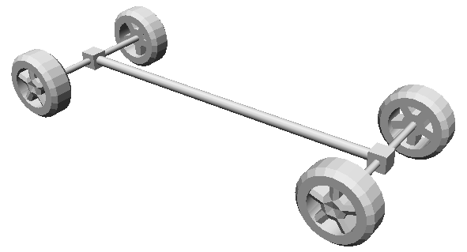

## AckermannVehicle

The `AckermannVehicle` PROTO allows the user to easily create any vehicle that
complies with the ackermann model. Position and orientation of the wheels are
automatically computed using the fields of the PROTO. These wheels are
automatically connected to the appropriate joints in order to rotate along the
correct axis. Actuators (`Motor` nodes called `right_steer` and `left_steer`)
are connected to the front joints to be able to steer the vehicle.

The base node of the `AckermannVehicle` PROTO is a `Robot` from which it
inherits its first seven fields. The rest of the vehicle (Shape, Sensors, other
actuators) can be added using the `extensionSlot` field.

```
AckermannVehicle {
  SFVec3f    translation                    0 0.4 0
  SFRotation rotation                       0 1 0 0.0
  SFString   name                           "vehicle"
  SFString   model                          "AckermannVehicle"
  SFString   controller                     "void"
  SFString   controllerArgs                 ""
  SFBool     synchronization                TRUE
  SFFloat    trackFront                     1.7
  SFFloat    trackRear                      1.7
  SFFloat    wheelbase                      4.0
  SFFloat    minSteeringAngle              -1
  SFFloat    maxSteeringAngle               1
  SFFloat    suspensionFrontSpringConstant  100000
  SFFloat    suspensionFrontDampingConstant 4000
  SFFloat    suspensionRearSpringConstant   100000
  SFFloat    suspensionRearDampingConstant  4000
  SFFloat    wheelsDampingConstant          5
  MFNode     extensionSlot                  NULL
  SFNode     boundingObject                 NULL
  SFNode     physics                        NULL
  SFNode     wheelFrontRight                AutomobileWheel { }
  SFNode     wheelFrontLeft                 AutomobileWheel { }
  SFNode     wheelRearRight                 AutomobileWheel { }
  SFNode     wheelRearLeft                  AutomobileWheel { }
  MFNode     axisDevicesFrontRight          [ ]
  MFNode     axisDevicesFrontLeft           [ ]
  MFNode     axisDevicesRearRight           [ ]
  MFNode     axisDevicesRearLeft            [ ]
  SFString   data                           ""
}
```

### AckermannVehicle Field Summary

- `trackFront and trackRear`: Defines the front/rear distances between right and
left wheels.
- `wheelbase`: Defines the distance between the front and the rear wheels axes.
- `minSteeringAngle and maxSteeringAngle`: Defines the minimum and maximum
steering angle of the front wheels.
- `suspension...`: Defines the characteristics of the suspension.
- `wheelsDampingConstant`: Defines the `dampingConstant` of each wheel joint used
to simulate the frictions of the vehicle.
- `extensionSlot`: Extension slot allowing the user to add other nodes (e.g.,
sensors, shape of the vehicle, etc.).
- `boundingObject`: Physical geometry of the vehicle.
- `physics`: `Physics` node of the vehicle defining the physical parameters of the
vehicle.
- `wheelX`: Slot to insert an `AutomobileWheel` (or any `AutomobileWheel`
descendant PROTOs).
- `axisDevicesX`: Slot to add devices in the wheels joints (such as `Brake`,
`PositionSensor` and `Motor`).
- `data`: Defines a user `data` string of the `Robot` node.

The center of the vehicle (position 0 0 0) is at the center of the rear wheels
axis. Any node added in the `extensionSlot` is added relatively to this
position. A `Transform` node should be used to move an extension node away from
this center.

You can easily create your own PROTO that inherits from the `AckermannVehicle`
PROTO, see for example the `SimpleVehicle` PROTO which automatically computes
the shapes of the wheel axes.

%figure "Result of the SimpleVehicle PROTO which inherits from the AckermannVehicle PROTO"



%end
