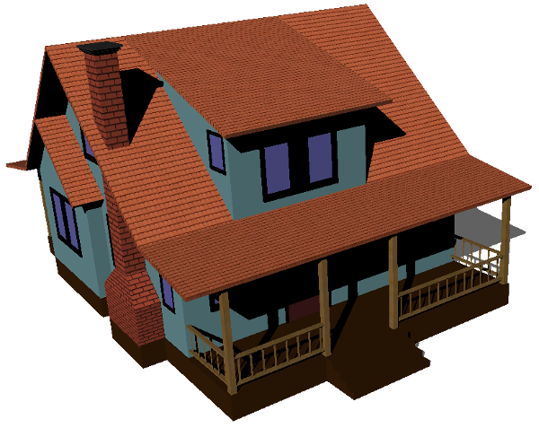
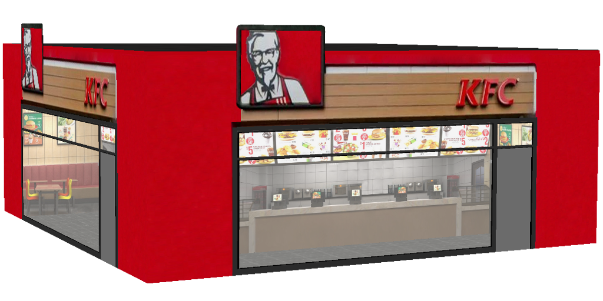
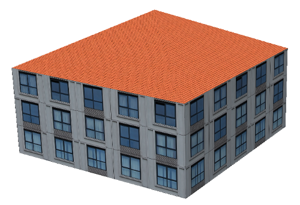
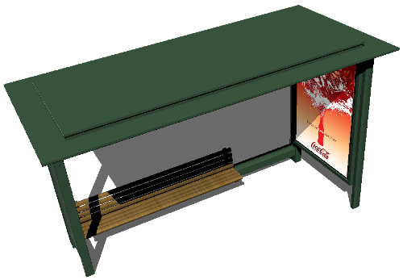
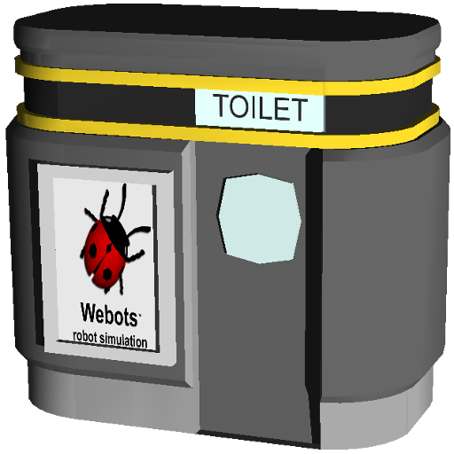

## Buildings

%figure "One of the available buildings"



%end

The following PROTO nodes of buildings are available to add in your worlds:

- Auditorium
- BigGlassTower
- BuildingUnderConstruction
- BungalowStyleHouse
- CommercialBuilding
- CyberboticsTower
- HollowBuilding
- Hotel
- ModernHouse
- Museum
- ResidentialBuilding
- SimpleTwoFloorsHouse
- TheThreeTowers
- UBuilding
- FastFoodRestaurant

%figure "An example of FastFoodRestaurant with two sides"



%end

### Building PROTO

In addition to those building PROTO nodes, the `Building` PROTO represents
a highly customizable building and can be used to model a large variety of
buildings.

%figure "An example of Building with the default parameters"



%end

```
Building {
  SFFloat     floorHeight            3
  SFInt32     floorNumber            3
  MFVec2f     corners                [10 10, 10 -10, -10 -10, -10 10 ]
  SFNode      wallAppearance         Appearance { material Material {} }
  SFNode      roofAppearance         Appearance { material Material {} }
  SFString    roofShape              "pyramidal roof"
  SFBool      snowOnRoof             FALSE
  SFFloat     roofHeight             3
  SFBool      enableBoundingObject   TRUE
  SFBool      bottom                 FALSE
}
```

#### Building Field Summary

- `floorHeight`: Defines the height of one floor.
- `floorNumber`: Defines the number of floors (excluding roof).
- `corners`: Defines the geometry of the building (2D ground footprint of the
building).
- `wallAppearance`: Defines the appearance used for the walls of the building.
- `roofShape`: Defines the geometry of the roof. Supported geometry are `flat
roof` and `pyramidal roof`.
- `roofAppearance`: Defines the appearance used for the roof of the building.
- `roofHeight`: Defines the height of the roof (used only in the case of pyramidal
roof).
- `enableBoundingObject`: Defines whether the building should have a bounding object.
- `bottom`: Defines whether the bottom face of the building should be displayed.

### SimpleBuilding PROTO

The `SimpleBuilding` PROTO is similar to the `Building` one except that the wall and roof appearances don't need to be set.
The `wallAppearance` and `roofAppearance` fields are replaced by the `wallType` and `roofType` ones.

The available roof types are:
  - tiled
  - gravel
  - slate
  - old tiles
  - sheet metal
  - metal tiles
  - bitumen

The available wall types are:
  - glass building
  - classic building
  - orange building
  - gray glass building
  - blue glass building
  - arcade-style building
  - transparent highrise
  - windowed building
  - old brick building
  - red and white building
  - construction building
  - red brick wall
  - old brick wall
  - stone brick
  - stone wall
  - glass highrise
  - old house
  - old building
  - highrise
  - brick building
  - residential building
  - old office building
  - factory building
  - tall house
  - office building

### Other city objects

In addition to buildings, other PROTO nodes are available representing objects
usually found in a city environment:

- BusStop
- Fence
- Fountain
- PublicToilet

%figure "The BusStop and PublicToilet PROTO models"




%end
