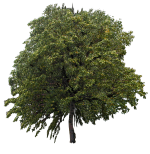
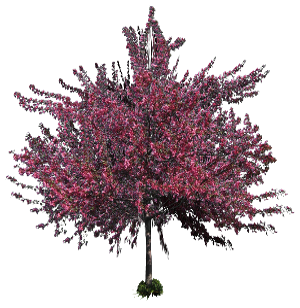
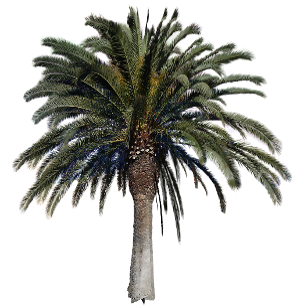
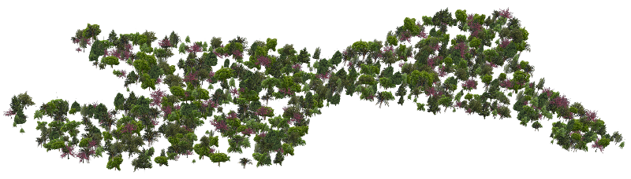

## Nature

In addition to the usual PROTO of `RoundTree`, `Rocks`, etc. Two PROTOs have
been developed to efficiently represent trees.

### SimpleTree

The `SimpleTree` PROTO use an efficient representation of tree made of only a
minimum of eight triangles. The size of the tree is customizable and a various
types of trees are supported. Here is the list of available trees types (a few
of them are visible in the following picture):

- crab apple tree
- hackberry tree
- hazel tree
- oak tree
- palm tree
- spruce
- white pine
- cherry tree
- birch tree

%figure "A few example of trees generated by the SimpleTree PROTO"





%end

```
SimpleTree {
     SFString   type                 "cherry tree"
     SFBool     withSnow             FALSE
     SFFloat    height               4
     SFFloat    radius               2
     SFInt32    subdivision          2
     SFBool     enableBoundingObject TRUE
 }
```

#### SimpleTree Field Summary

- `type`: Defines the texture to be used. If set to `random`, a type will be
randomly selected in the list.
- `withSnow`: Defines if the texture used should have snow on top.
- `height`: Defines the height of the tree.
- `radius`: Defines the radius of the tree.
- `subdivision`: Defines the number of faces used to represent the tree.
- `enableBoundingObject`: Defines if the tree should have a bounding object (the
bounding object is made of a simple cylinder).

### Forest

The `Forest` PROTO use only one `IndexedFaceSet` to represent efficiently a
large amount of trees.

%figure "An example of forest"



%end

```
Forest {
     MFString   treesFiles           [ ]
     MFVec2f    shape                [ -20 -10, 20 -10, 0 25]
     SFFloat    density              0.2
     SFString   type                 "random"
     SFBool     withSnow             FALSE
     SFFloat    maxHeight            6
     SFFloat    minHeight            2
     SFFloat    maxRadius            3
     SFFloat    minRadius            1
 }
```

#### Forest Field Summary

- `treesFiles`: Can be used to define the paths to several files in which are
defined the positions of the trees (one tree per line, using the format 'X Y
Z').
- `shape`: Alternatively, the position of each trees can be defined using the
`shape` field. This field defines the shape of the forest, in that case the
position of the trees is randomly generated from this shape.
- `density`: If the forest is defined using the `shape` field, this field defines
the density of three to be generated (in trees per meter square).
- `type`: Defines the type of threes, in case of `random` type, the forest will be
mixed.
- `withSnow`: Defines if the texture used should have snow on top.
- `minHeight and maxHeight`: Defines the height interval. The height of each tree
is independently and randomly selected between `minHeight` and `maxHeight`.
- `minRadius and maxRadius`: Defines the radius interval. The radius of each tree
is independently and randomly selected between `minRadius` and `maxRadius`.

