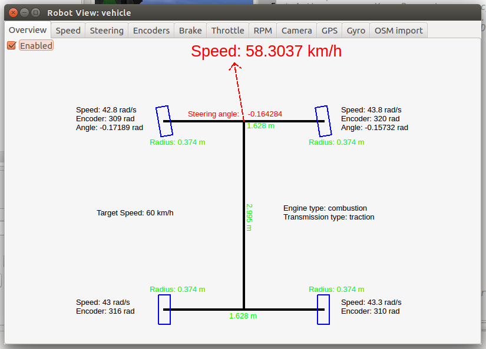

## Overview tab

In addition to the usual tabs for each sensors/actuators, the car robot-window
first tab gives a quick overview about the car state.

%figure "The Overview tab of the car robot-window"

%end

The following tabs give more detailed information about one specific state of
the car (e.g. speed, steering angles, wheels encoders, etc.). After those
specific tabs about car, you can found the usual tabs about sensors/actuators
added in the sensors slots of the car. Finally, the last tab allows to launch a
small graphical interface for the [OpenStreetMap
importer](openstreetmap-importer.md) tools.
