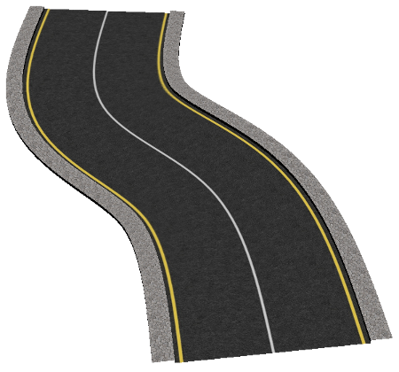
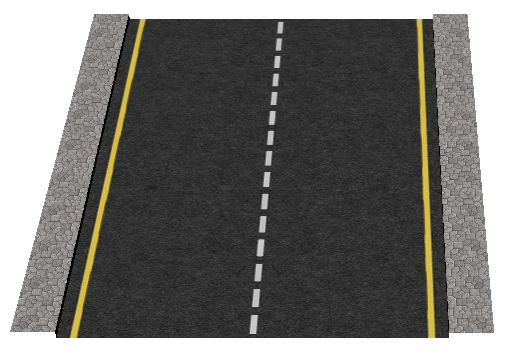
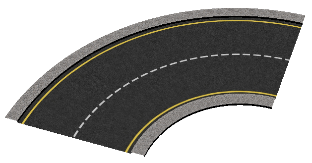
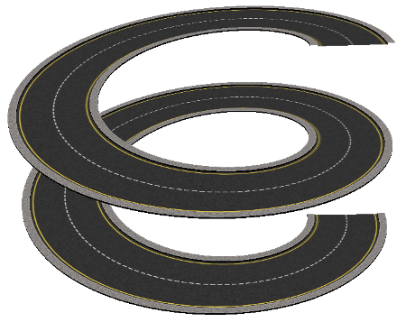
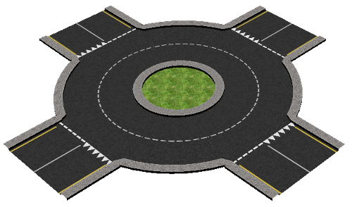
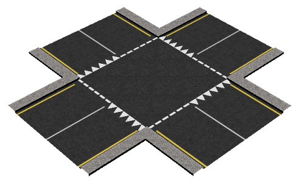
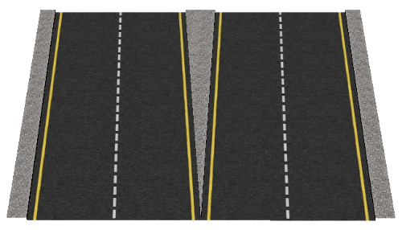
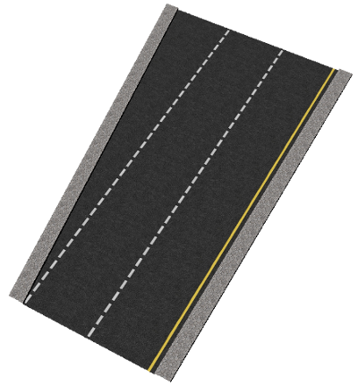
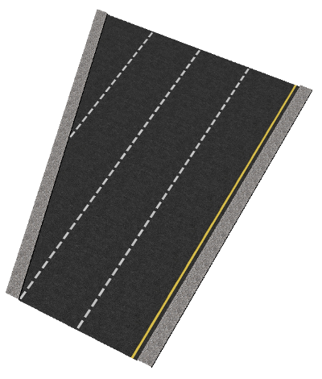

## Road segments

The first part of this section will present the various PROTO models of road segments and intersections, that can be used to build the road network.

### Road

The `Road` PROTO is the most generic one.
It can be used for a large variety of purposes.

%figure "Generic segment of road"



%end

Derived from [Solid](../reference/solid.md).

```
Road {
  SFVec3f    translation                0 0 0
  SFRotation rotation                   0 1 0 0
  SFString   name                       "road"
  SFString   id                         ""
  SFString   startJunction              ""
  SFString   endJunction                ""
  SFFloat    width                      7
  SFInt32    numberOfLanes              2
  SFInt32    numberOfForwardLanes       1
  SFFloat    speedLimit                 -1.0
  MFBool     dashedLine                 TRUE
  SFFloat    roadBorderHeight           0.15
  MFFloat    roadBorderWidth            [ 0.8 ]
  SFBool     road                       TRUE
  SFBool     rightBorder                TRUE
  SFBool     leftBorder                 TRUE
  SFBool     rightBarrier               FALSE
  SFBool     leftBarrier                FALSE
  SFBool     bottom                     FALSE
  SFBool     rightSide                  TRUE
  SFBool     leftSide                   TRUE
  MFVec3f    wayPoints                  [ 0 0 0, 0 0 1 ]
  MFFloat    roadTilt                   [ 0, 0]
  MFFloat    startingAngle              [ ]
  MFFloat    endingAngle                [ ]
  MFString   startLine                  [ ]
  MFString   endLine                    [ ]
  SFInt32    splineSubdivision          4
  MFString   texture                    "textures/road.jpg"
  SFFloat    textureScale               2
  MFString   pavementTexture            "textures/pavement.jpg"
  MFString   bottomTexture              [ ]
  SFString   turnLanesForward           ""
  SFString   turnLanesBackward          ""
  SFBool     locked                     TRUE
  SFBool     roadBoundingObject         FALSE
  SFBool     rightBorderBoundingObject  FALSE
  SFBool     leftBorderBoundingObject   FALSE
  SFBool     rightBarrierBoundingObject TRUE
  SFBool     leftBarrierBoundingObject  TRUE
  SFBool     castShadows                FALSE
  SFString   contactMaterial            "default"
}
```

#### Road field Summary

- `name`: Could contain the street name.
- `id`: Could contain a unique ID.
A unique ID is required to use the [SUMO exporter](sumo-exporter.md).
- `startJunction`: Could contain a reference to the [Crossroad](#crossroad) connected at the first Road waypoint.
Setting correctly this field is required to use the [SUMO exporter](sumo-exporter.md).
- `endJunction`: Could contain a reference to the [Crossroad](#crossroad) connected at the last Road waypoint.
Setting correctly this field is required to use the [SUMO exporter](sumo-exporter.md).
- `width`: Defines the total width of the road (excluding sidewalk).
- `numberOfLanes`: Defines the number of lanes (used for the texture mapping).
- `numberOfForwardLanes`: Defines number of forward lanes.
- `speedLimit`: Could contain the speed limit in meter per seconds.
- `dashedLine`: Defines for each line separating two lanes whether it should be continuous or dashed.
- `roadBorderHeight`: Defines the height of the sidewalk.
- `roadBorderWidth`: Defines the width of the sidewalk associated to each way-point (if there are less values than way-points, the last value is used for the last remaining way-points).
- `road`: Defines whether the road should be present or not (useful in case you only need the sidewalk).
- `rightBorder`: Defines whether the road should have a right sidewalk.
- `leftBorder`: Defines whether the road should have a left sidewalk.
- `rightBarrier`: Defines whether a crash barrier should be added along the right border of the road.
- `leftBarrier`: Defines whether a crash barrier should be added along the left border of the road.
- `bottom`: Defines whether the road bottom should be displayed (useful in case of bridge).
- `rightSide`: This field is used for the texture mapping.
It defines whether the side of the texture should be used for the right side of the road (useful to disable in case road assembly).
- `leftSide`: This field is used for the texture mapping.
It defines whether the side of the texture should be used for the left side of the road (useful to disable in case road assembly).
- `wayPoints`: Defines the path of the road.
- `roadTilt`: Defines the tilting angle corresponding to each way-point (if there are less values than way-points, 0 is used for the last remaining way-points).
- `startingAngle`: Defines the angle of the road at the first way-point.
- `endingAngle`: Defines the angle of the road at the last way-point.
- `startLine`: Defines the texture used for the road line at the first way-point for each lane.
If the string is empty, no road line will be added for the corresponding lane.
The two textures `textures/road_line_dashed.png` and `textures/road_line_triangle.png` may be used in this field.
- `endLine`: Defines the texture used for the road line at the last way-point for each lane.
If the string is empty, no road line will be added for the corresponding lane.
- `splineSubdivision`: Defines the degree of interpolation using B-Splines (if the value is lower than 0, the interpolation is disabled).
- `texture`: Defines the texture to be used for the road.
- `textureScale`: Defines the length (in meter) of the road texture.
- `pavementTexture`: Defines the texture to be used for the sidewalk.
- `bottomTexture`: Defines the texture to be used for the bottom of the road.
- `turnLanesForward`: Defines painted arrows before the end of the lanes using the same format as the OSM "turn:lanes:forward" key (e.g. "through|left;through|none").
Please refer to the corresponding OSM tag: http://wiki.openstreetmap.org/wiki/Key:turn.
- `turnLanesBackward`: Idem for the OSM "turn:lanes:backward" key.
- `roadBoundingObject`: Defines whether the road should have a bounding object.
- `rightBorderBoundingObject`: Defines whether the right sidewalk should have a bounding object.
- `leftBorderBoundingObject`: Defines whether the left sidewalk should have a bounding object.
- `rightBarrierBoundingObject`: Defines whether the right crash barrier (if any) should have a bounding object.
- `leftBarrierBoundingObject`: Defines whether the left crash barrier (if any) should have a bounding object.
- `castShadows`: defines whether the road should cast shadows.
- `contactMaterial`: defines the road contact material (used by the ContactProperties node).

### StraightRoadSegment

The `StraightRoadSegment` PROTO is the simplest one.
It can only be used to create a straight road.

%figure "Straight segment of road"



%end

Derived from [Road](#road).

```
StraightRoadSegment {
  SFFloat    startingRoadBorderWidth   0.8
  SFFloat    endingRoadBorderWidth     0.8
  SFFloat    length                    10
  SFFloat    startingRoadTilt          0
  SFFloat    endingRoadTilt            0
}
```

#### StraightRoadSegment Field Summary

Most of the fields are similar to the one of the [Road](#road) PROTO.
Therefore, only the specific ones will be explained.

- `startingRoadBorderWidth and endingRoadBorderWidth`: Instead of defining the width of the border for each way-points, you can only specify it for the beginning and end of the road.
- `startingRoadTilt and endingRoadTilt`: Instead of defining the tilting angle of the road for each way-points, you can only specify it for the beginning and end of the road.
- `length`: Defines the length of the road.

### CurvedRoadSegment

The `CurvedRoadSegment` PROTO is very simple too.
It can only be used to create a regularly curved road.

%figure "Curved segment of road"



%end

Derived from [Road](#road).

```
CurvedRoadSegment {
  SFFloat    curvatureRadius           10
  SFFloat    totalAngle                1.5708
  SFInt32    subdivision               8
  SFFloat    tilt                      0
}
```

#### CurvedRoadSegment Field Summary

Most of the fields are similar to the [Road](#road) PROTO.
Therefore, only the specific ones will be explained.

- `curvatureRadius`: Defines the curvature radius of the center of the road.
- `totalAngle`: Defines the angle covered by the road.
- `subdivision`: Defines the subdivision of the arc.
- `tilt`: Defines the maximum tilting angle at the middle of the segment.

### HelicoidalRoadSegment

The `HelicoidalRoadSegment` PROTO represents an helicoidal road.
It is mainly meant to showcase how the [Road](#road) PROTO can be inherited to create complex road structure in the third dimension.
It can, for example, be used to model a garage input ramp.

%figure "Helicoidal segment of road"



%end

Derived from [Road](#road).

```
HelicoidalRoadSegment {
  SFFloat    height                    20
  SFFloat    radius                    15
  SFFloat    heigthStep                5
  SFFloat    subdivision               64
}
```

#### Helicoidal Field Summary

Most of the fields are similar to the [Road](#road) PROTO.
Therefore, only the specific ones will be explained.

- `height`: Defines the total height covered by the road.
- `radius`: Defines the radius of the center of the road.
- `heigthStep`: Defines the step for the road to complete one lap.
- `subdivision`: Defines the subdivision of the helicoid.

### Crossroad

The `Crossroad` PROTO represents a crossroad.

%figure "Crossroad intersection"


%end

Derived from [Solid](https://www.cyberbotics.com/doc/reference/solid).

```
Crossroad {
  SFVec3f    translation      0 0 0
  SFRotation rotation         0 1 0 0
  SFString   name             "crossroad"
  SFString   id               ""
  MFVec3f    shape            [ 0 0 0, 1 0 0, 0 0 1]
  MFString   connectedRoadIDs []
  SFBool     boundingObject   FALSE
  SFBool     bottom           FALSE
  MFString   texture          "textures/asphalt.jpg"
  SFBool     locked           TRUE
  SFBool     castShadows      FALSE
  SFString   contactMaterial  "default"
}
```

#### Crossroad Field Summary

Most of the fields are similar to the one of the [Road](#road) PROTO.
Therefore, only the specific ones will be explained.

- `name`: Could contain the crossroad name.
- `id`: Could contain a unique ID.
A unique ID is required to use the [SUMO exporter](sumo-exporter.md).
- `shape`: Could contain a list of 3D coordinates which will be linked clockwise to display the graphical shape.
- `connectedRoadIDs`: Could contain a list of the identifiers of the connected Road.
This is required to use the [SUMO exporter](sumo-exporter.md).
- `boundingObject`: Defines if this crossroad should enable collisions based on the graphical shape.
- `texture`: Defines the texture of the crossroad.
- `bottom`: Defines whether the crossroad bottom should be displayed (useful in case of bridge).
- `castShadows`: Defines whether the crossroad should cast shadows.
- `contactMaterial`: Defines the crossroad contact material (used by the ContactProperties node).

### Roundabout

The `Roundabout` PROTO represents a roundabout intersection.

%figure "Roundabout intersection"



%end

Derived from [Crossroad](#crossroad).

```
Roundabout {
  SFInt32    subdivision              16
  SFFloat    innerRadius              4
  SFFloat    outerRadius              8
  SFBool     center                   TRUE
  SFVec2f    centerTextureScale       4 4
  SFInt32    roadNumber               4
  SFFloat    startRoadsLength         5
  SFFloat    startRoadsWith           7
  SFInt32    startRoadsNumberOfLanes  2
  MFString   startRoadsStartLine      [ "textures/road_line_dashed.png",
                                        "textures/road_line_triangle.png" ]
  MFString   startRoadsEndLine        [ ]
  MFBool     startRoadsDashedLine     FALSE
  SFBool     roadBoundingObject       FALSE
  SFBool     centerBoundingObject     FALSE
  MFString   centerTexture            "textures/grass.png"
  SFFloat    textureScale             2
  MFString   startRoadsTexture        "textures/road.jpg"
}
```

#### Roundabout Field Summary

Most of the fields are similar to the one of the [Road](#road) PROTO.
Therefore, only the specific ones will be explained.

- `subdivision`: Defines the subdivision of the circle.
- `innerRadius`: Defines the inner radius of the roundabout.
- `outerRadius`: Defines the outer radius of the roundabout.
- `center`: Defines whether the roundabout should have a central part.
- `centerTexture`: Defines the texture to be used for the central part.
- `centerTextureScale`: Defines the scale of the previous texture.
- `centerBoundingObject`: Defines whether the central part should have a bounding object.
- `roadNumber`: Defines the number of roads entering/leaving the roundabout.
- `startRoads...`: Defines the properties of the roads entering/leaving the roundabout.

### RoadIntersection

The `RoadIntersection` PROTO represents a perpendicular intersection.

%figure "Perpendicular intersection"



%end

Derived from [Crossroad](#crossroad).

```
RoadIntersection {
  SFVec3f    translation                    0 0 0
  SFRotation rotation                       0 1 0 0
  SFString   name                           "road intersection"
  SFInt32    roadNumber                     4
  SFFloat    roadsWith                      7
  SFBool     startRoads                     TRUE
  SFFloat    startRoadsLength               5
  SFInt32    startRoadsNumberOfLanes        2
  MFString   startRoadsStartLine            [ "textures/road_line_dashed.png",
                                              "textures/road_line_triangle.png" ]
  MFString   startRoadsEndLine              [ ]
  MFBool     startRoadsDashedLine           FALSE
  SFBool     startRoadBorder                TRUE
  SFFloat    startRoadBorderHeight          0.15
  SFFloat    startRoadBorderWidth           0.8
  SFBool     startRoadBorderboundingObject  FALSE
  SFBool     boundingObject                 FALSE
  SFString   contactMaterial                "default"
  SFBool     bottom                         FALSE
  SFBool     locked                         TRUE
  MFString   texture                        "textures/asphalt.jpg"
  MFString   startRoadsTexture              "textures/road.jpg"
}
```

### LaneSeparation

The `LaneSeparation` PROTO represents a road spliting in two.

%figure "Lane separation"



%end

Derived from [Crossroad](#crossroad) and [Road](#road).

```
LaneSeparation {
  SFInt32    numberOfleavingLanes        2
  SFBool     newLaneLeft                 TRUE
  SFBool     centralBorder               TRUE
  SFBool     centralBorderBoundingObject FALSE
}
```

#### LaneSeparation Field Summary

Most of the fields are similar to the one of the [Road](#road) PROTO.
Therefore, only the specific ones will be explained.

- `numberOfleavingLanes`: Defines the number of lanes leaving the main road.
- `newLaneLeft`: Defines if the lanes leaving the main road goes to the left or right.
- `centralBorder`: Defines if the central sidewalk should be present.
- `centralBorderBoundingObject`: Defines if the central sidewalk should have a bounding object.

### AddLaneRoadSegment

The `AddLaneRoadSegment` PROTO can be used to add (or remove) one lane to the road.

%figure "Addition of one lane"



%end

Derived from [Crossroad](#crossroad) and [Road](#road).

```
AddLaneRoadSegment {
  SFFloat    length                    20
  SFBool     newLaneLeft               TRUE
  MFString   newLaneTexture            "textures/road_no_border_line.jpg"
}
```

#### AddLaneRoadSegment Field Summary

Most of the fields are similar to the one of the [Road](#road) PROTO.
Therefore, only the specific ones will be explained.

- `length`: Defines in how many meter the new lane is created.
- `newLaneLeft`: Defines whether the new lane should be created on the right or left side of the road.
- `newLaneTexture`: Defines the texture to be used for the new lane.

### AddLanesRoadSegment

The `AddLanesRoadSegment` PROTO is very similar to the [AddLaneRoadSegment](#addlaneroadsegment) PROTO except that it allows to add several lanes to the road.

%figure "Addition of several lanes"



%end

Derived from [Crossroad](#crossroad) and [Road](#road).

```
AddLanesRoadSegment {
  SFInt32    numberOfNewLanes          2
}
```

#### AddLanesRoadSegment Field Summary

Most of the fields are similar to the one of the `Road` PROTO.
Therefore, only the specific one will be explained.

- `numberOfNewLanes`: Defines the number of new lanes to be added to the road.
