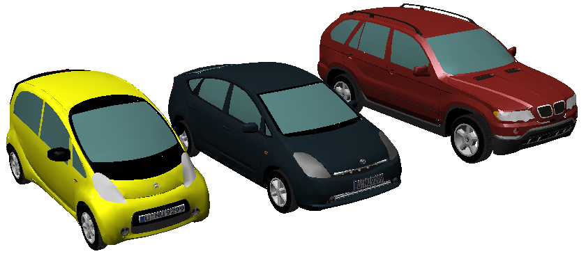
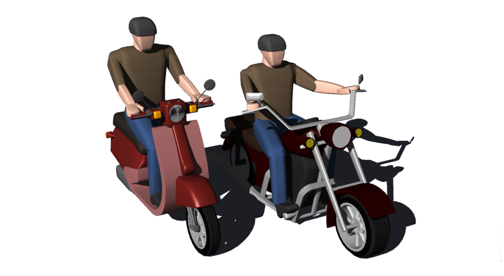

## Simple Vehicles

### CarSimple

For each model of [Car](#car), a 'simple' PROTO is present too.
These simplified kinematic PROTO models are not based on a `Robot` node but on a `Solid` node, it is therefore not possible to add sensors or control them.
They are made to represent non-moving parked vehicles or to be moved using a Supervisor because they are much faster to simulate than the normal PROTO models.

```
 PROTO CarSimple {
   field       SFVec3f    translation             0 0.4 0
   field       SFRotation rotation                0 1 0 0
   field       SFColor    color                   0.0 0.25 0.65
   field       MFColor    recognitionColors       [ 0.0 0.25 0.65, 0.1 0.1 0.1 ]
   field       MFString   plate                   "textures/plate.jpg"
   field       SFString   name                    "vehicle"
   field       SFBool     wheelBoundingObject     FALSE
 }
```

#### CarSimple Field Summary

- `recognitionColors`: If not empty, this vehicle may be recognized by any Camera
device with recognition capability (i.e. with a Recognition node).
- `wheelBoundingObject`: Allows the physical geometry of the wheels to be enabled.

CarSimple is not an actual PROTO but defines the common structure of all the 'simple' versions of the cars.
The different simple versions of the car PROTO nodes represent the different models of [Car](#car):

- the Sport SVR from Range Rover
- the X5 from BMW
- the Prius from Toyota
- the MKZ from Lincoln
- the C-Zero from Citroen

%figure "Models of cars created using the CarSimple PROTO"



%end

### TwoWheelerSimple

Due to the presence of driver, the TwoWheelerSimple PROTO nodes have a slightly different organisation.
Similar to CarSimple, the TwoWheelerSimple PROTO displayed bellow is just a common structure for the different versions of the two wheelers.

```
PROTO TwoWheelerSimple {
  field       SFVec3f    translation             0 0.25 0
  field       SFRotation rotation                0 1 0 0
  vrmlField   SFColor    primaryColor            0.43 0.11 0.1
  vrmlField   SFColor    secondaryColor          0.69 0.43 0.43
  field       MFColor    recognitionColors       [ 0.43 0.11 0.1, 0.69 0.43 0.43 ]
  field       SFNode     driver                  TwoWheelerDriver { }
  field       SFString   name                    "vehicle"
  field       SFBool     wheelBoundingObject     FALSE
}
```

#### TwoWheelerSimple Field Summary

- `secondaryColor`: Defines a secondary color to be chosen alongside the main one.
- `driver`: Defines a `Slot` node for the two-wheeler driver.

ScooterSimple and MotorbikeSimple are examples of actual TwoWheelerSimple PROTO that represent a scooter and a motorbike:

%figure "Models of ScooterSimple and MotorbikeSimple currently available"



%end
