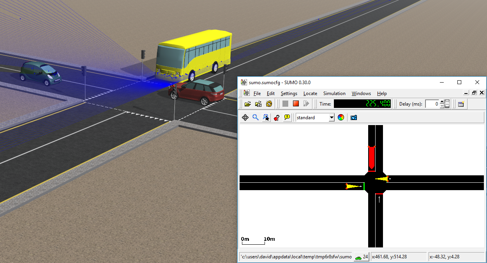

## SUMO Interface Example

%figure "The SUMO interface example world"

%end

This world simply represents a 4 roads intersection regulated by some traffic lights.
The goal of this world is to show the interface with SUMO.
At the beginning of the simulation, SUMO is started in graphic mode and will simulate some vehicles on the `horizontal` road.
When a priority vehicle arrives from the `vertical` road, it will be detected from the lane sensor and the states of the traffic lights will change.
