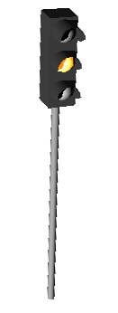
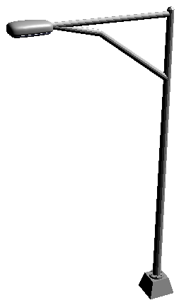
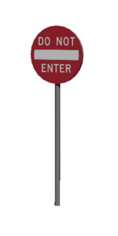
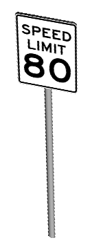
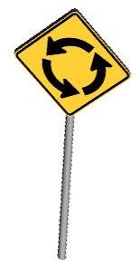
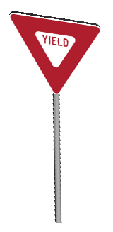

## Traffic signs and lights

In addition to the `PedestrianCrossing` and `TrafficCone` PROTOs, a set of
traffic signs and lights is provided.

All of those traffic signs and lights can either be mounted on the `Pole` or
`TrafficLightBigPole` PROTOs. The first one is a simple cylindrical pole on
which one element can be mounted. On the second bigger one, a maximum of three
elements can be mounted.

### Traffic lights

%figure "a traffic light"

%end

Two kinds of traffic lights are available, they both have 3 `LEDs` and can
therefore be controlled if inserted in a `Robot` node. For both of them, the
shape of the light can either be a full circle or an arrow (defined in the
`lamp_geometry` field)

- `TrafficLight`: Normal traffic light with 3 colors.
- `TrafficLightHorizontal`: Normal traffic light with 3 colors but with horizontal
sun-protector.

In addition to the traffic lights, the `StreetLight` PROTO can be used to light
some part of the road in nightly environments.

%figure "The StreetLight PROTO"

%end

### Traffic signs

%figure "Various traffic sign and traffic light"

%end

A total of 6 traffic signs are available. They represent the various sizes and
shapes usually used for traffic signs:

- `CautionSign`: Diamond sign usually used for warnings.
- `ExitSign`: Big rectangular sign used for example for highway exit.
- `OrderSign`: Circular sign usually used for interdictions.
- `SpeedLimitSign`: Rectangular sign usually used for speed limit.
- `StopSign`: Octagonal sign usually used for stop.
- `YieldSign`: Triangular sign usually used for yield.

A complete set of textures is available with those traffic signs and can easily
be applied using the `signImage` field.
