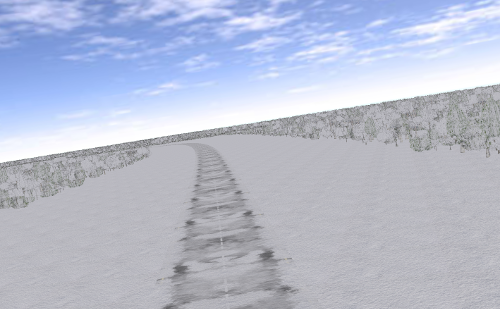

## Village winter

%figure "The Village winter world"

%end

This world represents a fictive small village too, but during the winter. A
variable amount of snow has been added on top of the roads, buildings and trees,
which make difficult to follow the road using on-board cameras. Moreover,
friction coefficients between the road and the tires have been adapted in
function of the amount of snow.

Of course the friction phenomena between snow/ice and tires is very complex a nd
this world should not be used as a ground truth but can still be used as a rough
approximation.

