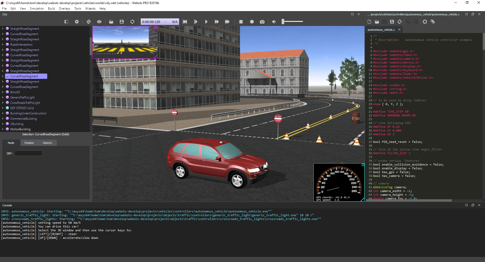

# Version R2018b Released

By Tom Norton - xxth June 2018

---

Today we're happy to announce the release of the all-new Webots 2018b, packed with some great new features.
As always, for a comprehensive list of changes please refer to the ChangeLog, found [here](https://www.cyberbotics.com/dvd/common/doc/webots/ChangeLog.html).

## WREN: Webots Renderer

## New Look and Feel

### New Themes

%figure "Webots Night, The new default theme for Webots"

%end

We've done lots of work on user experience with this latest update. 
Shown above is the new default look for Webots R2018b, Webots Night.
This new look features clean lines, flat design, and a subdued color palette with highlights in just the right places to make interacting with Webots even more intuitive.
We've also kept the previous style, in a theme called "Webots Classic", if you prefer the old look, along with a more vibrant theme named "Webots Dusk".
Additionally, the splash screen has been re-designed to match our new themes.

### It's All About Context

We've wanted to streamline actions normally undertaken during normal simulation design workflow. 
These include editing a robot's controller, seeing a robot's window, deleting an object from the scene, etc.
So, to improve this, we've added a context menu to the 3D view and Scene Tree!

%figure "A Typical Context Menu for a Selected Robot Node"

%end

The menu adapts to the currently selected tree item or object in the 3D view, providing selection-specific actions and options.

Boot up Webots R2018b and have an explore of these new GUI features!

## Simulation Reset

Reloading an entire world just to re-run your simulation can be slow, espeically for large worlds.
With this in mind, we have developed an alternative method of resetting a simulation, and our terminology has changed as such.
"Revert" has become "Reload" and now users can benefit from the new "Reset Simulation" action, also accessible via the Supervisor API.

%figure "Reset Simulation Action"

%end

This feature makes resetting even the most complex simulations instantaneous.

## New PROTOs

## Extra Goodies

The Speaker API can now load and play all major audio formats.

Added the possibility to set an empty string as Robot controller instead of the void controller to speed up simulation of non-controlled Robot nodes.

Projection mode, rendering mode, optional renderings and disable selection are now saved per world instead of globally.
