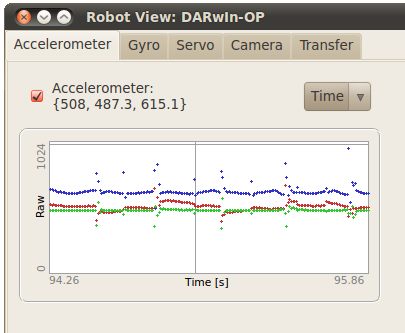

## Accelerometers

This tab can be used to investigate the values of the accelerometer while the
controller is running. If the checkbox is checked, the values of the
accelerometer are shown and plotted on the graph in real time. Four different
types of graph can be plot. The first three are one axis in function of an
other, and the last one, plots the value of the three axes in function of the
time. The corresponding colors are the following:

- Red for axis X
- Green for axis Y
- Blue for axis Z

%figure "Accelerometer tab of the robot-window"

%end

You can click any time on the graph to adjust the scale of the data currently
plotted.

