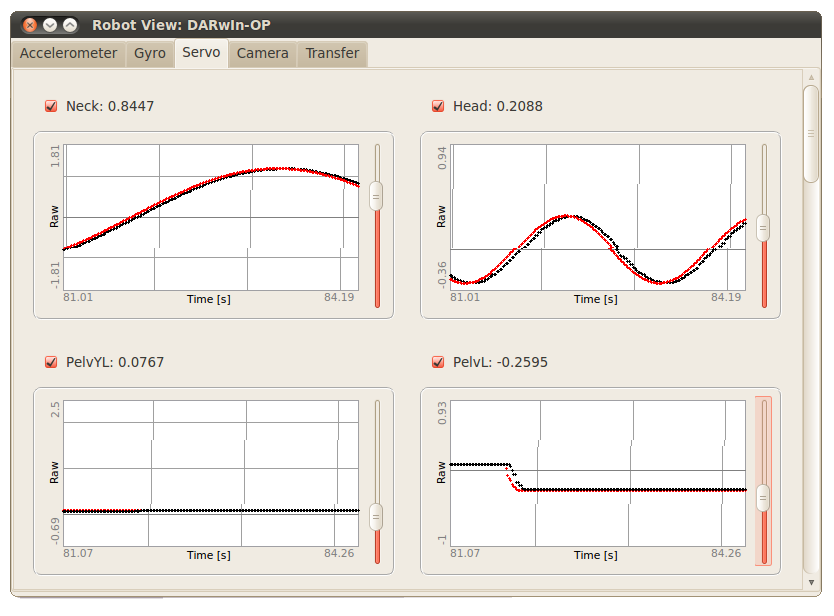

## Servos

Finally, this last tab can be used to see and influence the state of each servo.
The use of each servo in the robot window can separately be set by
checking/unchecking the corresponding checkbox of the servo. If the checkbox is
checked, the value of the servo is shown and plotted in function of the time. On
the graph, two different colors are used to distinguish the target value (in
red) and the real value (in black). It is also possible to manually change the
value of the servo by using the slider beside the graph.

%figure "Servo tab of the robot-window"

%end

