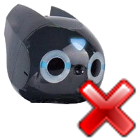

## Uninstall Webots files from the robot

If you don't need to use anymore Webots with your DARwIn-OP, you can uninstall
all the files installed on the DARwIn-OP by Webots by pressing this button:

%figure "Uninstall button"

%end

This will restore your robot like it was before installing the Webots files on
it. Even the demo program will again automatically start at the startup of the
robot. But if you send again a controller to the robot with Webots, all the
files will again be installed. You can also use this button to reinstall all
Webots files to the robot if you think something went wrong during the
installation.

If you install a new version of Webots on your computer the Webots files on the
robot will automatically be updated at the sending of the first controller
(don't worry if you use severals version of Webots, an older version can not
erase files from a newer version).

