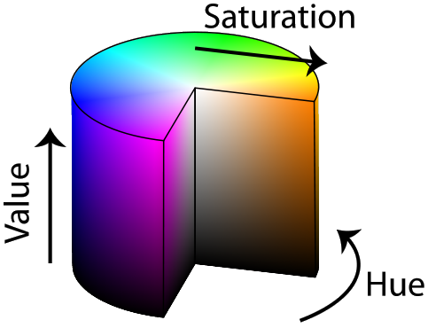
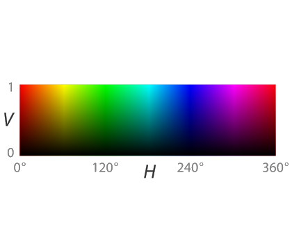

## Vision Manager

The `DARwInOPVisionManager` class allows you to use some image processing tools.

**Name**

**DARwInOPVisionManager(int width, int height, int hue, int hueTolerance, int minSaturation, int minValue, int minPercent, int maxPercent)** - *Vision Manager constructor*

```c++
#include <DARwInOPVisionManager.hpp>

DARwInOPVisionManager(int width,
                      int height,
                      int hue,
                      int hueTolerance,
                      int minSaturation,
                      int minValue,
                      int minPercent,
                      int maxPercent);
```

**Description**

The Vision Manager constructor. The arguments are the following:

- The widht of the image
- The height of the image
- The color hue of the target object to find
- The tolerance on the color hue of the target object to find
- The minimum color saturation of the target object to find
- The minimum color value of the target object to find
- The minimum percentage of color value in the image to validate the result
- The maximum percentage of color value in the image to validate the result

To find the color hue of the target object and to understand the impact of the
saturation and value you can refer to figure [HSV](#sv-colorspace) , for more
information you can also find a lot of great documentation on the Internet about
HSV colorspace.

%figure "SV colorspace"




%end

---

**Name**

**bool getBallCenter(double &x, double &y, const unsigned char * image)** - *Get the position of the target object*

```c++
#include <DARwInOPVisionManager.hpp>

void getBallCenter(double x, double y, const unsigned char * image);
```

**Description**

Get the center of the target object. This method returns true if the target was
found, and false otherwise. If found, the x and y variables are set. The image
pointer indicates the original image buffer. In order to find the position of
the target object, this method proceeds to the following steps:

- Store the BGRA version of the image in a buffer
- Use this buffer to convert the image to HSV format
- Use the `Finder` class of the Framework to find the target object
- Extract and save the position of the target object

---

**Name**

**bool isDetected(int x, int y);** - *Determine if a pixel of the image is part of the target*

```c++
#include <DARwInOPVisionManager.hpp>

void isDetected(int x, int y);
```

**Description**

Once the method `getBallCenter` was called it is possible to know which pixels
of the image are part of the target object by using the method `isDetected`.
This method returns true if the pixel (x,y) is part of the target object and
false otherwise.
