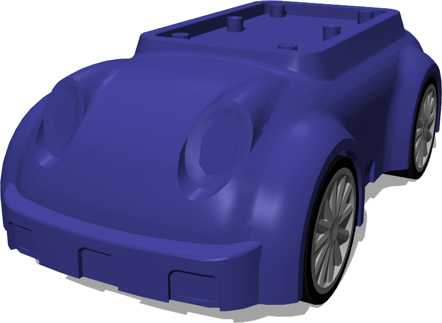

## Saeon's ALTINO

%figure "ALTINO model in Webots"

%end

The "ALTINO System" is a robot platform designed for education.
It is a four-wheeled robot based on an Ackermann vehicle frame.
It contains many sensors including infrared sensors, a compass and an accelerometer.
More information on the [constructor website](https://www.saeon-altino.com).

### Samples

You will find the following example in this folder: "WEBOTS\_HOME/projects/robots/saeon/worlds".

#### altino.wbt

 This simulation shows the ALTINO model in a simple environment.
The ALTINO controller, written in Python, shows a collision avoidance behavior based on a Braitenberg vehicle.
Alternatively, the vehicle can be controlled manually using the computer keyboard.
Please refer to the Webots console to learn the control keys.
