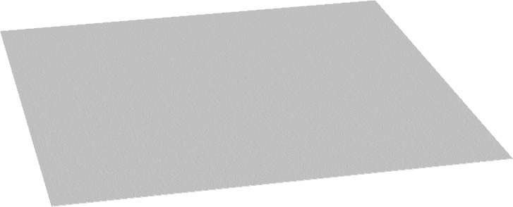
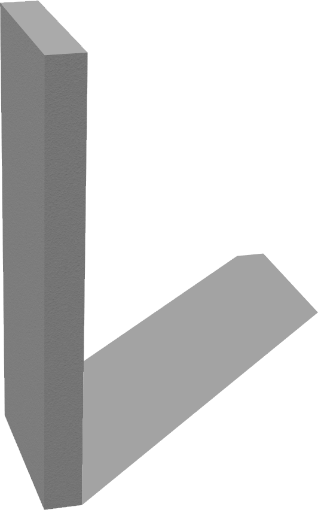
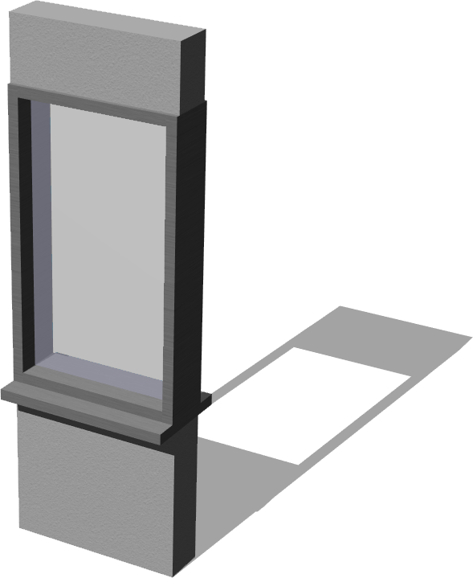

# Apartment Structure

## Ceiling

%figure "Ceiling"



%end

```
Ceiling {
      SFVec3f translation 0 2.4 0
      SFRotation rotation 1 0 0 3.14159
      SFString name "ceiling"
      SFString contactMaterial "default"
      SFVec2f size 10 10
      SFVec2f scale 5 5
      MFString texture "textures/roughcast.jpg"
      SFInt32 filtering 4
      SFBool locked TRUE
}
```

> **File location**: "WEBOTS\_HOME/projects/objects/apartment_structure/protos/Ceiling.proto"

### Description

A configurable standard ceiling

## Door

%figure "Door"


%end

```
Door {
      SFVec3f    translation            0 0 0
      SFRotation rotation               0 1 0 0
      SFString   name                   "door"
      SFVec3f    size                   1 2.4 0.2
      SFBool     canBeOpen              TRUE
      SFBool     jointAtLeft            TRUE
      SFBool     selfClosing            FALSE
      SFFloat    doorThickness          0.05
      SFFloat    frameHeight            2.0
      SFVec3f    frameSize              0.05 0.05 0.05
      SFFloat    mainMaterialDensity    200
      MFString   doorTextureUrl         "textures/door.jpg"
      MFString   wallTextureUrl         "textures/roughcast.jpg"
      SFVec2f    wallTileSize           0.5 0.5
      SFVec2f    wallTextureTranslation 0 0
      SFColor    topWallColor           0.8 0.8 0.8
      MFString   frameTextureUrl        "textures/metal.jpg"
      SFNode     doorHandle             DoorLever {}
}
```

> **File location**: "WEBOTS\_HOME/projects/objects/apartment_structure/protos/Door.proto"

### Description

A cutomizable openable door.
'wallTextureUrl', 'wallTileSize' and 'wallTextureTranslation' fields allows to specify the appearance of the wall.
'topWallColor' field value specifies the uniform color that will be applied to the top and bottom faces of the wall.

## DoorKnob

%figure "DoorKnob"


%end

```
DoorKnob {
      SFVec3f    translation      0 0 0
      SFRotation rotation         0 1 0 0
      SFString   name             "door knob"
      SFFloat    doorThickness    0.05
      SFFloat    handleRadius     0.03
      SFFloat    distanceFromDoor 0.065
      SFNode     appearance       Appearance { material Material {} }
      SFFloat    mass             0.7
}
```

> **File location**: "WEBOTS\_HOME/projects/objects/apartment_structure/protos/DoorKnob.proto"

### Description

A door knob.
This object can be used in the 'doorHandle' field of the Door object.

## DoorLever

%figure "DoorLever"


%end

```
DoorLever {
      SFVec3f    translation      0 0 0
      SFRotation rotation         0 1 0 0
      SFString   name             "door lever"
      SFBool     canTurn          FALSE
      SFBool     jointAtLeft      TRUE
      SFFloat    doorThickness    0.05
      SFFloat    handleThickness  0.0125
      SFFloat    handleLength     0.12
      SFFloat    distanceFromDoor 0.065
      SFNode     appearance       Appearance { material Material {} }
      SFFloat    mass             0.7
      SFBool     hasStaticParent  FALSE
}
```

> **File location**: "WEBOTS\_HOME/projects/objects/apartment_structure/protos/DoorLever.proto"

### Description

A door lever.
This object can be used in the 'doorHandle' field of the Door object.

## Wall

%figure "Wall"



%end

```
Wall {
      SFVec3f    translation            0 0 0
      SFRotation rotation               0 1 0 0
      SFString   name                   "wall"
      SFVec3f    size                   1 2.4 0.2
      MFString   wallTextureUrl         "textures/roughcast.jpg"
      SFVec2f    wallTileSize           0.5 0.5
      SFVec2f    wallTextureTranslation 0 0
      SFColor    topWallColor           0.8 0.8 0.8
}
```

> **File location**: "WEBOTS\_HOME/projects/objects/apartment_structure/protos/Wall.proto"

### Description

A customizable wall.
'wallTextureUrl', 'wallTileSize' and 'wallTextureTranslation' fields allows to specify the appearance of the wall.
'topWallColor' field value specifies the uniform color that will be applied to the top and bottom faces of the wall.

## Window

%figure "Window"



%end

```
Window {
      SFVec3f    translation            0 0 0
      SFRotation rotation               0 1 0 0
      SFString   name                   "window"
      SFVec3f    size                   0.8 2.4 0.2
      SFFloat    windowThickness        0.05
      SFFloat    bottomWallHeight       0.7
      SFFloat    windowHeight           1.4
      SFVec3f    frameSize              0.05 0.05 0.02
      SFVec2f    windowSillSize         0.1 0.05
      MFString   wallTextureUrl         "textures/roughcast.jpg"
      SFVec2f    wallTileSize           0.5 0.5
      SFVec2f    wallTextureTranslation 0 0
      SFColor    topWallColor           0.8 0.8 0.8
      MFString   frameTextureUrl        "textures/metal.jpg"
}
```

> **File location**: "WEBOTS\_HOME/projects/objects/apartment_structure/protos/Window.proto"

### Description

A customizable window including walls above and below.
'wallTextureUrl', 'wallTileSize' and 'wallTextureTranslation' fields allows to specify the appearance of the wall.
'topWallColor' field value specifies the uniform color that will be applied to the top and bottom faces of the wall.

