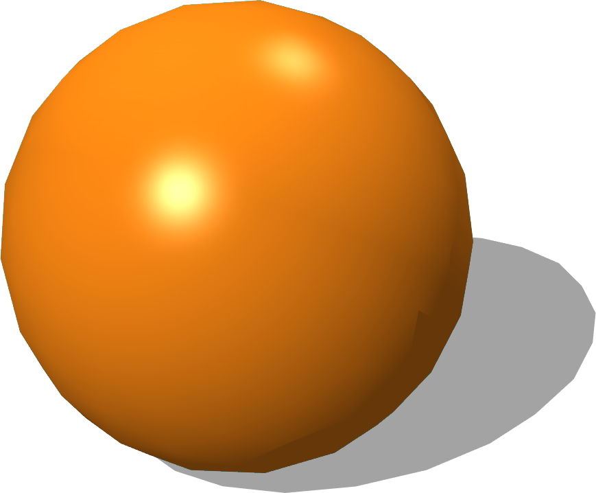

# Balls

## Ball

%figure "Ball"



%end

```
Ball {
      SFVec3f translation 0 0.0325 0
      SFRotation rotation 0 1 0 0
      SFString name "ball"
      SFColor color 1.0 0.54 0.08
      SFFloat radius 0.0325
      SFFloat mass 0.055
      MFVec3f centerOfMass [0 -0.0001 0]
      SFFloat linearDamping 0.17
      SFFloat angularDamping 0.33
      SFString contactMaterial "default"
}
```

> **File location**: "WEBOTS\_HOME/projects/objects/balls/protos/Ball.proto"

### Description

The Ball's size, mass and color correspond to the soccer ball used in the Robocup SPL
You can change the centerOfMass to [0 0 0] to avoid the random rolling effect

## PingPongBall

%figure "PingPongBall"


%end

```
PingPongBall {
      SFVec3f translation 0 0 0
      SFRotation rotation 0 1 0 0
      SFString name "ping pong ball"
      MFNode immersionProperties []
      MFString textureUrl "textures/pingpong_logo.jpg"
}
```

> **File location**: "WEBOTS\_HOME/projects/objects/balls/protos/PingPongBall.proto"

### Description

A ping pong ball.

## SoccerBall

%figure "SoccerBall"


%end

```
SoccerBall {
      SFVec3f translation 0 0.1 0
      SFRotation rotation 0 1 0 0
      SFString name "soccer ball"
      SFFloat radius 0.113
      SFFloat mass 0.6
}
```

> **File location**: "WEBOTS\_HOME/projects/objects/balls/protos/SoccerBall.proto"

### Description

A black and white soccer ball with customizable radius and mass.
This object is physics-enabled so it will roll or bounce when hit.

