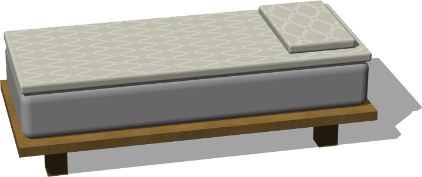

# Bedroom

## Bed

%figure "Bed"



%end

```
Bed {
      SFVec3f    translation         0 0 0
      SFRotation rotation            0 1 0 0
      SFString   name                "bed"
      SFVec3f    size                0.8 0.5 1.8
      SFBool     doubleBed           FALSE
      SFVec3f    feetSize            0.1 0.2 0.1
      SFFloat    feetPadding         0.1
      SFFloat    frameThickness      0.05
      MFString   fabricTextureUrl    "textures/fabric_with_motif.jpg"
      SFVec2f    fabricTileSize      0.5 0.5
      MFString   frameTextureUrl     "textures/wood.jpg"
      SFVec2f    frameTileSize       0.5 0.5
}
```

> **File location**: "WEBOTS\_HOME/projects/objects/bedroom/protos/Bed.proto"

### Description

Customizable bed with feet and one or 2 pillows

