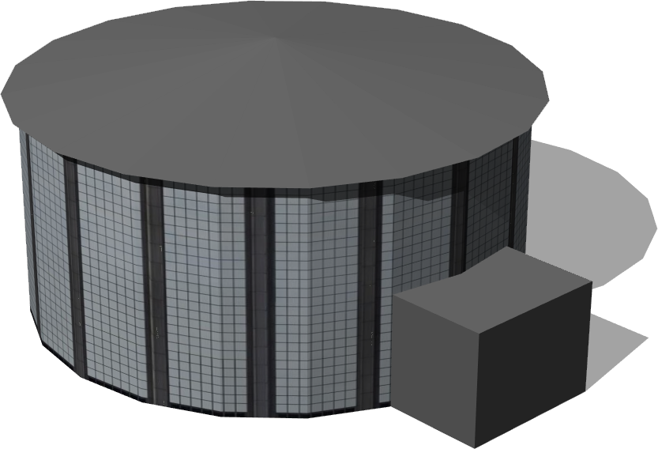
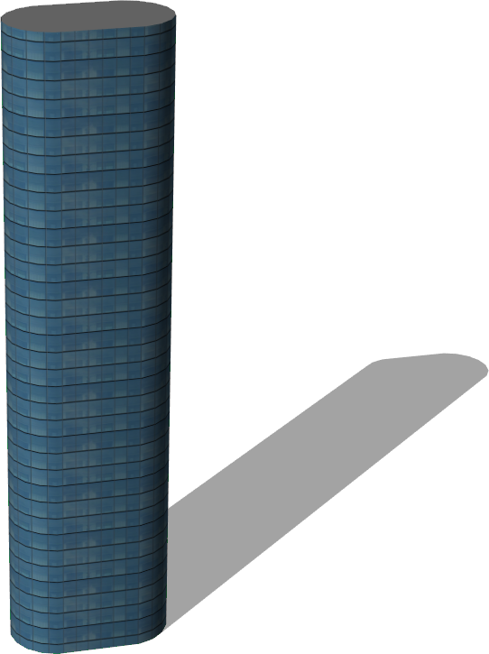
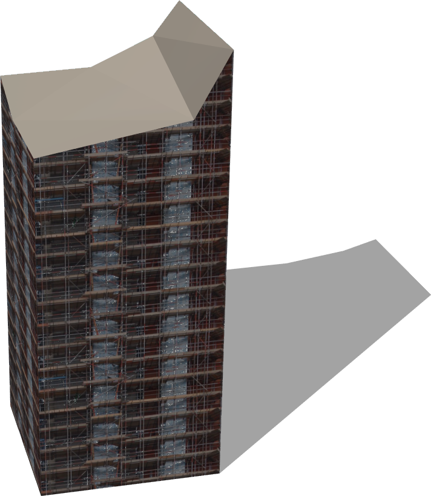
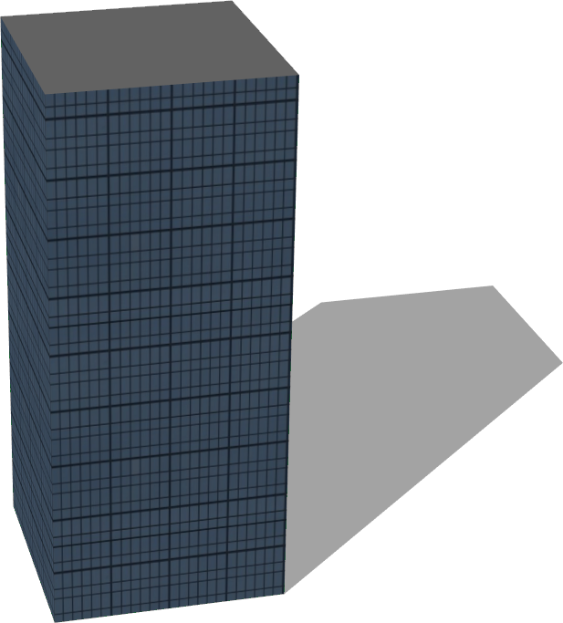
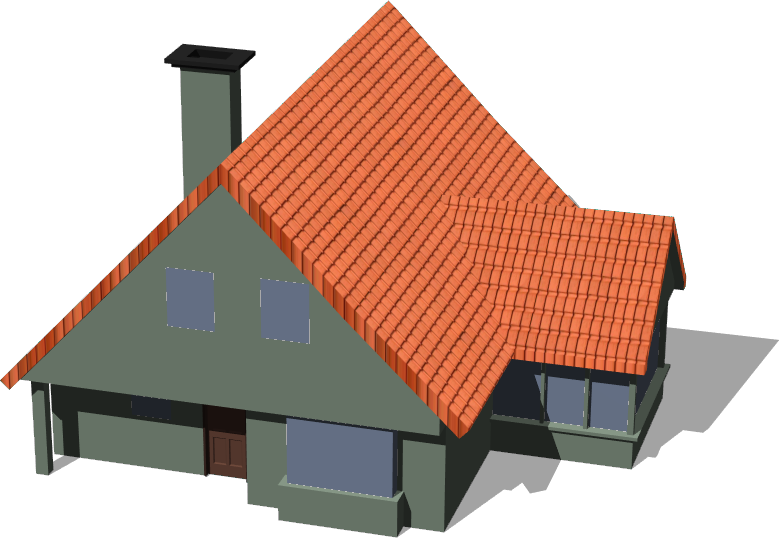
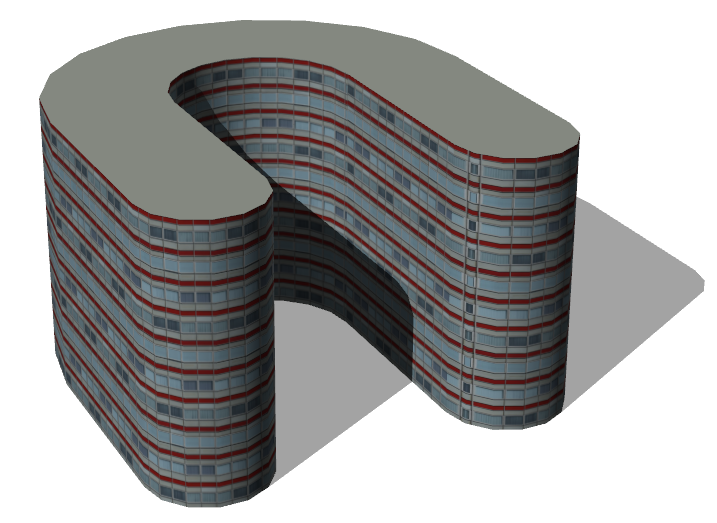

# Buildings

## Auditorium

%figure "Auditorium"



%end

```
Auditorium {
   SFVec3f translation 0 0 0
   SFRotation rotation 0 1 0 0
   SFString name "auditorium"
}
```

> **File location**: "WEBOTS\_HOME/projects/objects/buildings/protos/Auditorium.proto"

### Description

Building : A classic auditoruim.

## BigGlassTower

%figure "BigGlassTower"



%end

```
BigGlassTower {
   SFVec3f translation 0 0 0
   SFRotation rotation 0 1 0 0
   SFString name "big glass tower"
}
```

> **File location**: "WEBOTS\_HOME/projects/objects/buildings/protos/BigGlassTower.proto"

### Description

Building : A big glass tower.

## Building

```
Building {
   SFVec3f     translation            0 0 0
   SFRotation  rotation               0 1 0 0
   SFString    name                   "building"                           
   SFFloat     floorHeight            3                                    
   SFInt32     floorNumber            3                                    
   SFInt32     startingFloor          0                                    
       MFVec2f corners                [10 10, 10 -10, -10 -10, -10 10 ]    
   SFNode      wallAppearance         Appearance { material Material {} }  
   MFString    groundFloor            [ ]                                  
   MFFloat     groundFloorScale       [ ]                                  
   MFFloat     groundFloorTranslation [ ]                                  
   SFNode      roofAppearance         Appearance { material Material {} }  
   SFString    roofShape              "pyramidal roof"                     
   SFFloat     roofHeight             3                                    
   SFBool      enableBoundingObject   TRUE                                 
   SFBool      bottom                 FALSE                                
   SFString    model                  "building"
   MFColor     recognitionColors      []
}
```

> **File location**: "WEBOTS\_HOME/projects/objects/buildings/protos/Building.proto"

### Description

A customizable building, the size, appearance and geometry can fully be defined.
The roof shape can be either 'flat' or 'pyramidal' (in case of pyramidal roof it is possible to define the height).

### Field Summary

- `name`: could contain the name of the building

- `floorHeight`: defines the height of one floor

- `floorNumber`: defines the number of floors (excluding roof)

- `startingFloor`: defines the number of floors between the ground and the first floor

- `corners`: defines the geometry of the building

- `wallAppearance`: defines the wall appearance

- `groundFloor`: defines the texture to be used for the first floor (optional)

- `groundFloorScale`: defines the horizontal scale of the ground texture

- `groundFloorTranslation`: defines the translation of the ground floor textures

- `roofAppearance`: defines the roof appearance

- `roofShape`: defines the geometry of the roof (flat or pyramidal)

- `roofHeight`: defines the height of the roof (used only in the case of pyramidal roof)

- `enableBoundingObject`: defines if the building should have a bounding object or not

- `bottom`: defines if the building should have a floor (visible from below) or not

## BuildingUnderConstruction

%figure "BuildingUnderConstruction"



%end

```
BuildingUnderConstruction {
   SFVec3f translation 0 0 0
   SFRotation rotation 0 1 0 0
   SFString name "building under construction"
}
```

> **File location**: "WEBOTS\_HOME/projects/objects/buildings/protos/BuildingUnderConstruction.proto"

### Description

Building : Building under construction with scaffolding.

## BungalowStyleHouse

%figure "BungalowStyleHouse"


%end

```
BungalowStyleHouse {
   SFVec3f translation         0 0 0
   SFRotation rotation         0 1 0 0
   SFString name               "bungalow style house"
   SFBool fence                TRUE
   SFBool floor                TRUE
   SFBool chimney              TRUE
   SFBool enableBoundingObject TRUE
   SFNode appearance           Appearance { material Material { diffuseColor 0.52 0.73 0.76 } }
   SFNode floorAppearance      Appearance { material Material { diffuseColor 0.27 0.14 0.03 } }
   SFNode fenceAppearance      Appearance { material Material { } texture ImageTexture { url ["textures/wood.jpg"] } textureTransform TextureTransform { scale 10 10 } }
}
```

> **File location**: "WEBOTS\_HOME/projects/objects/buildings/protos/BungalowStyleHouse.proto"

### Description

A configurable bungalow style house
based on the blender model of noenmaster (http://www.blendswap.com/blends/view/66305)
Sponsored by the CTI project RO2IVSim (http://transport.epfl.ch/simulator-for-mobile-robots-and-intelligent-vehicles)

## CommercialBuilding

%figure "CommercialBuilding"


%end

```
CommercialBuilding {
   SFVec3f translation 0 0 0
   SFRotation rotation 0 1 0 0
   SFString name "commercial building"
}
```

> **File location**: "WEBOTS\_HOME/projects/objects/buildings/protos/CommercialBuilding.proto"

### Description

Building : A commercial building.

## CyberboticsTower

%figure "CyberboticsTower"



%end

```
CyberboticsTower {
   SFVec3f translation 0 0 0
   SFRotation rotation 0 1 0 0
   SFString name "Cyberbotics tower"
}
```

> **File location**: "WEBOTS\_HOME/projects/objects/buildings/protos/CyberboticsTower.proto"

### Description

Building : The Cyberbotics tower.

## FastFoodRestaurant

%figure "FastFoodRestaurant"


%end

```
FastFoodRestaurant {
   SFVec3f     translation   0 0 0
   SFRotation  rotation      0 1 0 0
   SFString    name          "fast food restaurant"
   SFFloat     height        4
   SFFloat     length        10
   SFFloat     width         10
   SFString    brand         "KFC"
   SFInt32     numberOfSides 1
}
```

> **File location**: "WEBOTS\_HOME/projects/objects/buildings/protos/FastFoodRestaurant.proto"

### Description

Fast food restaurant that comes in 4 versions: 'KFC', 'FFC', 'subway' or 'momo'.
The building can be changed to a two sided restaurant using the 'numberOfSides' parameter.

## HollowBuilding

%figure "HollowBuilding"


%end

```
HollowBuilding {
   SFVec3f translation 0 0 0
   SFRotation rotation 0 1 0 0
   SFString name "hollow building"
}
```

> **File location**: "WEBOTS\_HOME/projects/objects/buildings/protos/HollowBuilding.proto"

### Description

Building : A hollow building.

## Hotel

%figure "Hotel"


%end

```
Hotel {
   SFVec3f translation 0 0 0
   SFRotation rotation 0 1 0 0
   SFString name "hotel"
}
```

> **File location**: "WEBOTS\_HOME/projects/objects/buildings/protos/Hotel.proto"

### Description

Building : A big hotel.

## ModernHouse

```
ModernHouse {
   SFVec3f translation         0 0 0
   SFRotation rotation         0 1 0 0
   SFString name               "modern house"
   SFBool enableBoundingObject TRUE
   SFNode appearance           Appearance { material Material { diffuseColor 0.56 0.18 0.12 } }
   SFNode windowAppearance     Appearance { material Material { diffuseColor 0.38 0.55 0.69 } }
}
```

> **File location**: "WEBOTS\_HOME/projects/objects/buildings/protos/ModernHouse.proto"

### Description

A simple modern house
based on the blender model of andreschneider (http://www.blendswap.com/blends/view/65734)
Sponsored by the CTI project RO2IVSim (http://transport.epfl.ch/simulator-for-mobile-robots-and-intelligent-vehicles)

## Museum

%figure "Museum"


%end

```
Museum {
   SFVec3f translation 0 0 0
   SFRotation rotation 0 1 0 0
   SFString name "museum"
}
```

> **File location**: "WEBOTS\_HOME/projects/objects/buildings/protos/Museum.proto"

### Description

Building : An old museum.

## ResidentialBuilding

```
ResidentialBuilding {
   SFVec3f translation 0 0 0
   SFRotation rotation 0 1 0 0
   SFString name "residential building"
}
```

> **File location**: "WEBOTS\_HOME/projects/objects/buildings/protos/ResidentialBuilding.proto"

### Description

Building : A residential building.

## SimpleBuilding

%figure "SimpleBuilding"


%end

```
SimpleBuilding {
   SFVec3f     translation            0 0 0
   SFRotation  rotation               0 1 0 0
   SFString    name                   "building"                         
   SFFloat     floorHeight            3                                  
   SFInt32     floorNumber            3                                  
   SFInt32     startingFloor          0                                  
       MFVec2f corners                [10 10, 10 -10, -10 -10, -10 10 ]  
   SFString    wallType               "windowed building"                
   MFColor     wallColor              [ ]                                
   MFString    groundFloor            [ ]                                
   MFFloat     groundFloorScale       [ ]                                
   MFFloat     groundFloorTranslation [ ]                                
   SFString    roofType               "tiled"                            
   MFColor     roofColor              [ ]                                
   SFString    roofShape              "pyramidal roof"                   
   SFBool      snowOnRoof             FALSE                              
   SFFloat     roofHeight             3                                  
   SFBool      enableBoundingObject   TRUE                               
   SFBool      bottom                 FALSE                              
}
```

> **File location**: "WEBOTS\_HOME/projects/objects/buildings/protos/SimpleBuilding.proto"

### Description

A customizable building, the size and geometry can fully be defined.
The texture of the wall and roof can be selected using the fields 'wallType' and 'roofType'.
The roof shape can be either 'flat' or 'pyramidal' (in case of pyramidal roof it is possible to define the height).

### Field Summary

- `name`: could contain the name of the building

- `floorHeight`: defines the height of one floor

- `floorNumber`: defines the number of floors (excluding roof)

- `startingFloor`: defines the floor number for the "ground floor" of the building, as not all buildings start at the ground floor.

- `corners`: defines the geometry of the building

- `wallType`: defines the texture to be used for the wall

- `wallColor`: defines the color to be used for the wall

- `groundFloor`: defines the texture to be used for the first floor (optional)

- `groundFloorScale`: defines the horizontal scale of the ground texture

- `groundFloorTranslation`: defines the translation of the ground floor textures

- `roofType`: defines the texture to be used for the roof

- `roofColor`: defines the color to be used for the roof

- `roofShape`: defines the geometry of the roof (flat or pyramidal)

- `snowOnRoof`: defines if the texture with or without snow should be used

- `roofHeight`: defines the height of the roof (used only in the case of pyramidal roof)

- `enableBoundingObject`: defines if the building should have a bounding object or not

- `bottom`: defines if the building should have a floor (visible from below) or not

## SimpleTwoFloorsHouse

%figure "SimpleTwoFloorsHouse"



%end

```
SimpleTwoFloorsHouse {
   SFVec3f translation         0 0 0
   SFRotation rotation         0 1 0 0
   SFString name               "simple two floors house"
   SFBool enableBoundingObject TRUE
   SFNode appearance           Appearance { material Material { diffuseColor 0.63 0.71 0.63 } }
}
```

> **File location**: "WEBOTS\_HOME/projects/objects/buildings/protos/SimpleTwoFloorsHouse.proto"

### Description

A simple house with two floors
based on the blender model of andreschneider (http://www.blendswap.com/blends/view/59482)
Sponsored by the CTI project RO2IVSim (http://transport.epfl.ch/simulator-for-mobile-robots-and-intelligent-vehicles)

## TheThreeTowers

%figure "TheThreeTowers"


%end

```
TheThreeTowers {
   SFVec3f translation 0 0 0
   SFRotation rotation 0 1 0 0
   SFString name "three towers"
}
```

> **File location**: "WEBOTS\_HOME/projects/objects/buildings/protos/TheThreeTowers.proto"

### Description

Building : A group of three towers.

## UBuilding

%figure "UBuilding"



%end

```
UBuilding {
   SFVec3f translation 0 0 0
   SFRotation rotation 0 1 0 0
   SFString name "U building"
}
```

> **File location**: "WEBOTS\_HOME/projects/objects/buildings/protos/UBuilding.proto"

### Description

Building : A building with a "U" form.

