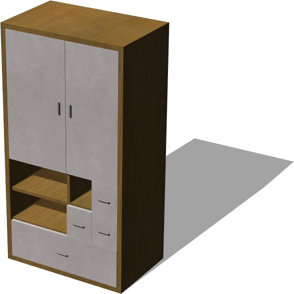
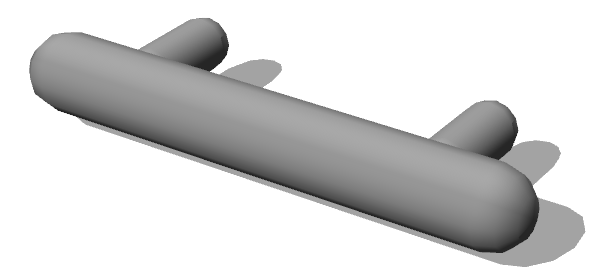

# Cabinet

## Cabinet

%figure "Cabinet"



%end

```
Cabinet {
   SFVec3f translation 0 0 0
   SFRotation rotation 0 1 0 0
   SFString name "cabinet"
   SFFloat depth 0.5
   SFFloat innerThickness 0.02
   SFFloat outerThickness 0.03
   MFFloat rowsHeights [
    0.24
    0.2
    0.2
    0.4
    0.4
  ]
   MFFloat columnsWidths [
    0.4
    0.17
    0.17
  ]
   MFString layout [
    "RightSidedDoor (1, 4, 1, 2, 1.5)"
    "LeftSidedDoor (2, 4, 2, 2, 1.5)"
    "Drawer (3, 3, 1, 1, 1.5)"
    "Drawer (2, 2, 1, 1, 1.5)"
    "Drawer (3, 2, 1, 1, 1.5)"
    "Drawer (1, 1, 3, 1, 3.5)"
    "Shelf (1, 5, 3, 0)"
    "Shelf (1, 4, 3, 0)"
    "Shelf (1, 3, 3, 0)"
    "Shelf (1, 2, 3, 0)"
    "Shelf (1, 3, 0, 1)"
    "Shelf (2, 3, 0, 1)"
  ]
   SFNode handle CabinetHandle {}
   MFString mainTextureUrl "textures/wood.jpg"
   MFString objectTextureUrl "textures/plastic.jpg"
}
```

> **File location**: "WEBOTS\_HOME/projects/objects/cabinet/protos/Cabinet.proto"

### Description

A customizable cabinet containing elements (shelves, dynamic doors, and drawers).
The internal cabinet layout is a grid in which the elements can be inserted.
The grid dimension (and so the cabinet size) is defined by the 'rowsHeights' and the 'columnsWidths' fields.
The 'layout' field is defining the location and the dimension of the elements into the grid layout, according to the following syntax:
- 'layout': list("[RightSidedDoor|LeftSiderDoor|Drawer|Shelf] (x, y, column span, row span[, mass])"
The coordinate origin (1,1) of the grid layout is at the bottom left corner.

## CabinetDoor

%figure "CabinetDoor"


%end

```
CabinetDoor {
   SFVec3f translation 0 0 0
   SFString name "cabinet door"
   SFVec3f size 0.3 0.2 0.2
   SFBool rightSided TRUE
   SFFloat thickness 0.03
   SFFloat mass 1.5
   SFNode handle CabinetHandle {}
   MFString mainTextureUrl "textures/wood.jpg"
   MFString objectTextureUrl "textures/plastic.jpg"
}
```

> **File location**: "WEBOTS\_HOME/projects/objects/cabinet/protos/CabinetDoor.proto"

### Description

A door for the Cabinet PROTO

## CabinetDrawer

%figure "CabinetDrawer"


%end

```
CabinetDrawer {
   SFVec3f translation 0 0 0
   SFString name "cabinet drawer"
   SFVec3f size 0.3 0.2 0.2
   SFFloat thickness 0.03
   SFFloat mass 1.5
   SFNode handle CabinetHandle {}
   MFString mainTextureUrl "textures/wood.jpg"
   MFString objectTextureUrl "textures/plastic.jpg"
}
```

> **File location**: "WEBOTS\_HOME/projects/objects/cabinet/protos/CabinetDrawer.proto"

### Description

A drawer for the Cabinet PROTO.

## CabinetHandle

%figure "CabinetHandle"



%end

```
CabinetHandle {
   SFVec3f translation 0 0 0
   SFRotation rotation 0 1 0 0
   SFString name "cabinet handle"
   SFFloat handleLength 0.065
   SFFloat handleRadius 0.0055
   SFColor handleColor 0.74 0.74 0.74
   SFFloat mass 0.3
}
```

> **File location**: "WEBOTS\_HOME/projects/objects/cabinet/protos/CabinetHandle.proto"

### Description

A handle for the Cabinet PROTO

