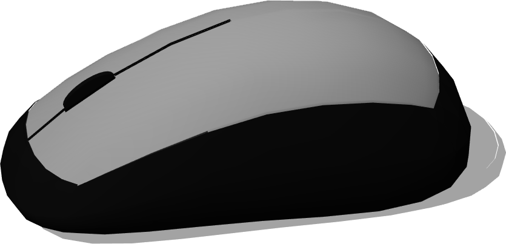

# Computers

## ComputerMouse

%figure "ComputerMouse"



%end

```
ComputerMouse {
   SFVec3f translation 0 0 0
   SFRotation rotation 0 1 0 0
   SFString name "computer mouse"
   SFColor topColor 0.71 0.71 0.71
   SFColor bottomColor 0.056 0.056 0.056
   SFFloat mass 0.1
}
```

> **File location**: "WEBOTS\_HOME/projects/objects/computers/protos/ComputerMouse.proto"

### Description

A computer mouse
Author: myriam.mosimann@epfl.ch

## DesktopComputer

%figure "DesktopComputer"


%end

```
DesktopComputer {
   SFVec3f translation 0 0 0
   SFRotation rotation 0 1 0 0
   SFString name "desktop computer"
   SFColor powerbuttonColor 0.252903 0.263813 0.266361
   SFFloat mass 0
}
```

> **File location**: "WEBOTS\_HOME/projects/objects/computers/protos/DesktopComputer.proto"

### Description

A computer tower
Author: myriam.mosimann@epfl.ch

## Keyboard

%figure "Keyboard"


%end

```
Keyboard {
   SFVec3f translation 0 0 0
   SFRotation rotation 0 1 0 0
   SFString name "keyboard"
   SFColor color 0.1 0.1 0.1
   SFFloat mass 0
}
```

> **File location**: "WEBOTS\_HOME/projects/objects/computers/protos/Keyboard.proto"

### Description

A computer keyboard
Author: myriam.mosimann@epfl.ch

## Laptop

%figure "Laptop"


%end

```
Laptop {
   SFVec3f translation 0 0 0
   SFRotation rotation 0 1 0 0
   SFString name "laptop"
   SFString controller "laptop_switch_on"
}
```

> **File location**: "WEBOTS\_HOME/projects/objects/computers/protos/Laptop.proto"

### Description

A simple laptop.

## Monitor

%figure "Monitor"


%end

```
Monitor {
   SFVec3f translation 0 0 0
   SFRotation rotation 0 1 0 0
   SFString name "monitor"
   SFColor color 0.15 0.15 0.15
   SFFloat mass 0
}
```

> **File location**: "WEBOTS\_HOME/projects/objects/computers/protos/Monitor.proto"

### Description

A computer monitor.

