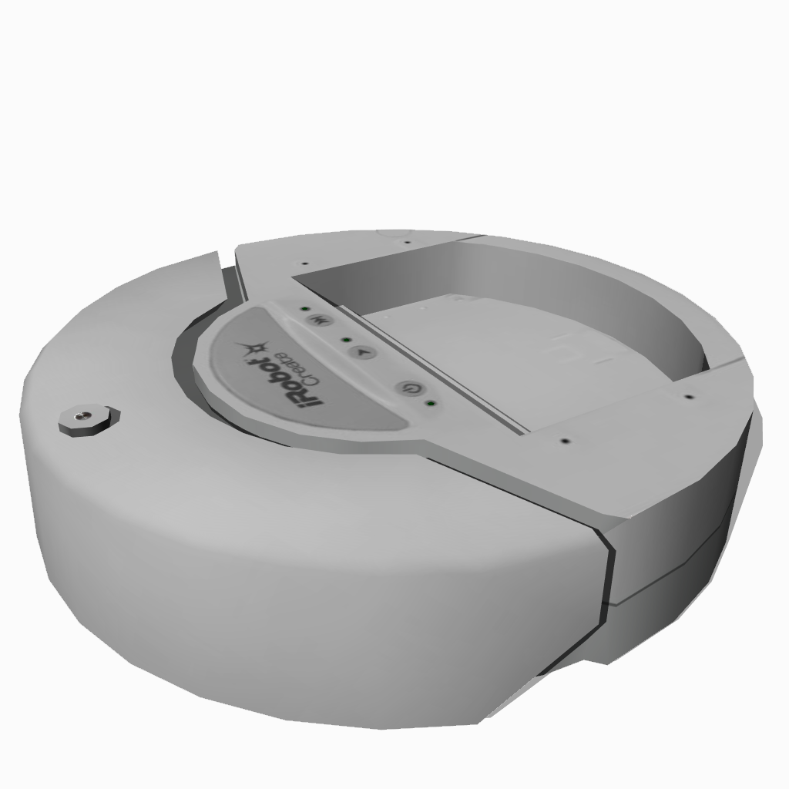

## iRobot's Create

%figure "Create model in Webots"

%end

The [iRobot Create](http://www.irobot.com/About-iRobot/STEM/Create-2.aspx) robot is a customizable frame based on the famous Roomba vacuum cleaning platform, and is created by iRobot.

### Samples

You will find the following sample in this folder: "WEBOTS\_HOME/projects/robots/irobot/create/worlds".

#### create.wbt

 This simulation shows the Create robot which cleans a small apartment.
The robot moves straight ahead.
When hitting an obstacle or detecting a virtual wall, the robot turns randomly.
The dust on the ground is a texture of a Display device managed by a Supervisor controller.
The Supervisor removes draws transparent circles into this texture at the robot's location to simulate cleaning dust.
