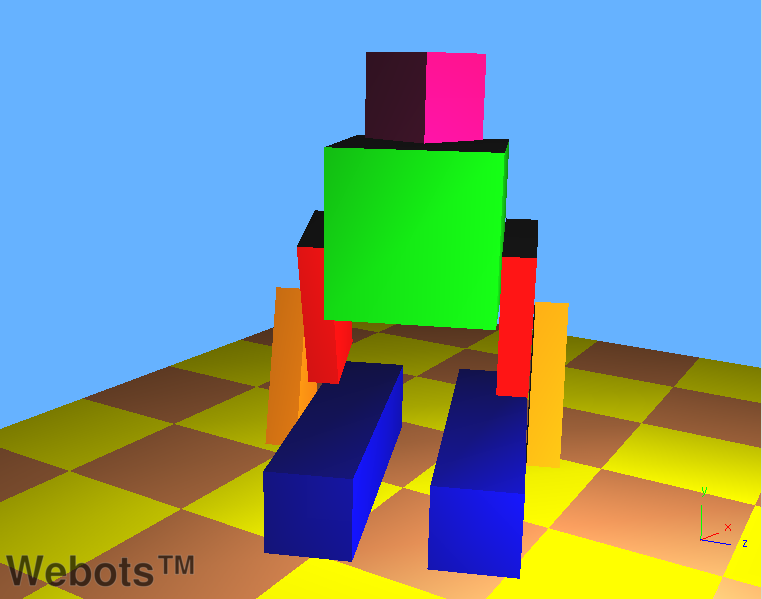
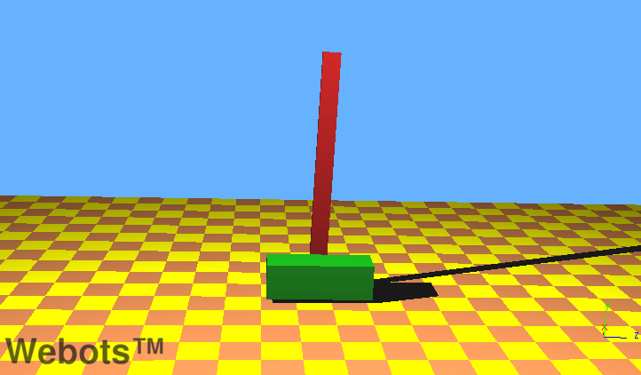
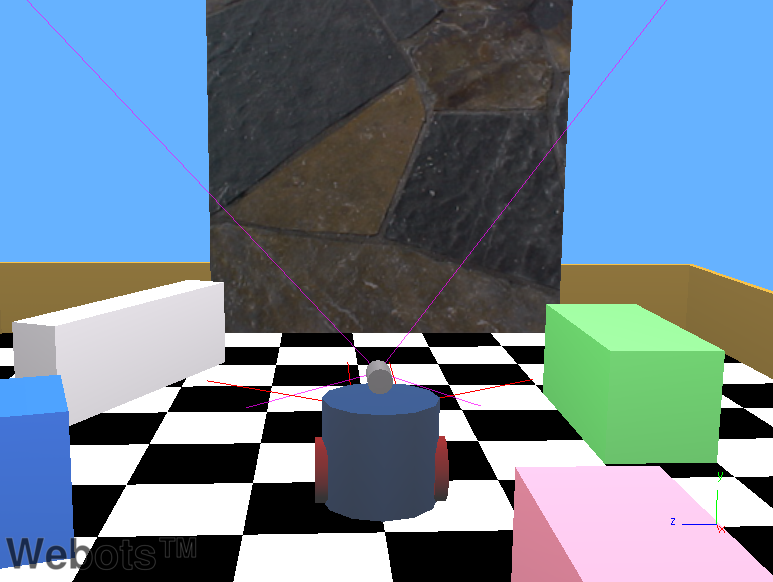

## How To

This section gives various examples of complexe behaviours and/or
functionalities. The world files are located in the
"WEBOTS_MODULES_PATH/projects/samples/howto/world" directory, and their
controllers in the "WEBOTS_MODULES_PATH/projects/samples/howto/controllers"
directory. For each, the world file and its corresponding controller are named
according to the behaviour they exemplify.

### binocular.wbt

####binocular.wbt

This example simply shows how to equip a robot with two `Camera`s for
stereovision. The example does not actually perform stereovision or any form of
computer vision.

### biped.wbt

####biped.wbt

In this example, a biped robot stands up while his head rotates. After a few
seconds, all the motors are turned off and the robot collapses. This example
illustrates how to build a simple articulated robot and also how to turn off
motor power.

### force_control.wbt

####force_control.wbt

This world shows two boxes connected by a `LinearMotor`. Here, the purpose is to
demonstrate the usage of the `wb_motor_set_force()` function to control a
`LinearMotor` with a user specified force. In this example,
`wb_motor_set_force()` is used to simulate the effect of a spring and a damper
between the two boxes. When the simulation starts, the motor force is used to
move the boxes apart. Then the motor force is turned off and boxes oscillate for
a while now according to the spring and damping equations programmed in the
controller.

### inverted_pendulum.wbt

####inverted_pendulum.wbt

In this example, a robot moves from left to right in order to keep an inverted
pendulum upright. This is known as the "Inverted Pendulum Problem", and it is
solved in our example by using a PID (Proportional Integral Differential)
controller.

### physics.wbt

####physics.wbt

In this example, a robot flies using a physics plugin. This plugins is an
example of:

### supervisor.wbt

####supervisor.wbt

This shows a simple soccer game with six robots and a referee. The `Supervisor`
code demonstrates the usage of several `Supervisor` functions. For example, the
`Supervisor` inserts a second ball to the simulation, changes its color, takes a
picture of the 3D view, restarts the simulation, etc. In addition the
`Supervisor` also plays the role of a soccer referee: it displays the current
score, places the players to their initial position when a goal is scored, etc.

### texture_change.wbt

####texture_change.wbt

In this example, a robot moves forward and backward in front of a large textured
panel. The robot watches the panel with its `Camera`. Meanwhile a `Supervisor`
switches the image displayed on the panel.

### town.wbt

####town.wbt

This example shows a complex city model built with various `Transform` nodes.
The model makes a intensive use of the `DEF` and `USE` VRML keywords.

