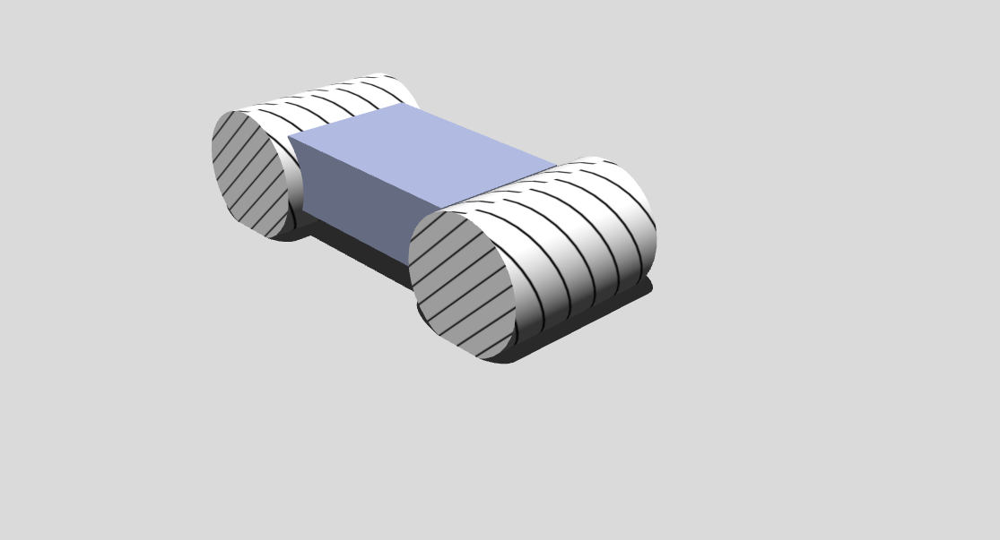

## How To

This section gives various examples of complex behaviors and/or functionalities.
The world files are located in the "WEBOTS\_HOME/projects/samples/howto/worlds" directory, and their controllers in the "WEBOTS\_HOME/projects/samples/howto/controllers" directory.
For each, the world file and its corresponding controller are named according to the behavior they exemplify.

### asymmetric\_friction1.wbt

**Keywords**: ContactProperties, asymmetric friction

 This example shows how to setup asymmetric friction between two solids.
A small box is sliding on two leaning fixed boxes.
Each boxes are stripped with black lines.
There is a smaller friction along the black lines, therefore the box is sliding along the black lines.

### asymmetric\_friction2.wbt

**Keywords**: ContactProperties, asymmetric friction

 This example shows how to setup asymmetric friction between two solids.
A solid is composed of two cylinders is sliding down a leaning plane.
The black strips on the cylinders indicate the friction direction:
there is a smaller friction along the black lines.
Rotate the solid to modify its speed.

### binocular.wbt

**Keywords**: Camera, stereovision, stereoscopic cameras

 This example simply shows how to equip a robot with two `Camera`s for stereovision.
The example does not actually perform stereovision or any form of computer vision.

### biped.wbt

**Keywords**: Humanoid robot, biped robot, power off, passive joint

 In this example, a biped robot stands up while his head rotates.
After a few seconds, all the motors are turned off and the robot collapses.
This example illustrates how to build a simple articulated robot and also how to turn off motor power.

### center\_of\_mass.wbt

**Keywords**: Center of mass

 In this example, a light robot rotates a heavy mass.
The inertia of the heavy mass let the robot base turns round.
The overall center of mass of the robot is changing.
This can be visualized with the `View / Optional Rendering / Show Center of Mass...` or `mass` tab of in the node editor when the robot is selected.

### contact\_points.wbt

**Keywords**: Physics plugin, contact points

 In this example, a box falls until it reaches the ground.
A physics plugin (cf. `WorldInfo.physics`) get information on the contact points and display the reaction forces on the `Console` and as red lines.

### cylinder\_stack.wbt

**Keywords**: Supervisor, contact points, cylinder collisions

 In this example, a stack of cylinders collapses.
A Supervisor get information on the contact points and display the reaction forces in the `Console`.

### force\_control.wbt

**Keywords**: Force control, linear motor, spring and damper

 This world shows two boxes connected by a `LinearMotor`.
Here, the purpose is to demonstrate the usage of the `wb_motor_set_force()` function to control a `LinearMotor` with a user specified force.
In this example, `wb_motor_set_force()` is used to simulate the effect of a spring and a damper between the two boxes. When the simulation starts, the motor force is used to move the boxes apart.
Then, the motor force is turned off and the boxes oscillate for a while according to the spring and damping equations programmed in the controller.

### four\_wheels.wbt

**Keywords**: four-wheeled frame

 This example shows three models of four-wheeled vehicles.
In the first layout, the four motorized wheels are positioned circularly, as it could be done for omnidirectional-wheeled robots.
In the second layout, the four motorized wheels are oriented in the same direction, as it could be done for a robot with tracks.
In the third layout, a simple [Ackermann steering geometry](https://en.wikipedia.org/wiki/Ackermann_steering_geometry) is shown.
Note that more completed Ackermann steering geometry can be achieved using the `AckermannVehicle.proto` model, and the `vehicle` library (cf. the [automobile book](https://www.cyberbotics.com/doc/automobile/index)).

### gui\_tracker.wbt

**Keywords**: GUI, custom Qt-based robot window

 This example shows how to use the deprecated Qt-based system to create custom windows.
A Supervisor is getting the position of five e-pucks moving randomly, and this information is sent to the custom robot window plugin called `tracking window`.
This window is based on Qt (embedded in Webots) and the `Qt utils` helper library.

### inverted\_pendulum.wbt

**Keywords**: Inverted pendulum, PID, LinearMotor

 In this example, a robot moves from left to right in order to keep an inverted pendulum upright.
This is known as the "Inverted Pendulum Problem", and it is solved in our example by using a PID (Proportional Integral Differential) controller.

### mouse\_events.wbt

**Keywords**: Mouse events

 This example shows how to use the Supervisor mouse events.
When the simulation is running, the `Supervisor` controller called `mouse_events.c` get the last mouse event and displays in the `Console` the 3D coordinate and the name of the hit object.

### omni\_wheels.wbt

**Keywords**: Omnidirectional wheels

 This example shows how to create omnidirectional wheels.
In this example, the omnidirectional wheels are modeled with two layers of joints and cylinders solids.
Faster omnidirectional wheels implementations could be achieved using asymmetric friction (cf. `Youbot` model).

### passive\_dynamic\_walker.wbt

**Keywords**: Passive dynamic walker

 This example shows how to create a passive dynamic walker.
This biped robot is not motorized.
It goes done the slope in a smooth move simply because of its shape and its potential energy.

### pedal\_racer.wbt

**Keywords**: Pedal racer, apply a force

 This example shows how to interact simply with a complex model.
You can apply a force to the pedals using `Alt + mouse left clic.`.

### physics.wbt

**Keywords**: Physics plugin, OpenGL drawing, flying robot, Emitter, Receiver

 In this example, a robot flies using a physics plugin.
This plugins is an example of:

- how to access Webots objects in the physics plugin
- how to exchange information with the controller
- how to add custom forces
- how to move objects
- how to handle collisions
- how to draw objects using OpenGL

### rope.wbt

TODO

### sick\_terrain\_scanning.wbt

TODO

### texture\_change.wbt

**Keywords**: Supervisor, texture, `wb_supervisor_field_set_*()`, Camera

 In this example, a robot moves forward and backward in front of a large textured panel.
The robot watches the panel with its `Camera`. Meanwhile a `Supervisor` switches the image displayed on the panel.

### vision.wbt

TODO

### ziegler\_nichols.wbt

TODO
