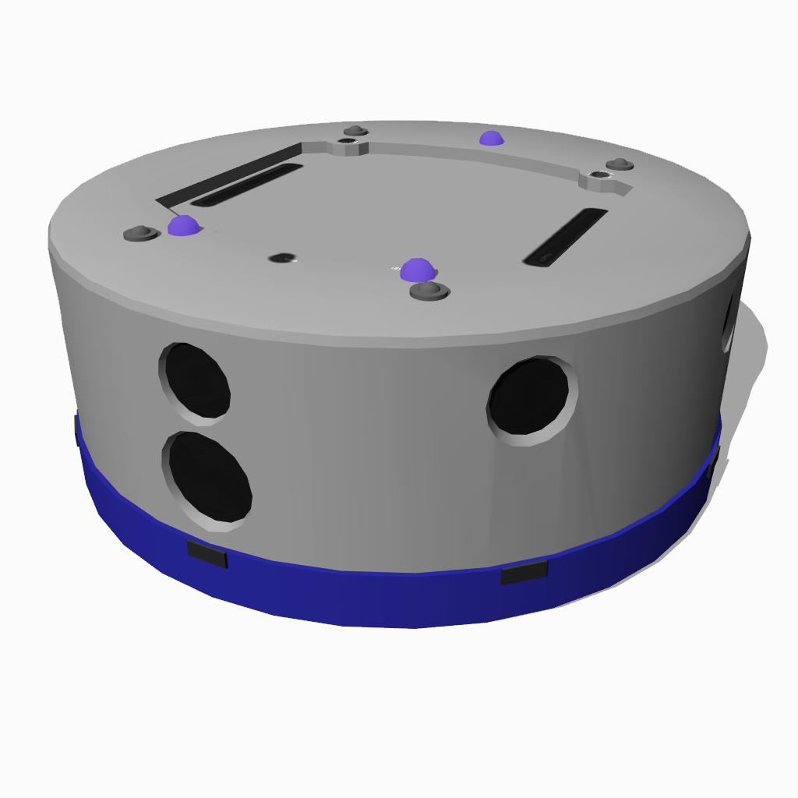

## K-Team's Khepera IV

%figure "Khepera IV model in Webots"



%end

The "Khepera IV" robot is a two-wheeled robot produced by [K-Team](https://www.k-team.com/mobile-robotics-products/khepera-iv).
It is mounted by multiple sensors including 8 distance sensors.

### Movie Presentation


### Khepera4 PROTO

```
Khepera4 {
  SFVec3f    translation         0 0 0
  SFRotation rotation            0 1 0 0
  SFString   name                "Khepera IV"
  SFString   controller          "khepera4"
  SFString   controllerArgs      ""
  SFString   customData          ""
  SFBool     synchronization     TRUE
  SFString   bodyMaterial        "default"
  SFString   wheelMaterial       "default"
  SFString   casterWheelMaterial "khepera4 caster wheel"
  SFInt32    emitterChannel      1
  SFInt32    receiverChannel     1
  MFNode     turretSlot          []
}
```

> **File location**: "WEBOTS\_HOME/projects/robots/k-team/khepera4/protos/Khepera4.proto"

#### Khepera4 Field Summary

- `translation`: Inherited from [Transform](../reference/transform.md) node.

- `rotation`: Inherited from [Transform](../reference/transform.md) node.

- `name`: Inherited from [Solid](../reference/solid.md) node.

- `controller`: Inherited from [Robot](../reference/robot.md) node.

- `controllerArgs`: Inherited from [Robot](../reference/robot.md) node.

- `customData`: Inherited from [Robot](../reference/robot.md) node.

- `synchronization`: Inherited from [Robot](../reference/robot.md) node.

- `bodyMaterial`: Defines the [Solid](../reference/solid.md) for the body.

- `wheelMaterial`: Defines the [Solid](../reference/solid.md) for the wheels.

- `casterWheelMaterial`: Defines the [Solid](../reference/solid.md) for the caster wheel.

- `emitterChannel`: Inherited from [Emitter](../reference/emitter.md) node.

- `receiverChannel`: Inherited from [Receiver](../reference/receiver.md) node.

- `turretSlot`: Extends the robot with new nodes in the turret slot.

### Samples

You will find the following sample in this folder: "WEBOTS\_HOME/projects/robots/k-team/khepera4/worlds":

#### khepera4.wbt

 This simulation shows a Khepera IV moving in a square arena.
Its camera is enabled.
