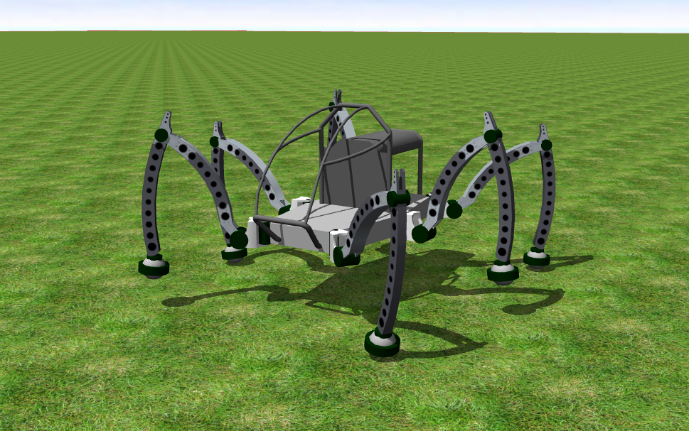

## micromagic's Mantis

%figure "Mantis model in Webots"

%end

The [Mantis robot](http://www.mantisrobot.com/) is an hydraulic powered hexapod walking machine developed in 2009 by Matt Denton.
A human can drive this robot.

### Movie Presentation

### Samples

You will find the following sample in this folder: "WEBOTS\_HOME/projects/robots/micromagic/mantis/worlds".

#### mantis.wbt

 The Mantis robot moves forwards on an uneven field.
Each Mantis motor is actuated by a simple sinusoidal function.
The parameters of these sinusoidal functions (amplitude, phase and offset) are unique for each motor and have been found empirically.
