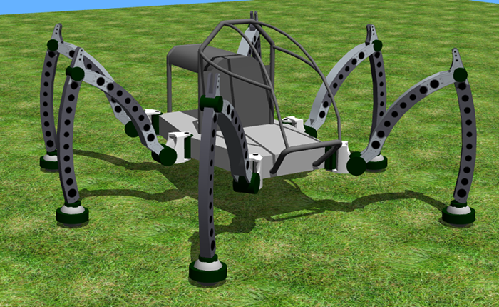

## micromagic's Mantis

%figure "Mantis model in Webots"

%end

The [Mantis robot](http://www.mantisrobot.com/) is an hydraulic powered hexapod walking machine developed from 2009 by Matt Denton.
A human can drive this robot.

### Samples

You will find the following sample in this folder: "WEBOTS\_HOME/projects/robots/micromagic/mantis/worlds".

#### mantis.wbt

 This simulation shows the Mantis robot. 
You can move its motors using the generic robot window.
