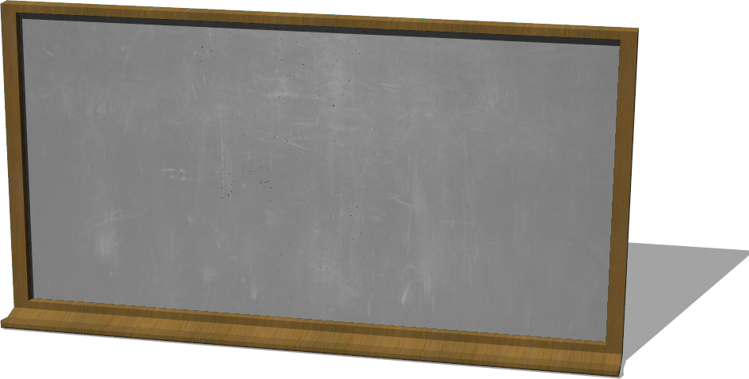

# Misc

## Blackboard

%figure "Blackboard"



%end

```
Blackboard {
   SFVec3f translation 0 0 0
   SFRotation rotation 0 1 0 0
   SFString name "blackboard"
}
```

> **File location**: "WEBOTS\_HOME/projects/objects/misc/protos/Blackboard.proto"

### Description

A blackboard (about 1.3 x 2.5 m)

## Book

%figure "Book"


%end

```
Book {
   SFVec3f translation 0 0.1 0
   SFRotation rotation 0 1 0 0
   SFString name "book"
   SFColor color 1 1 1
   MFString textureUrl "textures/book.jpg"
   SFFloat mass 0.3
}
```

> **File location**: "WEBOTS\_HOME/projects/objects/misc/protos/Book.proto"

### Description

A book (0.2 x 0.15 x 0.02 m)

## Clock

%figure "Clock"


%end

```
Clock {
   SFVec3f translation 0 0 0
   SFRotation rotation 0 1 0 0
   SFString name "clock"
}
```

> **File location**: "WEBOTS\_HOME/projects/objects/misc/protos/Clock.proto"

### Description

A clock (radius 16.5 cm)

