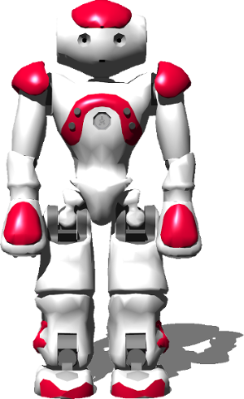
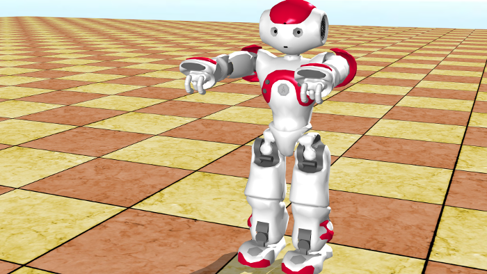
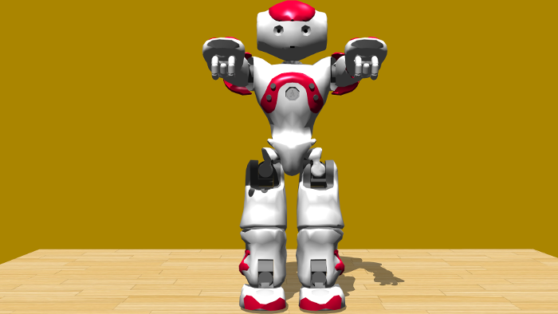
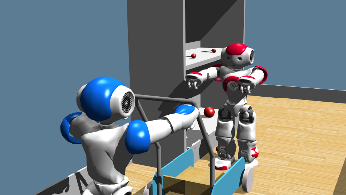

## SoftBank Robotics' Nao

%figure "Nao model in Webots"



%end

The Nao robot is a humanoid robot developed by [SoftBank Robotics](https://www.ald.softbankrobotics.com/en).
This section explains how to use Nao robot simulated in Webots together with the Choregraphe program of [SoftBank Robotics](https://www.ald.softbankrobotics.com/en).
Currently, Webots supports the Nao v3.3, v4.0 and v5.0 versions, with and without their articulated fingers (respectively with 25 and 21 degrees of freedom) for the first two.

### Movie Presentation


### Nao Models

You can switch between the Nao model thanks to the following Nao PROTO fields:

- *version* corresponds to the real Nao version.
The supported versions are "3.3", "4.0" and "5.0".
The main difference between these models is the different calibration of the physics.
The field of view of the cameras is slightly different too.
Please refer directly to the "Nao.proto" PROTO file to see the complete difference.
Note that each version has a different weight repartition in their bodies, the best contact properties in the simulated world aren't always the same.
They are currently optimized for the version 5.0 of Nao in the default Nao worlds and may not perform as well with previous versions of Nao.
- *degreeOfFreedom* corresponds to the degree of freedom of the real Nao.
For versions 3.3 and 4.0 of Nao, the supported degreeOfFreedom values are 25 and 21.
This corresponds to a model respectively with and without articulated fingers.
We recommend to use articulated fingers only if necessary because of their big resource consumption.
Version 5.0 does not exist without articulated fingers, so the only possible value is 25 in this case.

### Using Webots with Choregraphe

These instructions have been tested with Webots 8.0.0 and Choregraphe 2.1.1.10.
Please note that Webots must not be launched as root when using any world containing naoqisim, otherwise Choregraphe won't be able to send instructions to the robot in Webots.

Start Webots and open this world file: "WEBOTS\_HOME/projects/robots/aldebaran/worlds/nao.wbt" You should see a red Nao in an empty environment.
If the simulation is paused, then please start it by pushing the `Real-time` button in Webots.

The camera images in Webots (small purple viewports) should reflect what the robot sees.

Several lines of text information corresponding to the output of NAOqi should be printed to Webots console.

Now you can start Choregraphe with the --no-naoqi option.
Please make sure the Choregraphe version matches the NAOqi version printed in Webots console.
In Choregraphe choose the menu `Connection / Connect to...`.
Then, in the list, select the NAOqi that was started by Webots, on you local machine, it will have the port number 9559, unless you change it.
Note that the NAOqi will not appear in the list if the simulation was not started in Webots.
If the simulation was started but the robot still doesn't appear in the list, force the IP and port to 127.0.0.1 and 9559 in Choregraphe and then press connect.

At this point a Nao model matching the Webots model should appear in Choregraphe.
Now, in Choregraphe toggle the "Wake up" button, which is a little sun in the top right of the window.
Nao is currently in the "Stand Zero" pose, you can change its starting pose using the posture library in Choregraphe.

Then, double-click on any of the Nao parts in Choregraphe: a small window with control sliders appears.
Now, move any of the sliders: the motor movement in Choregraphe should be reflected in the Webots simulation.
If you open the Video monitor in Choregraphe you should see the picture of the Nao camera simulated by Webots.

It is possible to have several Nao robots in your simulation.
However, each Nao robot must use a different NAOqi port.
This can be done in the `controllerArgs` field in the newly created robot, e.g. 9560.

#### Using Motion Boxes

Now we can test some of the motion boxes of Choregraphe.
A simple example is a sit down -> stand up motion.
In Choregraphe, select the "Sit Down" and "Stand Up" boxes from `Box libraries > default`.
Drag and drop them in central view.
Then connect the global "onStart" input to the "Sit Down" box's "onStart" input, and the output of this box to the "Stand Up" box's "onStart" input.
Now, make sure the simulation is running, and push the `Play` button in Choregraphe.
This will make the robot sit down, and then stand up once he is done sitting down.

#### Using the Cameras

Webots simulates Nao's top and bottom cameras.
Using SoftBank Robotics's Choregraphe or the Monitor programs, it is possible to switch between these cameras.
In Choregraphe, use the "Select Camera" box in `Box Library / Vision`.
The simulated camera image can be viewed in Choregraphe: `View / Video monitor`.
The resolution of the image capture can be changed in Webots using the `cameraWidth` and `cameraHeight` fields of the robot.
Note that the simulation speed decreases as the resolution increases.
It is possible to hide the camera viewports (purple frame) in Webots, by setting the `cameraPixelSize` field to 0.
It is also possible to completely switch off the camera simulation by adding the "-nocam" option before the NAOqi port number in the `controllerArgs` field, e.g. "-nocam 9559".

### Nao PROTO

Derived from [Robot](../reference/robot.md).

```
Nao {
  SFVec3f    translation           0 0.334 0
  SFRotation rotation              1 0 0 -1.5708
  SFString   name                  "NAO"
  SFString   version               "5.0"
  SFInt32    degreeOfFreedom       25
  SFColor    color                 -1 -1 -1
  SFString   controller            "nao_demo"
  SFString   controllerArgs        ""
  SFString   customData            ""
  SFBool     synchronization       TRUE
  SFBool     selfCollision         FALSE
  SFFloat    gpsAccuracy           0.0
  SFInt32    cameraWidth           160
  SFInt32    cameraHeight          120
  SFNode     jersey                NULL
  SFInt32    channel               0
  SFString   contactMaterial       "NAO material"
  SFString   footContactMaterial   "NAO foot material"
  SFString   fingerContactMaterial "NAO finger material"
  SFFloat    fingerRadius          0.0055
  SFFloat    fingerTorque          10.0
  MFNode     bodySlot              []
  MFNode     headSlot              []
  MFNode     leftFootSlot          []
  MFNode     rightFootSlot         []
  MFNode     leftHandSlot          []
  MFNode     rightHandSlot         []
}
```

> **File location**: "WEBOTS\_HOME/projects/robots/aldebaran/protos/Nao.proto"

#### Nao Field Summary

- `version`: Defines the Nao version; either "3.3","4.0" or "5.0".

- `degreeOfFreedom`: Defines the number of degrees of freedom; either "21" (fixed fingers) or "25" (articulated fingers).

- `color`: Defines the `diffuseColor` field of the secondary [Material](../reference/material.md).

- `gpsAccuracy`: Defines the `accuracy` field of the [GPS](../reference/gps.md).

- `cameraWidth`: Defines the `width` field of the [Camera](../reference/camera.md).

- `cameraHeight`: Defines the `height` field of the [Camera](../reference/camera.md).

- `jersey`: Extends the robot with a jersey: typically NaoJersey.proto.

- `channel`: Defines the `channel` field of the [Emitter](../reference/emitter.md) and [Receiver](../reference/receiver.md).

- `contactMaterial`: Defines the `contactMaterial` field of all the [Solid](../reference/solid.md) nodes except the feet and the fingers ones.

- `footContactMaterial`: Defines the `contactMaterial` field of the foot [Solid](../reference/solid.md) nodes.

- `fingerContactMaterial`: Defines the `contactMaterial` field of the finger [Solid](../reference/solid.md) nodes.

- `fingerRadius`: Defines the radius of all the fingers.

- `fingerTorque`: Defines the torque applied on the finger motors.

- `bodySlot`: Extends the robot with new nodes in the body slot.

- `headSlot`: Extends the robot with new nodes in the head slot.

- `leftFootSlot`: Extends the robot with new nodes in the left foot slot.

- `rightFootSlot`: Extends the robot with new nodes in the right foot slot.

- `leftHandSlot`: Extends the robot with new nodes in the left hand slot.

- `rightHandSlot`: Extends the robot with new nodes in the righthand slot.

### Known Problems

#### macOS Support

SoftBank Robotics dropped the `simulator SDK` support for macOS since the `2.1.2.17` version.
Webots includes this latest version for macOS, however it doesn't work on recent macOS versions.

#### Timing Issues: Getting the Right Speed for Realistic Simulation

Choregraphe uses exclusively real-time and so the robot's motions are meant to be carried out in real-time.
The Webots simulator uses a virtual time base that can be faster or slower than real-time, depending on the CPU and GPU power of the host computer.
If the CPU and GPU are powerful enough, Webots can keep up with real-time, in this case the speed indicator in Webots shows approximately 1.0x, otherwise the speed indicator goes below 1.0x.
Choregraphe motions will play accurately only if Webots simulation speed is around 1.0x.
When Webots simulation speed drifts away from 1.0x, the physics simulation becomes wrong (unnatural) and thus Choregraphe motions don't work as expected anymore.
For example, if Webots indicates 0.5x, this means that it is only able to simulate at half real-time the motion provided by Choregraphe: the physics simulation is too slow.
Therefore it is important to keep the simulation speed as close as possible to 1.0x.
There are currently no means of synchronizing Webots and Choregraphe, but this problem will be addressed in a future release.
It is often possible to prevent the simulation speed from going below 1.0x, by keeping the CPU and GPU load as low as possible.
There are several ways to do that, here are the most effective ones:

- Switch off the simulation of the Nao cameras with the "-nocam" option, as mentioned above.
- Increase the value of `WorldInfo.displayRefesh` in the Scene Tree.
- Switch off the rendering of the shadows: change to FALSE the `castShadows` field of each light source in the Scene Tree.
- Reduce the dimensions of the 3D view in Webots, by manually resizing the GUI components.
- Remove unnecessary objects from the simulation, in particular objects with physics.

#### Unexpected Webots Crashes

If for some unexpected reason Webots crashes, it is possible that the `hal` or `naoqi-bin` processes remain active in memory.
In this case we recommend you to terminate these processes manually before restarting Webots.

On Windows, use the Task Manager (the Task Manager can be started by pressing Ctrl+Alt+Delete): In the Task Manager select the `Processes` tab, then select each `hal.exe` and `naoqi-bin.exe` line and push the "End Process" button for each one.

On Linux, you can use the `killall` or the `pkill` commands, e.g.:

```sh
$ killall hal naoqi-bin
```

### Samples

The Webots installation includes several world files with Nao robots.
You will find some in this folder: "WEBOTS\_HOME/projects/robots/aldebaran/worlds".

#### nao.wbt

 The "nao.wbt" world is meant to be used with Choregraphe (see above).

#### nao\_demo.wbt

 The "nao\_demo.wbt" world is a demonstration of a very simple controller that uses Webots C API instead of Choregraphe.

#### nao\_matlab.wbt

 The "nao\_matlab.wbt" world is an example of programming Webots using the Matlab API.

#### nao\_without\_camera.wbt

 The "nao\_without\_camera.wbt" world is similar to the "nao.wbt" world but the robot is not equipped with the cameras.

#### nao\_indoors.wbt

 The "nao\_indoors.wbt" world is meant to be used with Choregraph (see above).

#### nao\_robocup.wbt

 The "nao\_robocup.wbt" world is an example of how to use the NAOqi API inside Webots.
It is the same API that is used in Choregraphe, meaning that you can program Nao inside Webots without using Choregraphe if you want to.
In this world, Nao tries to shoot the ball in the goal.

#### challenge.wbt

 The "challenge.wbt" world in located in the following folder: "WEBOTS\_HOME/projects/samples/contests/nao_challenge/2013-2014/worlds"; and is a solution to the NAO Challenge contest (2013-2014 edition).

#### play\_with\_me.wbt

 The "play\_with\_me.wbt" world is a simple Nao robot that can be controlled using Choregraphe. Along with "get\_the\_candies.wbt", "get\_the\_candies\_with\_2\_robots.wbt" and "play\_a\_movie.wbt", this world can be found in the following folder: "WEBOTS\_HOME/projects/samples/contests/nao\_challenge/2014-2015/worlds"; as it was part of a NAO Challenge contest (2014-2015 edition).

#### get\_the\_candies.wbt

 The "get\_the\_candies.wbt" is a world from the NAO Challenge contest (2014-2015 edition) where the task is to carry the candies from the shelf to the cart.

#### get\_the\_candies\_with\_2\_robots.wbt

 The "get\_the\_candies\_with\_2\_robots.wbt" is a world from the NAO Challenge contest (2014-2015 edition) where the task is to carry the candies from the shelf to the cart using two Nao robots.

#### play\_a\_movie.wbt

 The "play\_a\_movie.wbt" is a world from the NAO Challenge contest (2014-2015 edition) where the task is to turn the TV on.

#### robotstadium\_nao\_vs\_robotis-op2.wbt

 The "robotstadium\_nao\_vs\_robotis-op2.wbt" world in located in the following folder:"WEBOTS\_HOME/projects/contests/robotstadium/worlds"; here, Nao robots are used in a soccer game opposing ROBOTIS OP2 robots.
In addition to that, Nao robots are also used in the world files of the [Robotstadium](http://www.robotstadium.org) contest.
