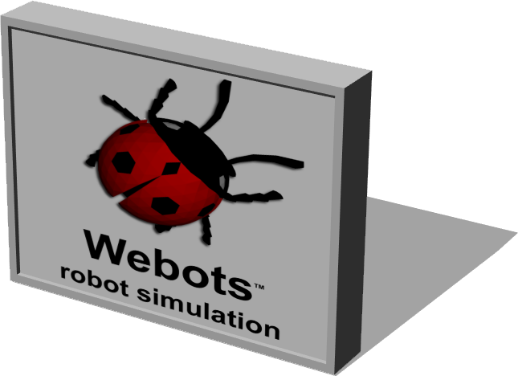

# Advertising Board

## AdvertisingBoard

%figure "AdvertisingBoard model in Webots."



%end

```
AdvertisingBoard {
   SFVec3f     translation       0 0 0
   SFRotation  rotation          0 1 0 0
   SFString    name              "advertising board"
   MFString    frontTexture      "textures/webots_billboard.jpg"
   MFString    backTexture       "textures/webots_billboard.jpg"
   MFColor     recognitionColors  [ 1 1 1, 0.75 0 0 ]
   SFBool      displayBackLight  FALSE
   SFFloat     displayWidth      4
   SFFloat     displayHeight     3
   SFFloat     frameThickness    0.6
   SFColor     frameColor        0.886275 0.886275 0.886275
   SFColor     poleColor         0.886275 0.886275 0.886275
   SFInt32     poleNumber        0
   SFString    poleType          "cylinder"
   SFFloat     poleHeight        5
   SFFloat     poleThickness     0.4
   SFFloat     baseRatio         3.2
}
```

> **File location**: "WEBOTS\_HOME/projects/objects/advertising_board/protos/AdvertisingBoard.proto"

### AdvertisingBoard Description

Double sided and adjustable advertising board with the possibility of adding up to four poles.
Those poles can either be a "cylinder", "box", or a "H-shape".

