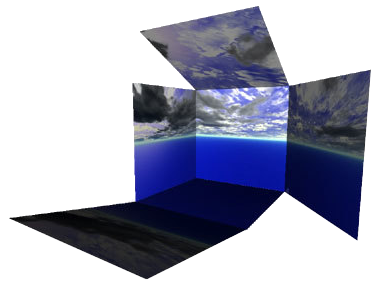
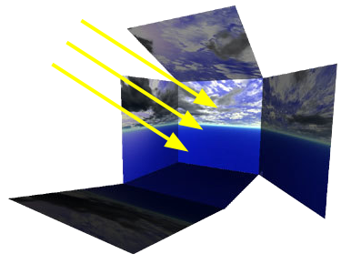

# Backgrounds

## TexturedBackground

Derived from [Background](../reference/background.md)

%%figure



%end

```
TexturedBackground {
  SFString texture "noon_sunny_empty"
}
```

> **File location**: "WEBOTS\_HOME/projects/objects/backgrounds/protos/TexturedBackground.proto"

### TexturedBackground Description

Background textured with a skybox.

Supported values for the "texture" field:

- dawn\_cloudy\_empty
- morning\_cloudy\_empty
- noon\_cloudy\_empty
- noon\_cloudy\_mountains
- noon\_stormy\_empty
- noon\_sunny\_empty
- noon\_sunny\_garden
- twilight\_cloudy\_empty

## TexturedBackgroundLight

Derived from [DirectionalLight](../reference/directionallight.md)

%%figure



%end

```
TexturedBackgroundLight {
  SFString texture        "noon_sunny_empty"
  SFBool   castShadows    TRUE                
  SFBool   castLensFlares FALSE               
}
```

> **File location**: "WEBOTS\_HOME/projects/objects/backgrounds/protos/TexturedBackgroundLight.proto"

### TexturedBackgroundLight Description

Light matching with the TexturedBackground.

Supported values for the "texture" field:

- dawn\_cloudy\_empty
- morning\_cloudy\_empty
- noon\_cloudy\_empty
- noon\_cloudy\_mountains
- noon\_stormy\_empty
- noon\_sunny\_empty
- noon\_sunny\_garden
- twilight\_cloudy\_empty

### TexturedBackgroundLight Field Summary

- `castShadows`: Defines whether the light should cast shadows.

- `castLensFlares`: Defines whether the light should cast lens-flares.

