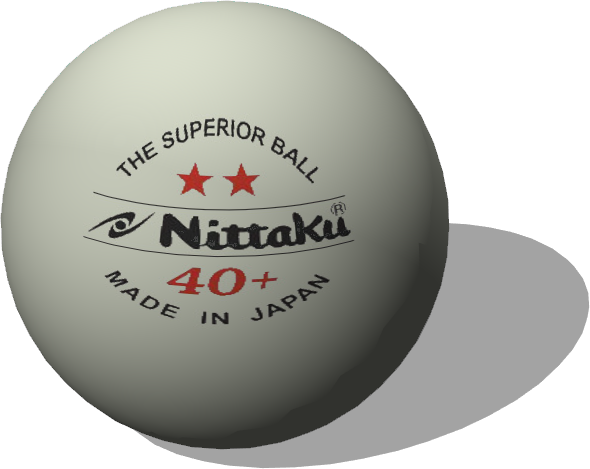

# Balls

## Ball

Derived from [Solid](../reference/solid.md)

%figure


%end

```
Ball {
  SFVec3f    translation     0 0.0325 0
  SFRotation rotation        0 1 0 0
  SFString   name            "ball"
  SFColor    color           1.0 0.54 0.08  
  SFFloat    radius          0.0325         
  SFFloat    mass            0.055          
  MFVec3f    centerOfMass    [0 -0.0001 0]  
  SFFloat    linearDamping   0.17           
  SFFloat    angularDamping  0.33           
  SFString   contactMaterial "default"      
}
```

> **File location**: "WEBOTS\_HOME/projects/objects/balls/protos/Ball.proto"

### Ball Description

The Ball's size, mass and color correspond to the soccer ball used in the Robocup SPL.
You can change the centerOfMass to [0 0 0] to avoid the random rolling effect.

### Ball Field Summary

- `color`: Defines the color of the ball.

- `radius`: Defines the radius of the ball.

- `mass`: Defines the mass of the ball.

- `centerOfMass`: Defines the center of mass of the ball.

- `linearDamping`: Defines the linear damping of the ball.

- `angularDamping`: Defines the angular damping of the ball.

- `contactMaterial`: Is equivalent to the `contactMaterial` field of the [Solid](../reference/solid.md) node.

## PingPongBall

Derived from [Solid](../reference/solid.md)

%figure



%end

```
PingPongBall {
  SFVec3f    translation         0 0 0
  SFRotation rotation            0 1 0 0
  SFString   name                "ping pong ball"
  MFNode     immersionProperties []                            
  MFString   textureUrl          "textures/pingpong_logo.jpg"  
}
```

> **File location**: "WEBOTS\_HOME/projects/objects/balls/protos/PingPongBall.proto"

### PingPongBall Description

A ping pong ball.

### PingPongBall Field Summary

- `immersionProperties`: Defines the immersion properties of the ball.

- `textureUrl`: Defines the texture used for the ball.

## SoccerBall

Derived from [Solid](../reference/solid.md)

%figure


%end

```
SoccerBall {
  SFVec3f    translation 0 0.1 0
  SFRotation rotation    0 1 0 0
  SFString   name        "soccer ball"
  SFFloat    radius      0.113          
  SFFloat    mass        0.6            
}
```

> **File location**: "WEBOTS\_HOME/projects/objects/balls/protos/SoccerBall.proto"

### SoccerBall Description

A black and white soccer ball with customizable radius and mass.
This object is physics-enabled so it will roll or bounce when hit.

### SoccerBall Field Summary

- `radius`: Defines the radius of the ball.

- `mass`: Defines the mass of the ball.

