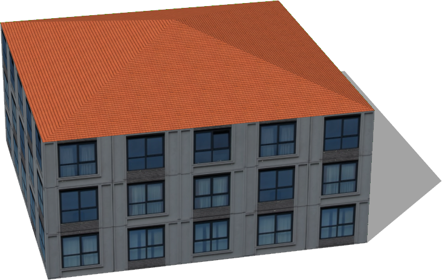
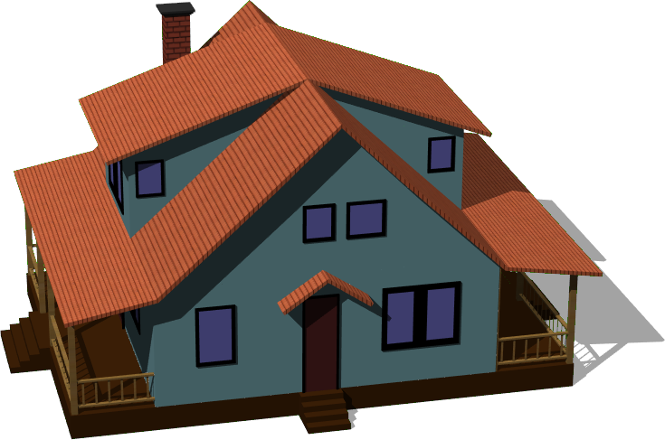
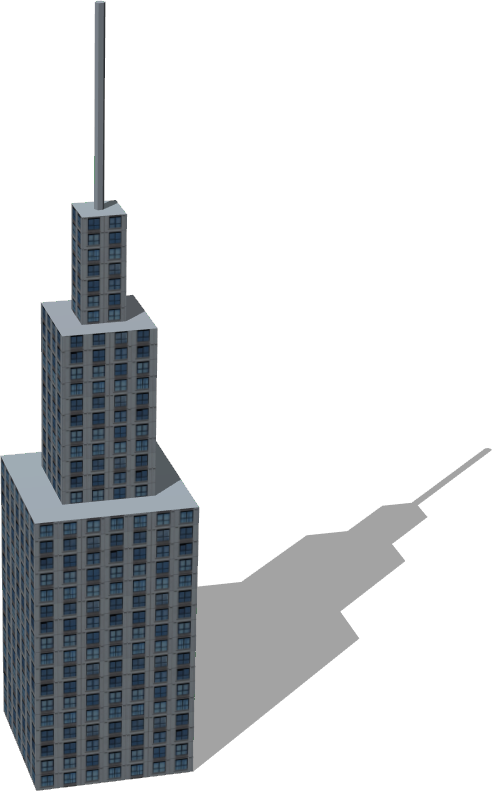
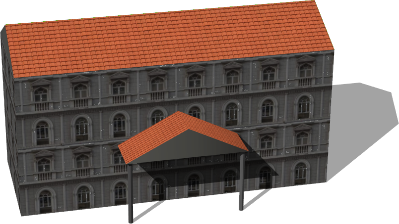
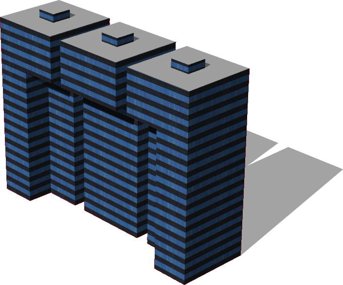

# Buildings

## Auditorium

Derived from [Solid](../reference/solid.md)

%figure "A classic auditoruim.
"


%end

```
Auditorium {
  SFVec3f    translation 0 0 0
  SFRotation rotation    0 1 0 0
  SFString   name        "auditorium"
}
```

> **File location**: "WEBOTS\_HOME/projects/objects/buildings/protos/Auditorium.proto"

## BigGlassTower

Derived from [Solid](../reference/solid.md)

%figure "A big glass tower.
"


%end

```
BigGlassTower {
  SFVec3f    translation 0 0 0
  SFRotation rotation    0 1 0 0
  SFString   name        "big glass tower"
}
```

> **File location**: "WEBOTS\_HOME/projects/objects/buildings/protos/BigGlassTower.proto"

## Building

Derived from [Solid](../reference/solid.md)

%figure "A customizable building, the size, appearance and geometry can fully be defined.
"



%end

```
Building {
  SFVec3f     translation            0 0 0
  SFRotation  rotation               0 1 0 0
  SFString    name                   "building"                           
  SFFloat     floorHeight            3                                    
  SFInt32     floorNumber            3                                    
  SFInt32     startingFloor          0                                    
  MFVec2f     corners                [10 10, 10 -10, -10 -10, -10 10 ]    
  SFNode      wallAppearance         Appearance { material Material {} }  
  MFString    groundFloor            []                                   
  MFFloat     groundFloorScale       []                                   
  MFFloat     groundFloorTranslation []                                   
  SFNode      roofAppearance         Appearance { material Material {} }  
  SFString    roofShape              "pyramidal roof"                     
  SFFloat     roofHeight             3                                    
  SFBool      enableBoundingObject   TRUE                                 
  SFBool      bottom                 FALSE                                
  SFString    model                  "building"                           
  MFColor     recognitionColors      []                                   
}
```

> **File location**: "WEBOTS\_HOME/projects/objects/buildings/protos/Building.proto"

### Building Field Summary

- `name`: Defines the name of the building

- `floorHeight`: Defines the height of one floor.

- `floorNumber`: Defines the number of floors (excluding roof).

- `startingFloor`: Defines the floor number for the "ground floor" of the building, as not all buildings start at the ground floor.

- `corners`: Defines the 2D geometry of the building (2D ground footprint of the building).

- `wallAppearance`: Defines the appearance used for the walls of the building.

- `groundFloor`: Defines the texture to be used for the first floor (optional).

- `groundFloorScale`: Defines the horizontal scale of the ground texture.

- `groundFloorTranslation`: Defines the translation of the ground floor textures.

- `roofAppearance`: Defines the appearance used for the roof of the building.

- `roofShape`: Defines the geometry of the roof. Supported geometry are `flat roof`, `pyramidal roof`, `gabled roof` and `hipped roof`.

- `roofHeight`: Defines the height of the roof (used only in the case of pyramidal roof).

- `enableBoundingObject`: Defines whether the building should have a bounding object.

- `bottom`: Defines whether the bottom face of the building should be displayed.

- `model`: Is equivalent to the `model` field of the [Solid](../reference/solid.md) node.

- `recognitionColors`: Is equivalent to the `recognitionColors` field of the [Solid](../reference/solid.md) node.

## BuildingUnderConstruction

Derived from [Solid](../reference/solid.md)

%figure "Building under construction with scaffolding.
"


%end

```
BuildingUnderConstruction {
  SFVec3f    translation 0 0 0
  SFRotation rotation    0 1 0 0
  SFString   name        "building under construction"
}
```

> **File location**: "WEBOTS\_HOME/projects/objects/buildings/protos/BuildingUnderConstruction.proto"

## BungalowStyleHouse

Derived from [Solid](../reference/solid.md)

%figure "A configurable bungalow style house.
The original blender model was made by noenmaster ([http://www.blendswap.com/blends/view/66305](http://www.blendswap.com/blends/view/66305)).
This model was sponsored by the CTI project RO2IVSim ([http://transport.epfl.ch/simulator-for-mobile-robots-and-intelligent-vehicles](http://transport.epfl.ch/simulator-for-mobile-robots-and-intelligent-vehicles)).
"



%end

```
BungalowStyleHouse {
  SFVec3f translation         0 0 0
  SFRotation rotation         0 1 0 0
  SFString name               "bungalow style house"
  SFBool fence                TRUE                                                                                                                                       
  SFBool floor                TRUE                                                                                                                                       
  SFBool chimney              TRUE                                                                                                                                       
  SFBool enableBoundingObject TRUE                                                                                                                                       
  SFNode appearance           Appearance { material Material { diffuseColor 0.52 0.73 0.76 } }                                                                           
  SFNode floorAppearance      Appearance { material Material { diffuseColor 0.27 0.14 0.03 } }                                                                           
  SFNode fenceAppearance      Appearance { material Material { } texture ImageTexture { url ["textures/wood.jpg"] } textureTransform TextureTransform { scale 10 10 } }  
}
```

> **File location**: "WEBOTS\_HOME/projects/objects/buildings/protos/BungalowStyleHouse.proto"

### BungalowStyleHouse Field Summary

- `fence`: Defines whether the house has a fence or not.

- `floor`: Defines whether the house is surelevated or not.

- `chimney`: Defines whether the house has a chimney or not.

- `enableBoundingObject`: Defines whether to enable the bounding object or not.

- `appearance`: Defines the appearance of the wall.

- `floorAppearance`: Defines the appearance of the floor.

- `fenceAppearance`: Defines the appearance of the fence.

## CommercialBuilding

Derived from [Solid](../reference/solid.md)

%figure "A commercial building.
"


%end

```
CommercialBuilding {
  SFVec3f    translation 0 0 0
  SFRotation rotation    0 1 0 0
  SFString   name        "commercial building"
}
```

> **File location**: "WEBOTS\_HOME/projects/objects/buildings/protos/CommercialBuilding.proto"

## CyberboticsTower

Derived from [Solid](../reference/solid.md)

%figure "The Cyberbotics tower.
"


%end

```
CyberboticsTower {
  SFVec3f    translation 0 0 0
  SFRotation rotation    0 1 0 0
  SFString   name        "Cyberbotics tower"
}
```

> **File location**: "WEBOTS\_HOME/projects/objects/buildings/protos/CyberboticsTower.proto"

## FastFoodRestaurant

Derived from [Solid](../reference/solid.md)

%figure "Fast food restaurant that comes in 4 versions:
- `KFC`
- `FFC`
- `subway`
- `momo`
The building can be changed to a two sided restaurant using the 'numberOfSides' parameter.
"


%end

```
FastFoodRestaurant {
  SFVec3f     translation   0 0 0
  SFRotation  rotation      0 1 0 0
  SFString    name          "fast food restaurant"
  SFFloat     height        4                       
  SFFloat     length        10                      
  SFFloat     width         10                      
  SFString    brand         "KFC"                   
  SFInt32     numberOfSides 1                       
}
```

> **File location**: "WEBOTS\_HOME/projects/objects/buildings/protos/FastFoodRestaurant.proto"

### FastFoodRestaurant Field Summary

- `height`: Defines the height of the building.

- `length`: Defines the length of the building.

- `width`: Defines the width of the building.

- `brand`: Defines the brand of the restaurant.

- `numberOfSides`: Defines whether it is a two sided restaurant.

## HollowBuilding

Derived from [Solid](../reference/solid.md)

%figure "A hollow building.
"


%end

```
HollowBuilding {
  SFVec3f    translation 0 0 0
  SFRotation rotation    0 1 0 0
  SFString   name        "hollow building"
}
```

> **File location**: "WEBOTS\_HOME/projects/objects/buildings/protos/HollowBuilding.proto"

## Hotel

Derived from [Solid](../reference/solid.md)

%figure "A big hotel.
"



%end

```
Hotel {
  SFVec3f    translation 0 0 0
  SFRotation rotation    0 1 0 0
  SFString   name        "hotel"
}
```

> **File location**: "WEBOTS\_HOME/projects/objects/buildings/protos/Hotel.proto"

## ModernHouse

Derived from [Solid](../reference/solid.md)

%figure "A simple modern house.
The original blender model was made by andreschneider ([http://www.blendswap.com/blends/view/65734](http://www.blendswap.com/blends/view/65734)).
This model was sponsored by the CTI project RO2IVSim ([http://transport.epfl.ch/simulator-for-mobile-robots-and-intelligent-vehicles](http://transport.epfl.ch/simulator-for-mobile-robots-and-intelligent-vehicles)).
"


%end

```
ModernHouse {
  SFVec3f    translation          0 0 0
  SFRotation rotation             0 1 0 0
  SFString   name                 "modern house"
  SFBool     enableBoundingObject TRUE                                                              
  SFNode     appearance           Appearance { material Material { diffuseColor 0.56 0.18 0.12 } }  
  SFNode     windowAppearance     Appearance { material Material { diffuseColor 0.38 0.55 0.69 } }  
}
```

> **File location**: "WEBOTS\_HOME/projects/objects/buildings/protos/ModernHouse.proto"

### ModernHouse Field Summary

- `enableBoundingObject`: Defines whether to enable the bounding object or not.

- `appearance`: Defines the wall appearance.

- `windowAppearance`: Defines the windows appearance.

## Museum

Derived from [Solid](../reference/solid.md)

%figure "An old museum.
"



%end

```
Museum {
  SFVec3f    translation 0 0 0
  SFRotation rotation    0 1 0 0
  SFString   name        "museum"
}
```

> **File location**: "WEBOTS\_HOME/projects/objects/buildings/protos/Museum.proto"

## ResidentialBuilding

Derived from [Solid](../reference/solid.md)

%figure "A residential building.
"


%end

```
ResidentialBuilding {
  SFVec3f    translation 0 0 0
  SFRotation rotation    0 1 0 0
  SFString   name        "residential building"
}
```

> **File location**: "WEBOTS\_HOME/projects/objects/buildings/protos/ResidentialBuilding.proto"

## SimpleBuilding

Derived from [Solid](../reference/solid.md)

%figure "A customizable building, the size and geometry can fully be defined.
The texture of the wall and roof can be selected using the fields 'wallType' and 'roofType'.
Available wall types are:
- `glass building`
- `classic building`
- `orange building`
- `gray glass building`
- `blue glass building`
- `arcade-style building`
- `transparent highrise`
- `windowed building`
- `old brick building`
- `red and white building`
- `construction building`
- `red brick wall`
- `old brick wall`
- `stone brick`
- `stone wall`
- `glass highrise`
- `old house`
- `old building`
- `highrise`
- `brick building`
- `residential building`
- `old office building`
- `factory building`
- `tall house`
- `office building`
- `concrete building`

Available roof types are:
- `tiled`
- `gravel`
- `slate`
- `old tiles`
- `sheet metal`
- `metal tiles`
- `bitumen`

The roof shape can be either 'flat' or 'pyramidal' (in case of pyramidal roof it is possible to define the height).
"


%end

```
SimpleBuilding {
  SFVec3f     translation            0 0 0
  SFRotation  rotation               0 1 0 0
  SFString    name                   "building"
  SFFloat     floorHeight            3                                  
  SFInt32     floorNumber            3                                  
  SFInt32     startingFloor          0                                  
  MFVec2f     corners                [10 10, 10 -10, -10 -10, -10 10 ]  
  SFString    wallType               "windowed building"                
  MFColor     wallColor              []                                 
  MFString    groundFloor            []                                 
  MFFloat     groundFloorScale       []                                 
  MFFloat     groundFloorTranslation []                                 
  SFString    roofType               "tiled"                            
  MFColor     roofColor              []                                 
  SFString    roofShape              "pyramidal roof"                   
  SFBool      snowOnRoof             FALSE                              
  SFFloat     roofHeight             3                                  
  SFBool      enableBoundingObject   TRUE                               
  SFBool      bottom                 FALSE                              
}
```

> **File location**: "WEBOTS\_HOME/projects/objects/buildings/protos/SimpleBuilding.proto"

### SimpleBuilding Field Summary

- `floorHeight`: Defines the height of one floor.

- `floorNumber`: Defines the number of floors (excluding roof).

- `startingFloor`: Defines the floor number for the "ground floor" of the building, as not all buildings start at the ground floor.

- `corners`: Defines the 2D geometry of the building (2D ground footprint of the building).

- `wallType`: Defines the wall type.

- `wallColor`: Defines the wall color.

- `groundFloor`: Defines the texture to be used for the first floor (optional).

- `groundFloorScale`: Defines the horizontal scale of the ground texture.

- `groundFloorTranslation`: Defines the translation of the ground floor textures.

- `roofType`: Defines roof type.

- `roofColor`: Defines the roof color.

- `roofShape`: Defines the geometry of the roof. Supported geometry are `flat roof`, `pyramidal roof`, `gabled roof` and `hipped roof`.

- `snowOnRoof`: Defines whether the texture with or without snow should be used.

- `roofHeight`: Defines the height of the roof.

- `enableBoundingObject`: Defines whether the building should have a bounding object or not.

- `bottom`: Defines whether the bottom face of the building should be displayed.

## SimpleTwoFloorsHouse

Derived from [Solid](../reference/solid.md)

%figure "A simple house with two floors.
The original blender model was made by andreschneider ([http://www.blendswap.com/blends/view/59482](http://www.blendswap.com/blends/view/59482)).
This model was sponsored by the CTI project RO2IVSim ([http://transport.epfl.ch/simulator-for-mobile-robots-and-intelligent-vehicles](http://transport.epfl.ch/simulator-for-mobile-robots-and-intelligent-vehicles)).
"


%end

```
SimpleTwoFloorsHouse {
  SFVec3f    translation           0 0 0
  SFRotation rotation              0 1 0 0
  SFString   name                  "simple two floors house"
  SFBool     enableBoundingObject  TRUE                                                              
  SFNode     appearance            Appearance { material Material { diffuseColor 0.63 0.71 0.63 } }  
}
```

> **File location**: "WEBOTS\_HOME/projects/objects/buildings/protos/SimpleTwoFloorsHouse.proto"

### SimpleTwoFloorsHouse Field Summary

- `enableBoundingObject`: Defines whether to enable the bounding object.

- `appearance`: Defines the house appearance.

## TheThreeTowers

Derived from [Solid](../reference/solid.md)

%figure "A group of three towers.
"



%end

```
TheThreeTowers {
  SFVec3f    translation 0 0 0
  SFRotation rotation    0 1 0 0
  SFString   name        "three towers"
}
```

> **File location**: "WEBOTS\_HOME/projects/objects/buildings/protos/TheThreeTowers.proto"

## UBuilding

Derived from [Solid](../reference/solid.md)

%figure "A building with a "U" form.
"


%end

```
UBuilding {
  SFVec3f    translation 0 0 0
  SFRotation rotation    0 1 0 0
  SFString   name        "U building"
}
```

> **File location**: "WEBOTS\_HOME/projects/objects/buildings/protos/UBuilding.proto"

