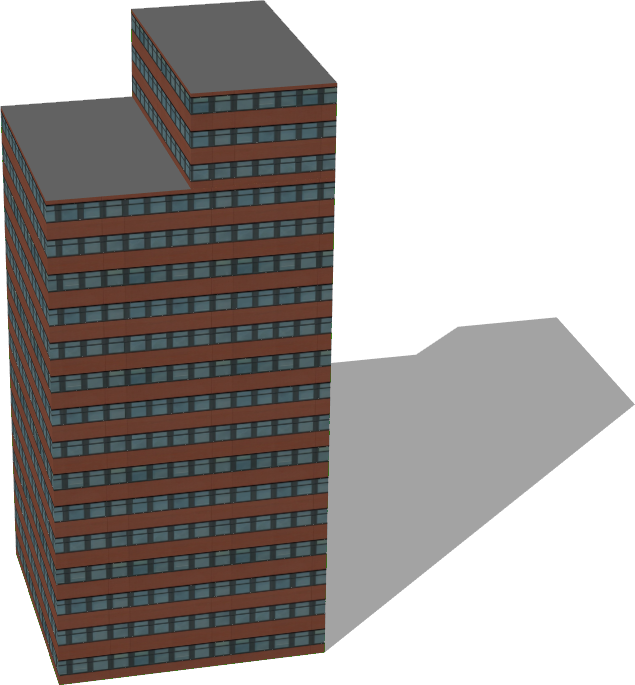
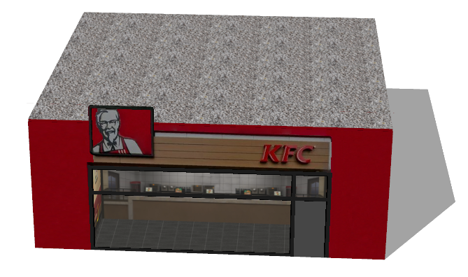
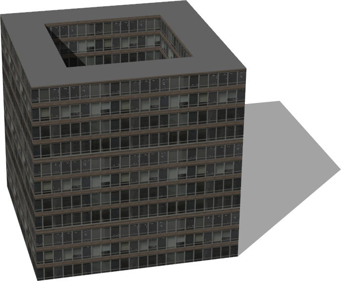

# Buildings

## Auditorium

%figure "Auditorium model in Webots."


%end

```
Auditorium {
  SFVec3f translation 0 0 0
  SFRotation rotation 0 1 0 0
  SFString name "auditorium"
}
```

> **File location**: "WEBOTS\_HOME/projects/objects/buildings/protos/Auditorium.proto"

### Auditorium Description

A classic auditoruim.

## BigGlassTower

%figure "BigGlassTower model in Webots."


%end

```
BigGlassTower {
  SFVec3f translation 0 0 0
  SFRotation rotation 0 1 0 0
  SFString name "big glass tower"
}
```

> **File location**: "WEBOTS\_HOME/projects/objects/buildings/protos/BigGlassTower.proto"

### BigGlassTower Description

A big glass tower.

## Building

%figure "Building model in Webots."


%end

```
Building {
  SFVec3f     translation            0 0 0
  SFRotation  rotation               0 1 0 0
  SFString    name                   "building"                           
  SFFloat     floorHeight            3                                    
  SFInt32     floorNumber            3                                    
  SFInt32     startingFloor          0                                    
  MFVec2f     corners                [10 10, 10 -10, -10 -10, -10 10 ]    
  SFNode      wallAppearance         Appearance { material Material {} }  
  MFString    groundFloor            []                                   
  MFFloat     groundFloorScale       []                                   
  MFFloat     groundFloorTranslation []                                   
  SFNode      roofAppearance         Appearance { material Material {} }  
  SFString    roofShape              "pyramidal roof"                     
  SFFloat     roofHeight             3                                    
  SFBool      enableBoundingObject   TRUE                                 
  SFBool      bottom                 FALSE                                
  SFString    model                  "building"
  MFColor     recognitionColors      []
}
```

> **File location**: "WEBOTS\_HOME/projects/objects/buildings/protos/Building.proto"

### Building Description

A customizable building, the size, appearance and geometry can fully be defined.

### Building Field Summary

- `name`: Defines the name of the building

- `floorHeight`: Defines the height of one floor.

- `floorNumber`: Defines the number of floors (excluding roof).

- `startingFloor`: Defines the floor number for the "ground floor" of the building, as not all buildings start at the ground floor.

- `corners`: Defines the 2D geometry of the building (2D ground footprint of the building).

- `wallAppearance`: Defines the appearance used for the walls of the building.

- `groundFloor`: Defines the texture to be used for the first floor (optional).

- `groundFloorScale`: Defines the horizontal scale of the ground texture.

- `groundFloorTranslation`: Defines the translation of the ground floor textures.

- `roofAppearance`: Defines the appearance used for the roof of the building.

- `roofShape`: Defines the geometry of the roof. Supported geometry are `flat roof`, `pyramidal roof`, `gabled roof` and `hipped roof`.

- `roofHeight`: Defines the height of the roof (used only in the case of pyramidal roof).

- `enableBoundingObject`: Defines whether the building should have a bounding object.

- `bottom`: Defines whether the bottom face of the building should be displayed.

## BuildingUnderConstruction

%figure "BuildingUnderConstruction model in Webots."


%end

```
BuildingUnderConstruction {
  SFVec3f translation 0 0 0
  SFRotation rotation 0 1 0 0
  SFString name "building under construction"
}
```

> **File location**: "WEBOTS\_HOME/projects/objects/buildings/protos/BuildingUnderConstruction.proto"

### BuildingUnderConstruction Description

Building under construction with scaffolding.

## BungalowStyleHouse

%figure "BungalowStyleHouse model in Webots."


%end

```
BungalowStyleHouse {
  SFVec3f translation         0 0 0
  SFRotation rotation         0 1 0 0
  SFString name               "bungalow style house"
  SFBool fence                TRUE
  SFBool floor                TRUE
  SFBool chimney              TRUE
  SFBool enableBoundingObject TRUE
  SFNode appearance           Appearance { material Material { diffuseColor 0.52 0.73 0.76 } }
  SFNode floorAppearance      Appearance { material Material { diffuseColor 0.27 0.14 0.03 } }
  SFNode fenceAppearance      Appearance { material Material { } texture ImageTexture { url ["textures/wood.jpg"] } textureTransform TextureTransform { scale 10 10 } }
}
```

> **File location**: "WEBOTS\_HOME/projects/objects/buildings/protos/BungalowStyleHouse.proto"

### BungalowStyleHouse Description

A configurable bungalow style house.
The original blender model was made by noenmaster ([http://www.blendswap.com/blends/view/66305](http://www.blendswap.com/blends/view/66305)).
This model was sponsored by the CTI project RO2IVSim ([http://transport.epfl.ch/simulator-for-mobile-robots-and-intelligent-vehicles](http://transport.epfl.ch/simulator-for-mobile-robots-and-intelligent-vehicles)).

## CommercialBuilding

%figure "CommercialBuilding model in Webots."



%end

```
CommercialBuilding {
  SFVec3f translation 0 0 0
  SFRotation rotation 0 1 0 0
  SFString name "commercial building"
}
```

> **File location**: "WEBOTS\_HOME/projects/objects/buildings/protos/CommercialBuilding.proto"

### CommercialBuilding Description

A commercial building.

## CyberboticsTower

%figure "CyberboticsTower model in Webots."


%end

```
CyberboticsTower {
  SFVec3f translation 0 0 0
  SFRotation rotation 0 1 0 0
  SFString name "Cyberbotics tower"
}
```

> **File location**: "WEBOTS\_HOME/projects/objects/buildings/protos/CyberboticsTower.proto"

### CyberboticsTower Description

The Cyberbotics tower.

## FastFoodRestaurant

%figure "FastFoodRestaurant model in Webots."



%end

```
FastFoodRestaurant {
  SFVec3f     translation   0 0 0
  SFRotation  rotation      0 1 0 0
  SFString    name          "fast food restaurant"
  SFFloat     height        4
  SFFloat     length        10
  SFFloat     width         10
  SFString    brand         "KFC"
  SFInt32     numberOfSides 1
}
```

> **File location**: "WEBOTS\_HOME/projects/objects/buildings/protos/FastFoodRestaurant.proto"

### FastFoodRestaurant Description

Fast food restaurant that comes in 4 versions: 'KFC', 'FFC', 'subway' or 'momo'.
The building can be changed to a two sided restaurant using the 'numberOfSides' parameter.

## HollowBuilding

%figure "HollowBuilding model in Webots."



%end

```
HollowBuilding {
  SFVec3f translation 0 0 0
  SFRotation rotation 0 1 0 0
  SFString name "hollow building"
}
```

> **File location**: "WEBOTS\_HOME/projects/objects/buildings/protos/HollowBuilding.proto"

### HollowBuilding Description

A hollow building.

## Hotel

%figure "Hotel model in Webots."


%end

```
Hotel {
  SFVec3f translation 0 0 0
  SFRotation rotation 0 1 0 0
  SFString name "hotel"
}
```

> **File location**: "WEBOTS\_HOME/projects/objects/buildings/protos/Hotel.proto"

### Hotel Description

A big hotel.

## ModernHouse

%figure "ModernHouse model in Webots."


%end

```
ModernHouse {
  SFVec3f translation         0 0 0
  SFRotation rotation         0 1 0 0
  SFString name               "modern house"
  SFBool enableBoundingObject TRUE
  SFNode appearance           Appearance { material Material { diffuseColor 0.56 0.18 0.12 } }
  SFNode windowAppearance     Appearance { material Material { diffuseColor 0.38 0.55 0.69 } }
}
```

> **File location**: "WEBOTS\_HOME/projects/objects/buildings/protos/ModernHouse.proto"

### ModernHouse Description

A simple modern house.
The original blender model was made by andreschneider ([http://www.blendswap.com/blends/view/65734](http://www.blendswap.com/blends/view/65734)).
This model was sponsored by the CTI project RO2IVSim ([http://transport.epfl.ch/simulator-for-mobile-robots-and-intelligent-vehicles](http://transport.epfl.ch/simulator-for-mobile-robots-and-intelligent-vehicles)).

## Museum

%figure "Museum model in Webots."


%end

```
Museum {
  SFVec3f translation 0 0 0
  SFRotation rotation 0 1 0 0
  SFString name "museum"
}
```

> **File location**: "WEBOTS\_HOME/projects/objects/buildings/protos/Museum.proto"

### Museum Description

An old museum.

## ResidentialBuilding

%figure "ResidentialBuilding model in Webots."


%end

```
ResidentialBuilding {
  SFVec3f translation 0 0 0
  SFRotation rotation 0 1 0 0
  SFString name "residential building"
}
```

> **File location**: "WEBOTS\_HOME/projects/objects/buildings/protos/ResidentialBuilding.proto"

### ResidentialBuilding Description

A residential building.

## SimpleBuilding

%figure "SimpleBuilding model in Webots."


%end

```
SimpleBuilding {
  SFVec3f     translation            0 0 0
  SFRotation  rotation               0 1 0 0
  SFString    name                   "building"                         
  SFFloat     floorHeight            3                                  
  SFInt32     floorNumber            3                                  
  SFInt32     startingFloor          0                                  
  MFVec2f     corners                [10 10, 10 -10, -10 -10, -10 10 ]  
  SFString    wallType               "windowed building"                
  MFColor     wallColor              []                                 
  MFString    groundFloor            []                                 
  MFFloat     groundFloorScale       []                                 
  MFFloat     groundFloorTranslation []                                 
  SFString    roofType               "tiled"                            
  MFColor     roofColor              []                                 
  SFString    roofShape              "pyramidal roof"                   
  SFBool      snowOnRoof             FALSE                              
  SFFloat     roofHeight             3                                  
  SFBool      enableBoundingObject   TRUE                               
  SFBool      bottom                 FALSE                              
}
```

> **File location**: "WEBOTS\_HOME/projects/objects/buildings/protos/SimpleBuilding.proto"

### SimpleBuilding Description

A customizable building, the size and geometry can fully be defined.
The texture of the wall and roof can be selected using the fields 'wallType' and 'roofType'.
Available wall types are:
- `glass building`
- `classic building`
- `orange building`
- `gray glass building`
- `blue glass building`
- `arcade-style building`
- `transparent highrise`
- `windowed building`
- `old brick building`
- `red and white building`
- `construction building`
- `red brick wall`
- `old brick wall`
- `stone brick`
- `stone wall`
- `glass highrise`
- `old house`
- `old building`
- `highrise`
- `brick building`
- `residential building`
- `old office building`
- `factory building`
- `tall house`
- `office building`
- `concrete building`

Available roof types are:
- `tiled`
- `gravel`
- `slate`
- `old tiles`
- `sheet metal`
- `metal tiles`
- `bitumen`

The roof shape can be either 'flat' or 'pyramidal' (in case of pyramidal roof it is possible to define the height).

### SimpleBuilding Field Summary

- `name`: Defines the name of the building.

- `floorHeight`: Defines the height of one floor.

- `floorNumber`: Defines the number of floors (excluding roof).

- `startingFloor`: Defines the floor number for the "ground floor" of the building, as not all buildings start at the ground floor.

- `corners`: Defines the 2D geometry of the building (2D ground footprint of the building).

- `wallType`: Defines the wall type.

- `wallColor`: Defines the wall color.

- `groundFloor`: Defines the texture to be used for the first floor (optional).

- `groundFloorScale`: Defines the horizontal scale of the ground texture.

- `groundFloorTranslation`: Defines the translation of the ground floor textures.

- `roofType`: Defines roof type.

- `roofColor`: Defines the roof color.

- `roofShape`: Defines the geometry of the roof. Supported geometry are `flat roof`, `pyramidal roof`, `gabled roof` and `hipped roof`.

- `snowOnRoof`: Defines if the texture with or without snow should be used.

- `roofHeight`: Defines the height of the roof.

- `enableBoundingObject`: Defines if the building should have a bounding object or not.

- `bottom`: Defines whether the bottom face of the building should be displayed.

## SimpleTwoFloorsHouse

%figure "SimpleTwoFloorsHouse model in Webots."


%end

```
SimpleTwoFloorsHouse {
  SFVec3f translation         0 0 0
  SFRotation rotation         0 1 0 0
  SFString name               "simple two floors house"
  SFBool enableBoundingObject TRUE
  SFNode appearance           Appearance { material Material { diffuseColor 0.63 0.71 0.63 } }
}
```

> **File location**: "WEBOTS\_HOME/projects/objects/buildings/protos/SimpleTwoFloorsHouse.proto"

### SimpleTwoFloorsHouse Description

A simple house with two floors.
The original blender model was made by andreschneider ([http://www.blendswap.com/blends/view/59482](http://www.blendswap.com/blends/view/59482)).
This model was sponsored by the CTI project RO2IVSim ([http://transport.epfl.ch/simulator-for-mobile-robots-and-intelligent-vehicles](http://transport.epfl.ch/simulator-for-mobile-robots-and-intelligent-vehicles)).

## TheThreeTowers

%figure "TheThreeTowers model in Webots."


%end

```
TheThreeTowers {
  SFVec3f translation 0 0 0
  SFRotation rotation 0 1 0 0
  SFString name "three towers"
}
```

> **File location**: "WEBOTS\_HOME/projects/objects/buildings/protos/TheThreeTowers.proto"

### TheThreeTowers Description

A group of three towers.

## UBuilding

%figure "UBuilding model in Webots."


%end

```
UBuilding {
  SFVec3f translation 0 0 0
  SFRotation rotation 0 1 0 0
  SFString name "U building"
}
```

> **File location**: "WEBOTS\_HOME/projects/objects/buildings/protos/UBuilding.proto"

### UBuilding Description

A building with a "U" form.

