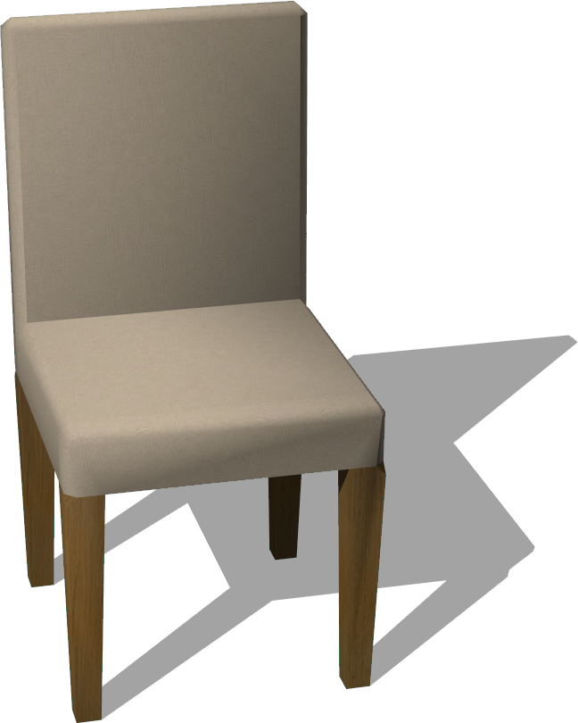
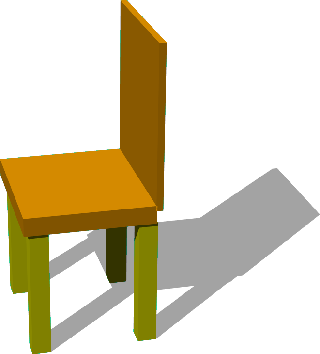
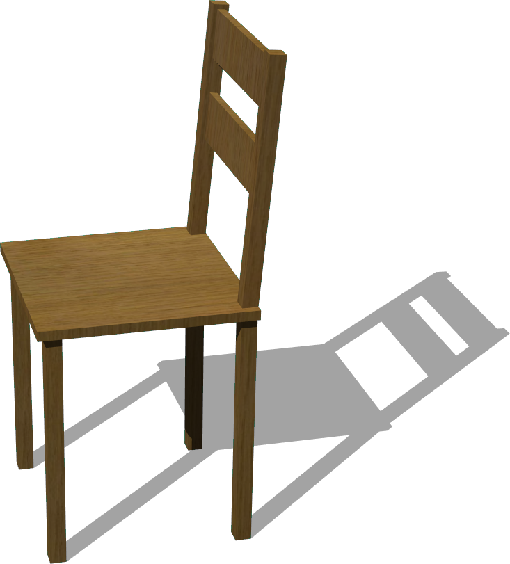

# Chairs

## Chair

%figure "Chair model in Webots."



%end

```
Chair {
   SFVec3f translation 0 0 0
   SFRotation rotation 0 1 0 0
   SFString name "chair"
   SFColor color 1 1 1
   MFString textureUrl "textures/chair.jpg"
   SFNode physics NULL
}
```

> **File location**: "WEBOTS\_HOME/projects/objects/chairs/protos/Chair.proto"

### Chair Description

A chair (0.5 x 1 x 0.5 m).

## SimpleChair

%figure "SimpleChair model in Webots."



%end

```
SimpleChair {
   SFVec3f translation 0 0.91 0
   SFRotation rotation 0 1 0 0
   SFString name "simple chair"
   SFColor legColor 1 1 0
   SFColor seatColor 1 0.65 0
   SFFloat mass 5
}
```

> **File location**: "WEBOTS\_HOME/projects/objects/chairs/protos/SimpleChair.proto"

### SimpleChair Description

A simple two-colors chair with a customizable mass, but a fixed height of 1.25 meter.
This object is physics-enabled so it can be pushed.

## WoodenChair

%figure "WoodenChair model in Webots."



%end

```
WoodenChair {
   SFVec3f translation 0 0 0
   SFRotation rotation 0 1 0 0
   SFString name "wooden chair"
   SFColor color 1 1 1
   MFString textureUrl "textures/wood.jpg"
   SFNode physics NULL
}
```

> **File location**: "WEBOTS\_HOME/projects/objects/chairs/protos/WoodenChair.proto"

### WoodenChair Description

A wooden chair (0.42 x 0.944 x 0.44 m).

