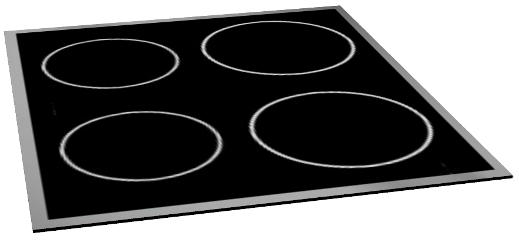
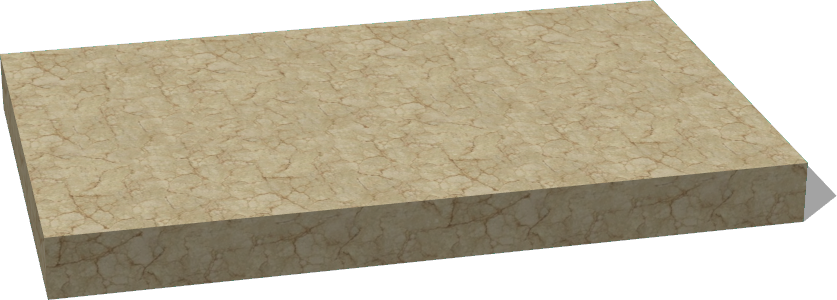

# Components

## HotPlate

%figure "HotPlate model in Webots."



%end

```
HotPlate {
  SFVec3f    translation 0 0.71 0
  SFRotation rotation    0 1 0 0
  SFString   name        "hot plate"
  MFString   textureUrl  "textures/components.jpg"
}
```

> **File location**: "WEBOTS\_HOME/projects/objects/kitchen/components/protos/HotPlate.proto"

### HotPlate Description

An hot plate.

## Sink

%figure "Sink model in Webots."


%end

```
Sink {
  SFVec3f    translation 0 0.72 0
  SFRotation rotation    0 1 0 0
  SFString   name        "sink"
  MFString   textureUrl  "textures/components.jpg"
}
```

> **File location**: "WEBOTS\_HOME/projects/objects/kitchen/components/protos/Sink.proto"

### Sink Description

A sink.

## Worktop

%figure "Worktop model in Webots."



%end

```
Worktop {
  SFVec3f    translation   0 0.71 0
  SFRotation rotation      0 1 0 0
  SFString   name          "worktop"
  SFVec3f    size          0.44 0.06 0.7
  MFString   textureUrl    "textures/worktop.jpg"
  SFVec2f    tileSize      0.7 0.7
}
```

> **File location**: "WEBOTS\_HOME/projects/objects/kitchen/components/protos/Worktop.proto"

### Worktop Description

A customizable (size, texture, etc.) worktop.

