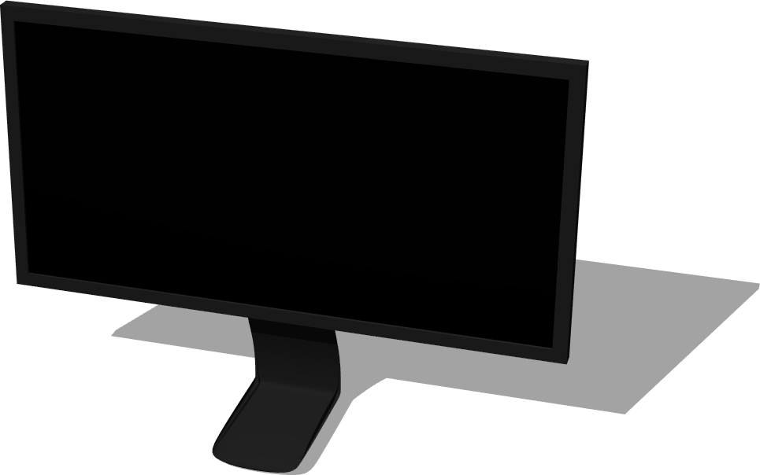

# Computers

## ComputerMouse

Derived from [Solid](../reference/<built-in method lower of str object at 0x00000000057F7E90>.md)

%figure "ComputerMouse model in Webots."


%end

```
ComputerMouse {
  SFVec3f    translation 0 0 0
  SFRotation rotation    0 1 0 0
  SFString   name        "computer mouse"
  SFColor    topColor    0.71 0.71 0.71     
  SFColor    bottomColor 0.056 0.056 0.056  
  SFFloat    mass        0.1                
}
```

> **File location**: "WEBOTS\_HOME/projects/objects/computers/protos/ComputerMouse.proto"

### ComputerMouse Description

A computer mouse.

### ComputerMouse Field Summary

- `topColor`: Defines the color of the top part of the mouse.

- `bottomColor`: Defines the color of the bottom part of the mouse.

- `mass`: Defines the mass of the mouse in kg.

## DesktopComputer

Derived from [Solid](../reference/<built-in method lower of str object at 0x00000000057F7E90>.md)

%figure "DesktopComputer model in Webots."


%end

```
DesktopComputer {
  SFVec3f    translation      0 0 0
  SFRotation rotation         0 1 0 0
  SFString   name             "desktop computer"
  SFColor    powerbuttonColor 0.252903 0.263813 0.266361  
  SFFloat    mass             0                           
}
```

> **File location**: "WEBOTS\_HOME/projects/objects/computers/protos/DesktopComputer.proto"

### DesktopComputer Description

A computer tower.

### DesktopComputer Field Summary

- `powerbuttonColor`: Defines the color of the computer power button.

- `mass`: Defines the mass of the computer in kg. A value smaller or equal to 0 remove the physics of the computer.

## Keyboard

Derived from [Solid](../reference/<built-in method lower of str object at 0x00000000057F7D78>.md)

%figure "Keyboard model in Webots."


%end

```
Keyboard {
  SFVec3f    translation 0 0 0
  SFRotation rotation    0 1 0 0
  SFString   name        "keyboard"
  SFColor    color       0.1 0.1 0.1  
  SFFloat    mass        0            
}
```

> **File location**: "WEBOTS\_HOME/projects/objects/computers/protos/Keyboard.proto"

### Keyboard Description

A computer keyboard.

### Keyboard Field Summary

- `color`: Defines the color of the keyboard.

- `mass`: Defines the mass of the keyboard in kg. A value smaller or equal to 0 remove the physics of the keyboard.

## Laptop

Derived from [Solid](../reference/<built-in method lower of str object at 0x00000000057F7F58>.md)

%figure "Laptop model in Webots."


%end

```
Laptop {
  SFVec3f    translation 0 0 0
  SFRotation rotation    0 1 0 0
  SFString   name        "laptop"
  SFString   controller  "laptop_switch_on"  
}
```

> **File location**: "WEBOTS\_HOME/projects/objects/computers/protos/Laptop.proto"

### Laptop Description

A simple laptop.

### Laptop Field Summary

- `controller`: Defines the controller of the laptop which can use the Display device to show images.

## Monitor

Derived from [Solid](../reference/<built-in method lower of str object at 0x00000000057F7F08>.md)

%figure "Monitor model in Webots."



%end

```
Monitor {
  SFVec3f    translation 0 0 0
  SFRotation rotation    0 1 0 0
  SFString   name        "monitor"
  SFColor    color       0.15 0.15 0.15  
  SFFloat    mass        0               
}
```

> **File location**: "WEBOTS\_HOME/projects/objects/computers/protos/Monitor.proto"

### Monitor Description

A computer monitor.

### Monitor Field Summary

- `color`: Defines the color of the monitor.

- `mass`: Defines the mass of the monitor in kg. A value smaller or equal to 0 remove the physics of the monitor.

