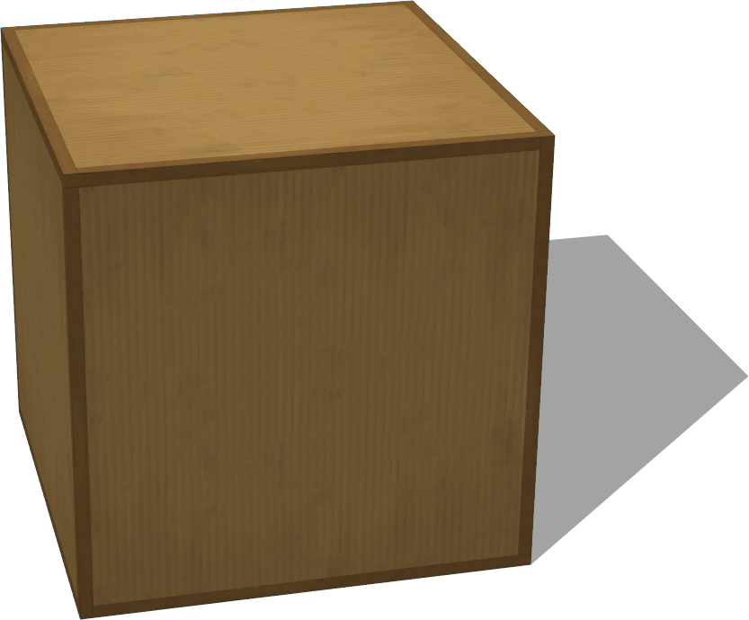

# Containers

## CardboardBox

%figure "CardboardBox model in Webots."



%end

```
CardboardBox {
  SFVec3f translation 0 0.3 0
  SFRotation rotation 0 1 0 0
  SFString name "cardboard box"
  SFVec3f size 0.6 0.6 0.6
  SFFloat mass 0
  SFBool locked FALSE
}
```

> **File location**: "WEBOTS\_HOME/projects/objects/factory/containers/protos/CardboardBox.proto"

### CardboardBox Description

A cardboard box.

## WoodenBox

%figure "WoodenBox model in Webots."


%end

```
WoodenBox {
  SFVec3f translation 0 0.3 0
  SFRotation rotation 0 1 0 0
  SFString name "wooden box"
  SFVec3f size 0.6 0.6 0.6
  SFFloat mass 0
  MFNode immersionProperties []
  SFBool locked FALSE
}
```

> **File location**: "WEBOTS\_HOME/projects/objects/factory/containers/protos/WoodenBox.proto"

### WoodenBox Description

A wooden box.

