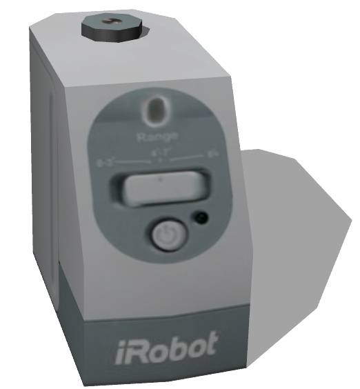

# Create Wall

## CreateWall

Virtual walls are an accessory of the IRobot Create allowing to inform the robot about areas typically for restricted access to a room.

Derived from [Robot](../reference/robot.md).

%figure



%end

```
CreateWall {
  SFVec3f    translation    0 0 0
  SFRotation rotation       0 1 0 0
  SFFloat    range          2.4384
  SFFloat    aperture       0.157
  SFString   controller     "create_wall_emit_signal"
  SFString   controllerArgs ""
  SFString   name           "iRobot wall"
}
```

> **File location**: "WEBOTS\_HOME/projects/objects/create_wall/protos/CreateWall.proto"

### CreateWall Field Summary

- `range`: Defines the range of the infra-red emitter.

- `aperture`: Defines the aperture of the infra-red emitter.

- `controller`: Defines the controller which is used to emit infra-red messages.

- `controllerArgs`: Is equivalent to the `controllerArgs` field of the [Robot](../reference/robot.md) node.

