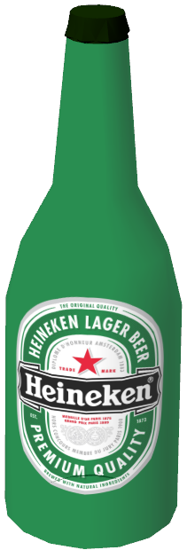
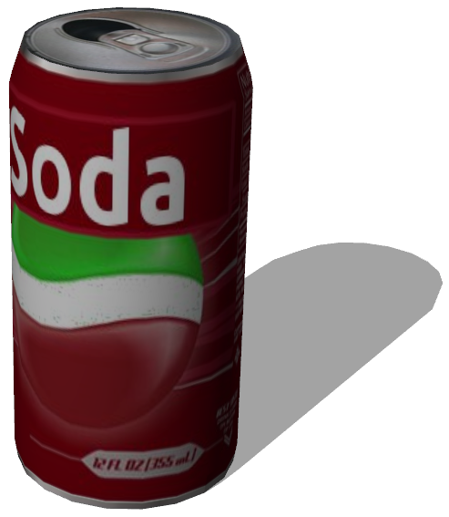
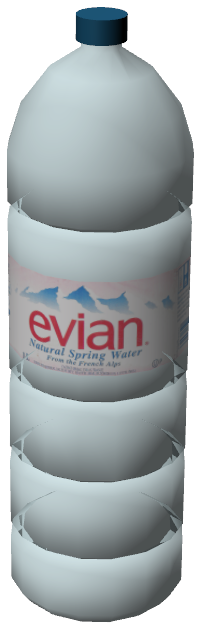

# Drinks

## BeerBottle

Derived from [Solid](../reference/<built-in method lower of str object at 0x00000000057F7F30>.md)

%figure "BeerBottle model in Webots."



%end

```
BeerBottle {
  SFVec3f    translation 0 0 0
  SFRotation rotation    0 1 0 0
  SFString   name        "beer bottle"
  MFString   textureUrl  "textures/heineken.jpg"
  SFFloat    mass        0.4
}
```

> **File location**: "WEBOTS\_HOME/projects/objects/drinks/protos/BeerBottle.proto"

### BeerBottle Description

A beer bottle.

## Can

Derived from [Solid](../reference/<built-in method lower of str object at 0x00000000057F7EB8>.md)

%figure "Can model in Webots."



%end

```
Can {
  SFVec3f translation 0 0.06 0
  SFRotation rotation 0 1 0 0
  SFString name "can"
  SFColor color 1 1 1
  MFString textureUrl "textures/can.jpg"
  SFFloat mass 0.35
}
```

> **File location**: "WEBOTS\_HOME/projects/objects/drinks/protos/Can.proto"

### Can Description

A can (0.03175 x 0.1222 x 0.03175 m).

## WaterBottle

Derived from [Solid](../reference/<built-in method lower of str object at 0x00000000057F7D50>.md)

%figure "WaterBottle model in Webots."



%end

```
WaterBottle {
  SFVec3f    translation 0 0 0
  SFRotation rotation    0 1 0 0
  SFString   name        "water bottle"
  MFString   textureUrl  "textures/evian.jpg"
  SFFloat    mass        1
}
```

> **File location**: "WEBOTS\_HOME/projects/objects/drinks/protos/WaterBottle.proto"

### WaterBottle Description

A water bottle.

