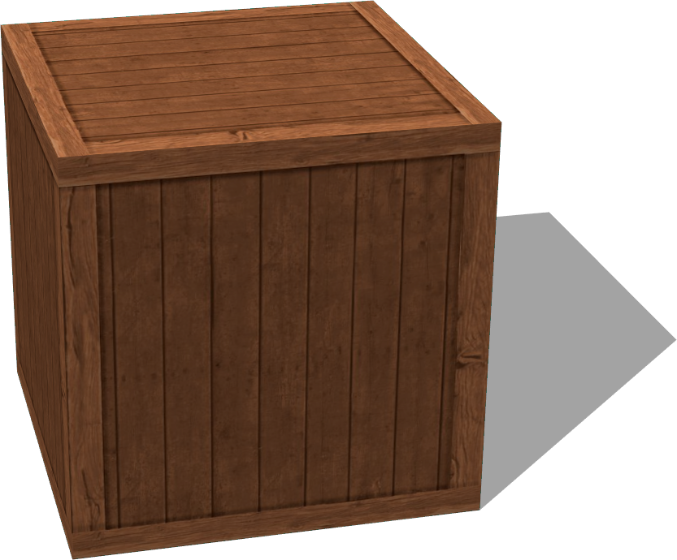
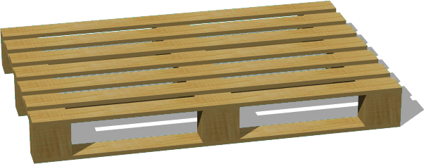
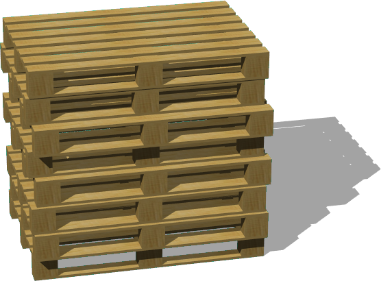
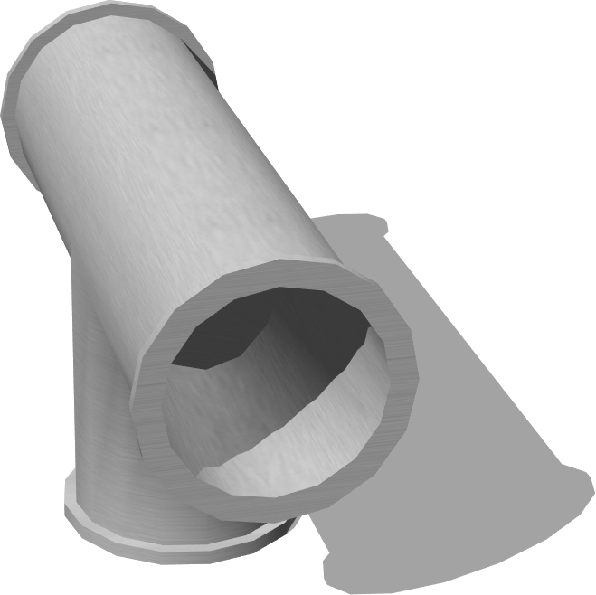
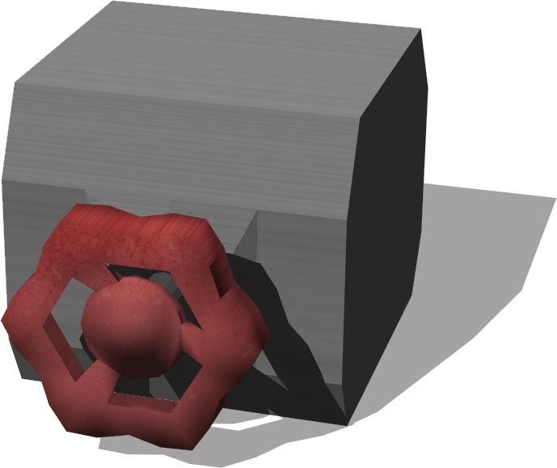

# Factory

## Containers

### CardboardBox

A cardboard box.

%figure


%end

Derived from [Solid](../reference/solid.md).

```
CardboardBox {
  SFVec3f    translation 0 0.3 0
  SFRotation rotation    0 1 0 0
  SFString   name        "cardboard box"
  SFVec3f    size        0.6 0.6 0.6
  SFFloat    mass        0
  SFBool     locked      FALSE
}
```

> **File location**: "WEBOTS\_HOME/projects/objects/factory/containers/protos/CardboardBox.proto"

#### CardboardBox Field Summary

- `name`: Defines the texture used for the cardboard box.

- `size`: Defines the size of the cardboard box.

- `mass`: Defines the mass of the cardboard box in kg. A value smaller or equal to 0 remove the physics of the cardboard box.

### WoodenBox

A wooden box.

%figure



%end

Derived from [Solid](../reference/solid.md).

```
WoodenBox {
  SFVec3f    translation         0 0.3 0
  SFRotation rotation            0 1 0 0
  SFString   name                "wooden box"
  SFVec3f    size                0.6 0.6 0.6
  SFFloat    mass                0
  MFNode     immersionProperties []
  SFBool     locked              FALSE
}
```

> **File location**: "WEBOTS\_HOME/projects/objects/factory/containers/protos/WoodenBox.proto"

#### WoodenBox Field Summary

- `size`: Defines the size of the wooden box.

- `mass`: Defines the mass of the wooden box in kg. A value smaller or equal to 0 remove the physics of the wooden box.

## Pallet

### WoodenPallet

Simple and configurable wooden pallet.

%figure



%end

Derived from [Solid](../reference/solid.md).

```
WoodenPallet {
  SFVec3f    translation    0 0 0
  SFRotation rotation       0 1 0 0
  SFString   name           "wooden pallet"
  SFVec3f    size           0.8 0.14 1.2
  SFInt32    lathNumber     6
  SFFloat    lathWidth      0.08
  SFFloat    mass           0
  SFBool     boundingObject TRUE
  SFBool     locked         FALSE
}
```

> **File location**: "WEBOTS\_HOME/projects/objects/factory/pallet/protos/WoodenPallet.proto"

#### WoodenPallet Field Summary

- `size`: Defines the size of the pallet.

- `lathNumber`: Defines the number of lath of the pallet.

- `lathWidth`: Defines the width of one lath.

- `mass`: Defines the mass of the pallet in kg. A value smaller or equal to 0 remove the physics of the pallet.

- `boundingObject`: Defines whether the bounding object should be enabled.

### WoodenPalletStack

Simple and configurable wooden pallet stack.

%figure



%end

Derived from [Solid](../reference/solid.md).

```
WoodenPalletStack {
  SFVec3f    translation              0 0 0
  SFRotation rotation                 0 1 0 0
  SFString   name                     "wooden pallet stack"
  SFInt32    palletNumber             8
  SFVec3f    palletSize               0.8 0.14 1.2
  SFInt32    palletLathNumber         6
  SFFloat    palletLathWidth          0.08
  SFFloat    lateralMisalignment      0.1
  SFFloat    longitudinalMisalignment 0.05
  SFFloat    palletMass               0
  SFBool     boundingObject           TRUE
  SFBool     locked                   FALSE
}
```

> **File location**: "WEBOTS\_HOME/projects/objects/factory/pallet/protos/WoodenPalletStack.proto"

#### WoodenPalletStack Field Summary

- `palletNumber`: Defines the number of pallet in the stack (vertically).

- `palletSize`: Defines the size of one pallet.

- `palletLathNumber`: Defines the number of lath of each pallet.s

- `palletLathWidth`: Defines the width of the pallet laths.

- `lateralMisalignment`: Defines the maximum lateral misalignment between two pallets.

- `longitudinalMisalignment`: Defines the maximum longitudinal misalignment between two pallets.

- `palletMass`: Defines the mass of one pallet in kg. A value smaller or equal to 0 remove the physics of the stack.

- `boundingObject`: Defines whether the bounding object should be enabled.

## Pipes

### LJoint

90-degree L-joint for connecting pipes.

%figure


%end

Derived from [Solid](../reference/solid.md).

```
LJoint {
  SFVec3f    translation 0 0.104 0
  SFRotation rotation    0 1 0 0
  SFString   name        "L joint pipe"
  SFVec3f    scale       1 1 1
}
```

> **File location**: "WEBOTS\_HOME/projects/objects/factory/pipes/protos/LJoint.proto"

### PipeSection

A section of pipe.

%figure


%end

Derived from [Solid](../reference/solid.md).

```
PipeSection {
  SFVec3f    translation 0 0.03 0
  SFRotation rotation    0 0 1 1.5708
  SFString   name        "pipe section"
  SFFloat    height      0.5
  SFFloat    radius      0.03
  SFInt32    subdivision 24
}
```

> **File location**: "WEBOTS\_HOME/projects/objects/factory/pipes/protos/PipeSection.proto"

#### PipeSection Field Summary

- `height`: Defines the height of the pipe.

- `radius`: Defines the radius of the pipe.

- `subdivision`: Defines the number of polygons used to represent the pipe cylinder and so its resolution.

### TJoint

3-slot T-joint for connecting pipes.

%figure



%end

Derived from [Solid](../reference/solid.md).

```
TJoint {
  SFVec3f    translation 0 0.95 0
  SFRotation rotation    0 1 0 0
  SFString   name        "T joint pipe"
  SFVec3f    scale       1 1 1
}
```

> **File location**: "WEBOTS\_HOME/projects/objects/factory/pipes/protos/TJoint.proto"

## Tools

### Bolt

A threaded bolt.

%figure


%end

Derived from [Solid](../reference/solid.md).

```
Bolt {
  SFVec3f    translation     0 0.0131 0
  SFRotation rotation        0 0 1 0
  SFString   name            "bolt"
  SFString   contactMaterial "default"
}
```

> **File location**: "WEBOTS\_HOME/projects/objects/factory/tools/protos/Bolt.proto"

#### Bolt Field Summary

### Hammer

A 25cm asymmetric club hammer.

%figure


%end

Derived from [Solid](../reference/solid.md).

```
Hammer {
  SFVec3f    translation     0 0.014 0
  SFRotation rotation        0 1 0 0
  SFString   name            "hammer"
  SFString   contactMaterial "default"
}
```

> **File location**: "WEBOTS\_HOME/projects/objects/factory/tools/protos/Hammer.proto"

#### Hammer Field Summary

### Nut

A hexagonal nut.

%figure


%end

Derived from [Solid](../reference/solid.md).

```
Nut {
  SFVec3f    translation     0 0.004 0
  SFRotation rotation        0 1 0 0
  SFString   name            "nut"
  SFString   contactMaterial "default"
}
```

> **File location**: "WEBOTS\_HOME/projects/objects/factory/tools/protos/Nut.proto"

#### Nut Field Summary

### PaintBucket

A 4kg bucket of paint, with HingeJoint-based handle.

%figure


%end

Derived from [Solid](../reference/solid.md).

```
PaintBucket {
  SFVec3f    translation     0 0 0
  SFRotation rotation        0 1 0 0
  SFString   name            "paint bucket"
  SFString   contactMaterial "default"
}
```

> **File location**: "WEBOTS\_HOME/projects/objects/factory/tools/protos/PaintBucket.proto"

#### PaintBucket Field Summary

### PlatformCart

A platform cart with overall dimensions 90Lx50Wx85H cm.

%figure


%end

Derived from [Solid](../reference/solid.md).

```
PlatformCart {
  SFVec3f    translation 0 0 0
  SFRotation rotation    0 1 0 0
  SFString   name        "platform cart"
  MFNode     slot        []
  SFNode     physics     Physics {}
}
```

> **File location**: "WEBOTS\_HOME/projects/objects/factory/tools/protos/PlatformCart.proto"

#### PlatformCart Field Summary

- `slot`: Extends the cart with new nodes in the slot.

### Screwdriver

A Philips screwdriver. The blade and handle are balanced.

%figure


%end

Derived from [Solid](../reference/solid.md).

```
Screwdriver {
  SFVec3f    translation     0 0.012 0
  SFRotation rotation        0 1 0 0
  SFString   name            "screwdriver"
  SFString   contactMaterial "default"
}
```

> **File location**: "WEBOTS\_HOME/projects/objects/factory/tools/protos/Screwdriver.proto"

#### Screwdriver Field Summary

### Wrench

A 15cm Open-End wrench.

%figure


%end

Derived from [Solid](../reference/solid.md).

```
Wrench {
  SFVec3f    translation     0 0 0
  SFRotation rotation        0 1 0 0
  SFString   name            "wrench"
  SFString   contactMaterial "default"
}
```

> **File location**: "WEBOTS\_HOME/projects/objects/factory/tools/protos/Wrench.proto"

#### Wrench Field Summary

## Valves

### LargeValve

Large Wheel-based valve. Handle can be moved in either direction by the angle (radians) in the "absolute stop" field.

%figure


%end

Derived from [Robot](../reference/robot.md).

```
LargeValve {
  SFVec3f    translation     0 0.106 0
  SFRotation rotation        0 1 0 0
  SFString   name            "large valve"
  SFFloat    jointFriction   0.5
  SFString   controller      "valve_turner"
  SFString   absoluteStop    "15.7079632679"
  SFString   contactMaterial "default"
}
```

> **File location**: "WEBOTS\_HOME/projects/objects/factory/valves/protos/LargeValve.proto"

#### LargeValve Field Summary

- `jointFriction`: Defines the static friction of the valve joint.

- `controller`: Defines the controller of the valve which is used to limit its rotation.

- `absoluteStop`: Defines the maximum rotational angle in radians. This value is sent to the controller using the controllerArgs field.

### LeverValve

Lever-based valve. Handle can be moved in either direction (from up) of 45 degrees.

%figure


%end

Derived from [Solid](../reference/solid.md).

```
LeverValve {
  SFVec3f    translation   0 0.142 0
  SFRotation rotation      0 1 0 0
  SFString   name          "lever valve"
  SFFloat    jointFriction 1
  SFVec3f    scale         0.7 0.7 0.7
}
```

> **File location**: "WEBOTS\_HOME/projects/objects/factory/valves/protos/LeverValve.proto"

#### LeverValve Field Summary

- `jointFriction`: Defines the static friction of the valve joint.

### SmallValve

Small Wheel-based valve. Handle can be moved in either direction by the angle (radians) in the "absolute stop" field.

%figure



%end

Derived from [Robot](../reference/robot.md).

```
SmallValve {
  SFVec3f    translation   0 0.077 0
  SFRotation rotation      0 1 0 0
  SFString   name          "small valve"
  SFFloat    jointFriction 0.1
  SFString   controller    "valve_turner"
  SFString   absoluteStop  "15.7079632679"
}
```

> **File location**: "WEBOTS\_HOME/projects/objects/factory/valves/protos/SmallValve.proto"

#### SmallValve Field Summary

- `jointFriction`: Defines the static friction of the valve joint.

- `controller`: Defines the controller of the valve which is used to limit its rotation.

- `absoluteStop`: Defines the maximum rotational angle in radians. This value is sent to the controller using the controllerArgs field.

