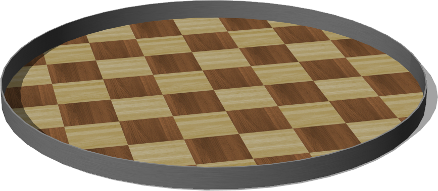
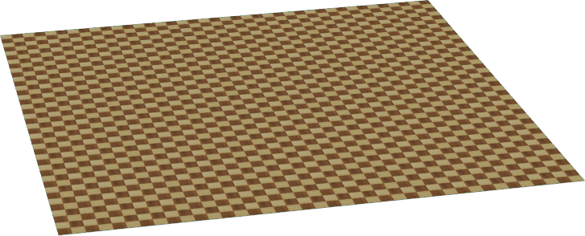
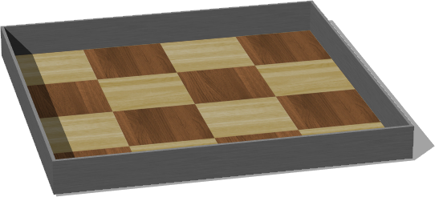
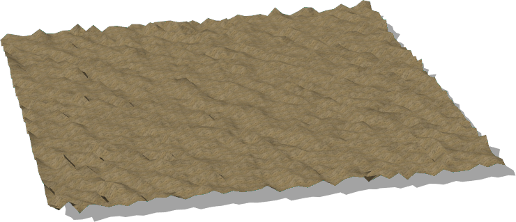

# Floors

## CircleArena

%figure "CircleArena model in Webots."



%end

```
CircleArena {
   SFVec3f translation 0 0 0
   SFRotation rotation 0 1 0 0
   SFString name "circle arena"
   SFFloat radius 1.0
   SFString contactMaterial "default"
   MFString floorTextureUrl "textures/checkered_parquetry.jpg"
   SFVec2f floorTileSize 0.5 0.5
   SFFloat wallThickness 0.01
   SFFloat wallHeight 0.1
   MFString wallTextureUrl "textures/metal.jpg"
   SFVec2f wallTileSize 0.5 0.5
   SFInt32 subdivision 48
}
```

> **File location**: "WEBOTS\_HOME/projects/objects/floors/protos/CircleArena.proto"

### CircleArena Description

A configurable circle arena composed of floor surrounded by wall.

## Floor

%figure "Floor model in Webots."



%end

```
Floor {
   SFVec3f translation 0 0 0
   SFRotation rotation 0 1 0 0
   SFString name "floor"
   SFString contactMaterial "default"
   SFVec2f size 10 10
   SFVec2f tileSize 0.5 0.5
   MFString texture "textures/checkered_parquetry.jpg"
   SFInt32 subdivision 8
   SFInt32 filtering 5
}
```

> **File location**: "WEBOTS\_HOME/projects/objects/floors/protos/Floor.proto"

### Floor Description

Configurable standard flat floor.

## RectangleArena

%figure "RectangleArena model in Webots."



%end

```
RectangleArena {
   SFVec3f translation 0 0 0
   SFRotation rotation 0 1 0 0
   SFString name "rectangle arena"
   SFString contactMaterial "default"
   SFVec2f floorSize 1 1
   MFString floorTextureUrl "textures/checkered_parquetry.jpg"
   SFVec2f floorTileSize 0.5 0.5
   SFFloat wallThickness 0.01
   SFFloat wallHeight 0.1
   MFString wallTextureUrl "textures/metal.jpg"
   SFColor wallColor 0.8 0.8 0.8
   SFVec2f wallTileSize 0.5 0.5
   SFInt32 subdivision 8
}
```

> **File location**: "WEBOTS\_HOME/projects/objects/floors/protos/RectangleArena.proto"

### RectangleArena Description

A configurable rectangle arena composed of a floor surrounded by walls.

## UnevenTerrain

%figure "UnevenTerrain model in Webots."



%end

```
UnevenTerrain {
   SFVec3f    translation    0 0 0
   SFRotation rotation       0 1 0 0
   SFString   name           "uneven terrain"
   SFVec3f    size           50 5 50
   SFInt32    xDimension     50
   SFInt32    zDimension     50
   MFString   texture        "textures/sand.jpg"
   SFVec2f    textureScale   1.0 1.0
   SFInt32    randomSeed     1 
   SFBool     flatCenter     FALSE
   SFBool     flatBounds     FALSE
   SFInt32    perlinNOctaves 3
}
```

> **File location**: "WEBOTS\_HOME/projects/objects/floors/protos/UnevenTerrain.proto"

### UnevenTerrain Description

Randomly generated uneven terrain based on Perlin noise.

### UnevenTerrain Field Summary

- `randomSeed`: if seed <= 0 then set a random seed

