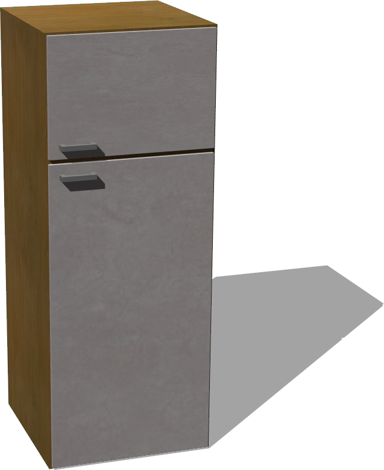

# Fridge

## Fridge

%figure "Fridge model in Webots."



%end

```
Fridge {
  SFVec3f translation 0 0 0
  SFRotation rotation 0 1 0 0
  SFString name "fridge"
  SFColor mainColor 1 1 1
  MFString mainTextureUrl [
    "textures/fridge_main.jpg"
  ]
  SFColor doorColor 1 1 1
  MFString doorTextureUrl [
    "textures/fridge_door.jpg"
  ]
}
```

> **File location**: "WEBOTS\_HOME/projects/objects/kitchen/fridge/protos/Fridge.proto"

### Fridge Description

A fridge with 2 doors (0.7 x 1.8 x 0.7 m).

