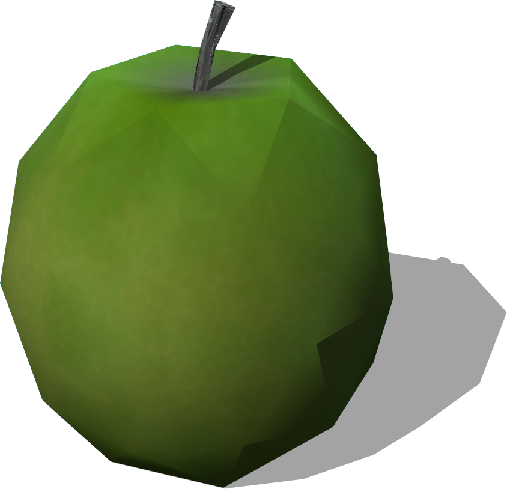
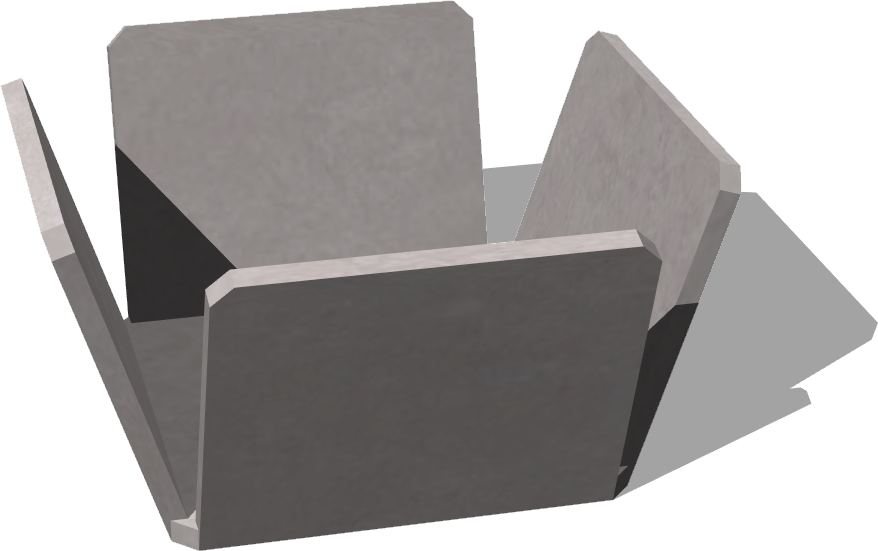
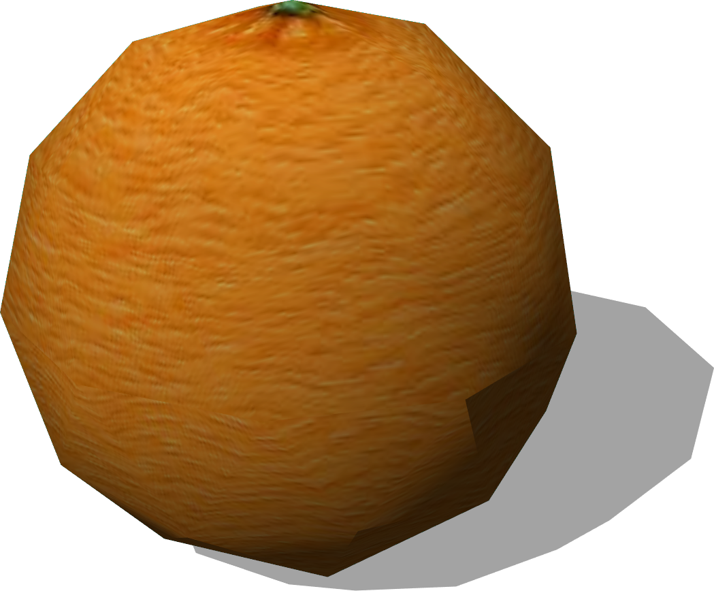

# Fruits

## Apple

Derived from [Solid](../reference/solid.md)

%%figure



%end

```
Apple {
  SFVec3f    translation         0 0.05 0
  SFRotation rotation            0 1 0 0
  SFString   name                "apple"
  SFColor    color               1 1 1                 
  MFString   textureUrl          "textures/apple.jpg"  
  SFFloat    mass                0.15                  
  MFNode     immersionProperties []                    
}
```

> **File location**: "WEBOTS\_HOME/projects/objects/fruits/protos/Apple.proto"

### Apple Description

An apple (0.05 x 0.05 x 0.05 m).

### Apple Field Summary

- `color`: Define the color of the apple.

- `textureUrl`: Defines the texture used for the apple.

- `mass`: Defines the mass of the apple in kg.

- `immersionProperties`: Is equivalent to the `immersionProperties` field of the [Solid](../reference/solid.md) node.

## FruitBowl

Derived from [Solid](../reference/solid.md)

%%figure



%end

```
FruitBowl {
  SFVec3f    translation 0 0 0
  SFRotation rotation    0 1 0 0
  SFString   name        "fruit bowl"
  SFColor    color       1 1 1                  
  MFString   textureUrl "textures/plastic.jpg"  
  SFFloat    mass        0.5                    
}
```

> **File location**: "WEBOTS\_HOME/projects/objects/fruits/protos/FruitBowl.proto"

### FruitBowl Description

A fruit bowl (0.146 x 0.146 x 0.146 m).

### FruitBowl Field Summary

- `color`: Defines the color of the bowl.

- `textureUrl`: Defines the texture used for the bowl.

- `mass`: Defines the mass of the bowl in kg.

## Orange

Derived from [Solid](../reference/solid.md)

%%figure



%end

```
Orange {
  SFVec3f    translation 0 0.05 0
  SFRotation rotation    0 1 0 0
  SFString   name        "orange"
  SFColor    color       1 1 1                  
  MFString   textureUrl  "textures/orange.jpg"  
  SFFloat    mass        0.15                   
}
```

> **File location**: "WEBOTS\_HOME/projects/objects/fruits/protos/Orange.proto"

### Orange Description

An orange (0.05 x 0.05 x 0.05 m).

### Orange Field Summary

- `color`: Defines the color of the orange.

- `textureUrl`: Defines the texture used fo rteh orange.

- `mass`: Defines the mass of the orange in kg.

