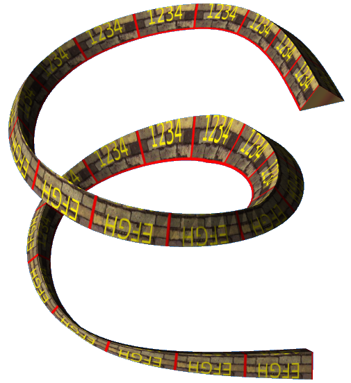

# Geometries

## Extrusion

%figure "Extrusion model in Webots."



%end

```
Extrusion {
      MFVec2f    crossSection              [1 1, 1 -1, -1 -1, -1 1, 1 1]   
      MFVec3f    spine                     [0 0 0, 0 1 0]                  
      MFVec2f    scale                     1.0 1.0                         
      MFRotation orientation               [0 0 1 0]                       
      SFBool     beginCap                  TRUE                            
      SFBool     endCap                    TRUE                            
      SFBool     ccw                       TRUE
      SFBool     solid                     TRUE
      SFBool     convex                    TRUE
      SFFloat    creaseAngle               0.0
      SFInt32    splineSubdivision         4                               
}
```

> **File location**: "WEBOTS\_HOME/projects/objects/geometries/protos/Extrusion.proto"

### Extrusion Description

Generic extrusion geometry.
The shape (defined by the 'crossSection' field) is extruded along the path defined by the field 'spine'.

### Extrusion Field Summary

- `crossSection`: defines the crossSection of the extrusion

- `spine`: defines the extrusion path

- `scale`: defines the scale of each point of the spine

- `orientation`: defines the orientation of the cross-section at each point of the spine

- `beginCap`: defines if the beginCap face is present or not

- `endCap`: defines if the endCap face is present or not

- `splineSubdivision`: if greater than 0 the path is computed using B-Spline, furthermore, if biger than 1, the segments are subdivided

## TexturedBox

%figure "TexturedBox model in Webots."


%end

```
TexturedBox {
  SFVec3f  size    0.1 0.1 0.1
  SFString mapping "flat"
  SFBool   front   TRUE
  SFBool   back    TRUE
  SFBool   left    TRUE
  SFBool   right   TRUE
  SFBool   top     TRUE
  SFBool   bottom  TRUE
}
```

> **File location**: "WEBOTS\_HOME/projects/objects/geometries/protos/TexturedBox.proto"

### TexturedBox Description

Box with customizable texture mapping.
Available texture mappings:
- 'cube' mapping: see texture at projects/samples/geometries/worlds/textures/cube\_mapping.jpg
- 'compact' cube mapping: see texture at projects/samples/geometries/worlds/textures/compact\_mapping.jpg
- 'flat' mapping: projecting the texture on the front face
- 'metric' mapping: similar to default mapping but the texture is not deformed to match each face size
- 'default' mapping: same texture on all the faces
- 'none': no texture mapping
If a boolean field (front, back, left, right, top, bottom) is FALSE, then the corresponding face is not drawn.
A demo of these mappings is available in projects/samples/geometries/worlds/textured\_boxes.wbt.

## TexturedParallelepiped

%figure "TexturedParallelepiped model in Webots."


%end

```
TexturedParallelepiped {
  SFVec3f  size    0.1 0.1 0.1
  SFVec3f  angles  0.7854 0.0 0.0
  SFString mapping "flat"
  SFBool   front   TRUE
  SFBool   back    TRUE
  SFBool   left    TRUE
  SFBool   right   TRUE
  SFBool   top     TRUE
  SFBool   bottom  TRUE
}
```

> **File location**: "WEBOTS\_HOME/projects/objects/geometries/protos/TexturedParallelepiped.proto"

### TexturedParallelepiped Description

Customizable parallelepiped.
The 'size' and 'angles' fields specify the edges and angles of the parallelepiped:
- angles.x: angle between base and side edges of the parallelogram face
- angles.y: angle in y direction between front and back faces of the prism
- angles.z: angle in x direction between front and back faces of the prism
Available texture mappings:
- 'cube' mapping: see texture at projects/samples/geometries/worlds/textures/cube\_mapping.jpg
- 'compact' cube mapping: see texture at projects/samples/geometries/worlds/textures/compact\_mapping.jpg
- 'flat' mapping: projecting the texture on the front face
- 'metric' mapping: similar to default mapping but the texture is not deformed to match each face size
- 'default' mapping: same texture on all the faces
- 'none' no texture mapping
If a boolean field (front, back, left, right, top, bottom) is FALSE, then the corresponding face is not drawn.
A demo of these mappings is available in projects/samples/geometries/worlds/textured\_boxes.wbt.

