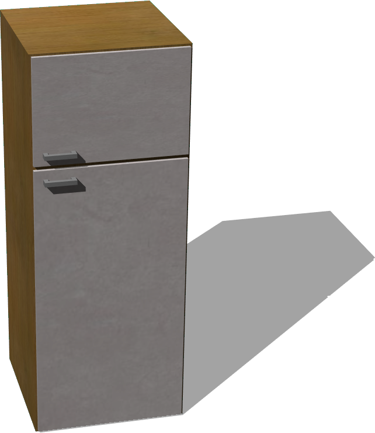
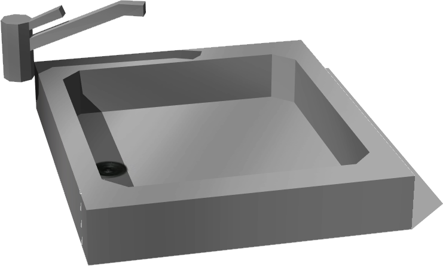

# Fridge

Derived from [Solid](../reference/solid.md)

%figure "Fridge model in Webots."



%end

```
Fridge {
  SFVec3f    translation    0 0 0
  SFRotation rotation       0 1 0 0
  SFString   name           "fridge"
  SFColor    mainColor      1 1 1                         
  MFString   mainTextureUrl ["textures/fridge_main.jpg"]  
  SFColor    doorColor      1 1 1                         
  MFString   doorTextureUrl ["textures/fridge_door.jpg"]  
}
```

> **File location**: "WEBOTS\_HOME/projects/objects/kitchen/fridge/protos/Fridge.proto"

### Fridge Description

A fridge with 2 doors (0.7 x 1.8 x 0.7 m).

### Fridge Field Summary

- `mainColor`: Defines the color of the fridge.

- `mainTextureUrl`: Defines the texture used for the fridge.

- `doorColor`: Defines the color of the door of the fridge.

- `doorTextureUrl`: Defines the texture used for the door of the fridge.

# Breakfast

## BiscuitBox

Derived from [Solid](../reference/solid.md)

%figure "BiscuitBox model in Webots."


%end

```
BiscuitBox {
  SFVec3f    translation 0 0 0
  SFRotation rotation    0 1 0 0
  SFString   name        "biscuit box"
  SFVec3f    size        0.24 0.04 0.08              
  MFString   textureUrl  "textures/biscuit_box.jpg"  
  SFFloat    mass        0.4                         
}
```

> **File location**: "WEBOTS\_HOME/projects/objects/kitchen/breakfast/protos/BiscuitBox.proto"

### BiscuitBox Description

A customizable (size, texture, etc.) biscuit box.

### BiscuitBox Field Summary

- `size`: Defines the size of the box.

- `textureUrl`: Defines the texture used for the box.

- `mass`: Defines the mass of the box in kg.

## CerealBox

Derived from [Solid](../reference/solid.md)

%figure "CerealBox model in Webots."


%end

```
CerealBox {
  SFVec3f    translation 0 0 0
  SFRotation rotation    0 1 0 0
  SFString   name        "cereal box"
  SFVec3f    size        0.08 0.3 0.2                 
  MFString   textureUrl  "textures/cereal_box_2.jpg"  
  SFFloat    mass        1                            
}
```

> **File location**: "WEBOTS\_HOME/projects/objects/kitchen/breakfast/protos/CerealBox.proto"

### CerealBox Description

A customizable (size, texture, etc.) cereal box.

### CerealBox Field Summary

- `size`: Defines the size of the box.

- `textureUrl`: Defines the texture used for the box.

- `mass`: Defines the mass of the box in kg.

## HoneyJar

Derived from [Solid](../reference/solid.md)

%figure "HoneyJar model in Webots."


%end

```
HoneyJar {
  SFVec3f    translation    0 0 0
  SFRotation rotation       0 1 0 0
  SFString   name           "honey jar"
  MFString   textureLidUrl  "textures/bee_lid.jpg"      
  SFFloat    mass           0.5                         
  SFColor    color          0.839216 0.572549 0.105882  
}
```

> **File location**: "WEBOTS\_HOME/projects/objects/kitchen/breakfast/protos/HoneyJar.proto"

### HoneyJar Description

A honey jar.

### HoneyJar Field Summary

- `textureLidUrl`: Defines the texture used for the lid of the jar.

- `mass`: Defines the mass of the jar in kg.

- `color`: Defines the color of the jar.

## JamJar

Derived from [Solid](../reference/solid.md)

%figure "JamJar model in Webots."


%end

```
JamJar {
  SFVec3f    translation   0 0 0
  SFRotation rotation      0 1 0 0
  SFString   name          "jam jar"
  MFString   textureLidUrl "textures/blue_jar_lid.jpg"  
  SFFloat    mass          0.5                          
}
```

> **File location**: "WEBOTS\_HOME/projects/objects/kitchen/breakfast/protos/JamJar.proto"

### JamJar Description

A jam jar.

### JamJar Field Summary

- `textureLidUrl`: Defines the texture used for the lid of the jar.

- `mass`: Defines the mass of the jar in kg.

# Components

## HotPlate

Derived from [Solid](../reference/solid.md)

%figure "HotPlate model in Webots."


%end

```
HotPlate {
  SFVec3f    translation 0 0.71 0
  SFRotation rotation    0 1 0 0
  SFString   name        "hot plate"
  MFString   textureUrl  "textures/components.jpg"  
}
```

> **File location**: "WEBOTS\_HOME/projects/objects/kitchen/components/protos/HotPlate.proto"

### HotPlate Description

An hot plate.

### HotPlate Field Summary

- `textureUrl`: Defines the texture used for the hot plate.

## Sink

Derived from [Solid](../reference/solid.md)

%figure "Sink model in Webots."



%end

```
Sink {
  SFVec3f    translation 0 0.72 0
  SFRotation rotation    0 1 0 0
  SFString   name        "sink"
  MFString   textureUrl  "textures/components.jpg"  
}
```

> **File location**: "WEBOTS\_HOME/projects/objects/kitchen/components/protos/Sink.proto"

### Sink Description

A sink.

### Sink Field Summary

- `textureUrl`: Defines the texture used for the sink.

## Worktop

Derived from [Solid](../reference/solid.md)

%figure "Worktop model in Webots."


%end

```
Worktop {
  SFVec3f    translation   0 0.71 0
  SFRotation rotation      0 1 0 0
  SFString   name          "worktop"
  SFVec3f    size          0.44 0.06 0.7           
  MFString   textureUrl    "textures/worktop.jpg"  
  SFVec2f    tileSize      0.7 0.7                 
}
```

> **File location**: "WEBOTS\_HOME/projects/objects/kitchen/components/protos/Worktop.proto"

### Worktop Description

A customizable (size, texture, etc.) worktop.

### Worktop Field Summary

- `size`: Defines the size of the worktop.

- `textureUrl`: Defines the texture used for the worktop.

- `tileSize`: Defines the size of texture used for the worktop.

# Oven

Derived from [Solid](../reference/solid.md)

%figure "Oven model in Webots."


%end

```
Oven {
  SFVec3f    translation    0 0.34 0
  SFRotation rotation       0 1 0 0
  SFString   name           "oven"
  SFColor    mainColor      1 1 1                  
  MFString   mainTextureUrl ["textures/oven.jpg"]  
  SFColor    doorColor      1 1 1                  
  MFString   doorTextureUrl ["textures/oven.jpg"]  
}
```

> **File location**: "WEBOTS\_HOME/projects/objects/kitchen/oven/protos/Oven.proto"

### Oven Description

An oven (0.5 x 0.68 x 0.44 m).

### Oven Field Summary

- `mainColor`: Defines the color of the oven.

- `mainTextureUrl`: Defines the texture used for the oven.

- `doorColor`: Defines the color of the door of the oven.

- `doorTextureUrl`: Defines the texture used for the door of the oven.

# Utensils

## Carafe

Derived from [Solid](../reference/solid.md)

%figure "Carafe model in Webots."


%end

```
Carafe {
  SFVec3f    translation 0 0 0
  SFRotation rotation    0 1 0 0
  SFString   name        "carafe"
  SFFloat    mass        1         
}
```

> **File location**: "WEBOTS\_HOME/projects/objects/kitchen/utensils/protos/Carafe.proto"

### Carafe Description

A carafe.

### Carafe Field Summary

- `mass`: Defines the mass of the carafe in kg.

## Cookware

Derived from [Solid](../reference/solid.md)

%figure "Cookware model in Webots."


%end

```
Cookware {
  SFVec3f    translation 0 0 0
  SFRotation rotation    0 1 0 0
  SFString   name       "cookware"
  SFColor    color      0.7 0.7 0.7  
  SFFloat    mass       0.7          
}
```

> **File location**: "WEBOTS\_HOME/projects/objects/kitchen/utensils/protos/Cookware.proto"

### Cookware Description

A cookware.

### Cookware Field Summary

- `color`: Defines the color of the cookware.

- `mass`: Defines the mass of the cookware in kg.

## Fork

Derived from [Solid](../reference/solid.md)

%figure "Fork model in Webots."


%end

```
Fork {
  SFVec3f    translation 0 0 0
  SFRotation rotation    0 1 0 0
  SFString   name        "fork"
  SFColor    color       0.55 0.55 0.55  
}
```

> **File location**: "WEBOTS\_HOME/projects/objects/kitchen/utensils/protos/Fork.proto"

### Fork Description

A fork.

### Fork Field Summary

- `color`: Defines the color of the fork.

## Glass

Derived from [Solid](../reference/solid.md)

%figure "Glass model in Webots."


%end

```
Glass {
  SFVec3f    translation 0 0 0
  SFRotation rotation    0 1 0 0
  SFString   name        "glass"
  SFFloat    mass        0.17     
}
```

> **File location**: "WEBOTS\_HOME/projects/objects/kitchen/utensils/protos/Glass.proto"

### Glass Description

A glass.

### Glass Field Summary

- `mass`: Defines the mass of the glass in kg.

## Knife

Derived from [Solid](../reference/solid.md)

%figure "Knife model in Webots."


%end

```
Knife {
  SFVec3f    translation 0 0 0
  SFRotation rotation    0 1 0 0
  SFString   name        "knife"
  SFColor    color       0.55 0.55 0.55  
}
```

> **File location**: "WEBOTS\_HOME/projects/objects/kitchen/utensils/protos/Knife.proto"

### Knife Description

A knife.

### Knife Field Summary

- `color`: Defines the color of the knife.

## Lid

Derived from [Solid](../reference/solid.md)

%figure "Lid model in Webots."


%end

```
Lid {
  SFVec3f    translation 0 0.068 0
  SFRotation rotation    0 1 0 0
  SFString   name        "lid"
  SFColor    color       0.7 0.7 0.7  
  SFFloat    mass        0.19         
}
```

> **File location**: "WEBOTS\_HOME/projects/objects/kitchen/utensils/protos/Lid.proto"

### Lid Description

A lid.

### Lid Field Summary

- `color`: Defines the color of the lid.

- `mass`: Defines the mass of the lid in kg.

## Plate

Derived from [Solid](../reference/solid.md)

%figure "Plate model in Webots."


%end

```
Plate {
  SFVec3f    translation 0 0 0
  SFRotation rotation    0 1 0 0
  SFString   name        "plate"
  MFString   textureUrl  "textures/floral_plate.jpg"  
  SFFloat    height      0.01                         
  SFFloat    radius      0.11                         
  SFFloat    mass        0.3                          
}
```

> **File location**: "WEBOTS\_HOME/projects/objects/kitchen/utensils/protos/Plate.proto"

### Plate Description

A customizable (dimensions, texture, etc. ) plate.

### Plate Field Summary

- `textureUrl`: Defines the textures used for of the plate.

- `height`: Defines the height of the plate.

- `radius`: Defines the radius of the plate.

- `mass`: Defines the mass of the plate in kg.

## Spoon

Derived from [Solid](../reference/solid.md)

%figure "Spoon model in Webots."


%end

```
Spoon {
  SFVec3f     translation 0 0 0
  SFRotation  rotation    0 1 0 0
  SFString    name        "spoon"
  SFColor     color       0.55 0.55 0.55  
  SFString    type        "table"         
}
```

> **File location**: "WEBOTS\_HOME/projects/objects/kitchen/utensils/protos/Spoon.proto"

### Spoon Description

A spoon.

### Spoon Field Summary

- `color`: Defines the color of the spoon.

- `type`: Defines the type of spoon. The value should be either `table` or `tea`.

## Wineglass

Derived from [Solid](../reference/solid.md)

%figure "Wineglass model in Webots."


%end

```
Wineglass {
  SFVec3f    translation 0 0 0
  SFRotation rotation    0 1 0 0
  SFString   name        "wine glass"
  SFFloat    mass        0.2           
}
```

> **File location**: "WEBOTS\_HOME/projects/objects/kitchen/utensils/protos/Wineglass.proto"

### Wineglass Description

A wine glass.

### Wineglass Field Summary

- `mass`: Defines the mass of the wine glass in kg.

## WoodenSpoon

Derived from [Solid](../reference/solid.md)

%figure "WoodenSpoon model in Webots."


%end

```
WoodenSpoon {
  SFVec3f    translation 0 0 0
  SFRotation rotation    0 1 0 0
  SFString   name        "wooden spoon"
  MFString   textureUrl  "textures/wooden_spoon.jpg"  
}
```

> **File location**: "WEBOTS\_HOME/projects/objects/kitchen/utensils/protos/WoodenSpoon.proto"

### WoodenSpoon Description

A wooden spoon.

### WoodenSpoon Field Summary

- `textureUrl`: Defines the texture used for the spoon.

