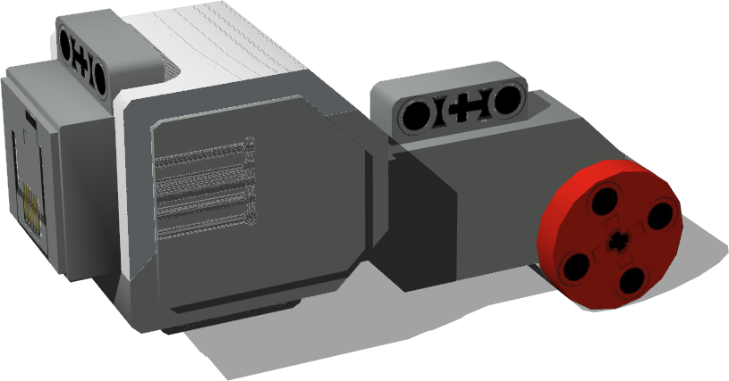
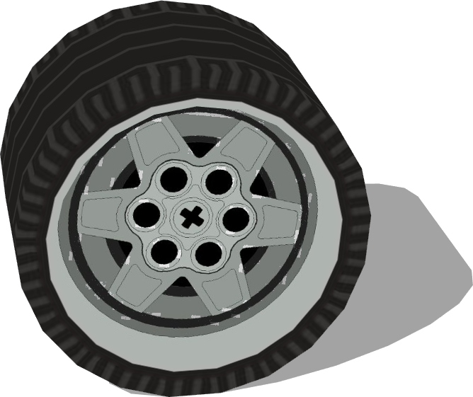

# Lego

## LegoLargeMotor

Derived from [Solid](../reference/solid.md)

%figure "LEGO Mindstorm EV3 large motor. Part id: 6009430.
"



%end

```
LegoLargeMotor {
  SFVec3f    translation 0 0 0
  SFRotation rotation    0 1 0 0
  SFString   name        "LEGO large motor"
}
```

> **File location**: "WEBOTS\_HOME/projects/objects/lego/protos/LegoLargeMotor.proto"

## LegoWheel

Derived from [Solid](../reference/solid.md)

%figure "LEGO Mindstrom EV 3 wheel. Parts id: 4634091 & 6035364.
"



%end

```
LegoWheel {
  SFVec3f    translation 0 0.0219974 0
  SFRotation rotation    0 1 0 0
  SFString   name        "LEGO wheel"
}
```

> **File location**: "WEBOTS\_HOME/projects/objects/lego/protos/LegoWheel.proto"

