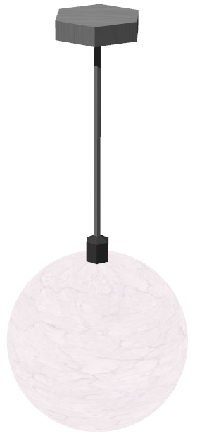
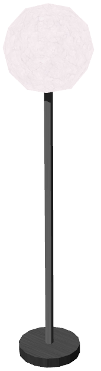

# Lights

## CeilingLight

Derived from [Solid](../reference/<built-in method lower of str object at 0x00000000057F7E90>.md)

%figure "CeilingLight model in Webots."



%end

```
CeilingLight {
  SFVec3f    translation                0 2.4 0
  SFRotation rotation                   0 1 0 0
  SFString   name                       "ceiling light"
  SFColor    bulbColor                  1 1 1                         
  MFString   bulbTextureUrl             "textures/light_bulb.jpg"     
  SFColor    supportColor               1 1 1                         
  MFString   supportTextureUrl          "textures/light_support.jpg"  
  SFFloat    pointLightAmbientIntensity 0                             
  SFVec3f    pointLightAttenuation      1 0 0                         
  SFColor    pointLightColor            1 1 1                         
  SFFloat    pointLightIntensity        1                             
  SFBool     pointLightCastShadows      FALSE                         
}
```

> **File location**: "WEBOTS\_HOME/projects/objects/lights/protos/CeilingLight.proto"

### CeilingLight Description

A ceiling light (0.19 x 0.8 x 0.19 m).

### CeilingLight Field Summary

- `bulbColor`: Defines the color of the light bulb.

- `bulbTextureUrl`: Defines the texture used for the light bulb.

- `supportColor`: Defines the color of the light support.

- `supportTextureUrl`: Defines the texture used for the light support.

- `pointLightAmbientIntensity`: Defines the ambiant intensity of the point light.

- `pointLightAttenuation`: Defines the attenuation of the point light.

- `pointLightColor`: Defines the color of the point light.

- `pointLightIntensity`: Defines the intensity of the point light.

- `pointLightCastShadows`: Defines whether the point light should cast shadows.

## FloorLight

Derived from [Solid](../reference/<built-in method lower of str object at 0x00000000057F7D50>.md)

%figure "FloorLight model in Webots."



%end

```
FloorLight {
  SFVec3f    translation                0 0 0
  SFRotation rotation                   0 1 0 0
  SFString   name                       "floor light"
  SFColor    bulbColor                  1 1 1                         
  MFString   bulbTextureUrl             "textures/light_bulb.jpg"     
  SFColor    supportColor               1 1 1                         
  MFString   supportTextureUrl          "textures/light_support.jpg"  
  SFFloat    pointLightAmbientIntensity 0                             
  SFVec3f    pointLightAttenuation      1 0 0                         
  SFColor    pointLightColor            1 1 1                         
  SFFloat    pointLightIntensity        1                             
  SFBool     pointLightCastShadows      FALSE                         
  SFNode     physics                    NULL                          
}
```

> **File location**: "WEBOTS\_HOME/projects/objects/lights/protos/FloorLight.proto"

### FloorLight Description

A floor light (0.19 x 1.6 x 0.19 m).

### FloorLight Field Summary

- `bulbColor`: Defines the color of the light bulb.

- `bulbTextureUrl`: Defines the texture used for the light bulb.

- `supportColor`: Defines the color of the light support.

- `supportTextureUrl`: Defines the texture used for the light support.

- `pointLightAmbientIntensity`: Defines the ambiant intensity of the point light.

- `pointLightAttenuation`: Defines the attenuation of the point light.

- `pointLightColor`: Defines the color of the point light.

- `pointLightIntensity`: Defines the intensity of the point light.

- `pointLightCastShadows`: Defines whether the point light should cast shadows.

- `physics`: Is equivalent to the `physics` field of the [Solid](../reference/solid.md) node.

