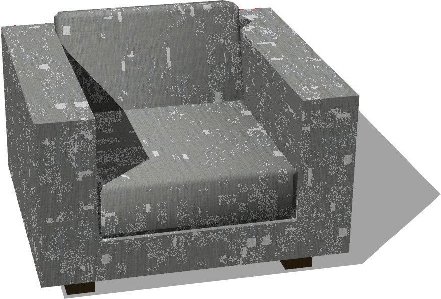
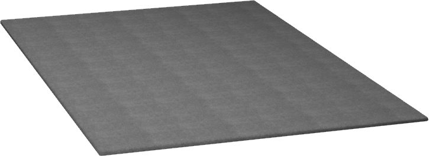
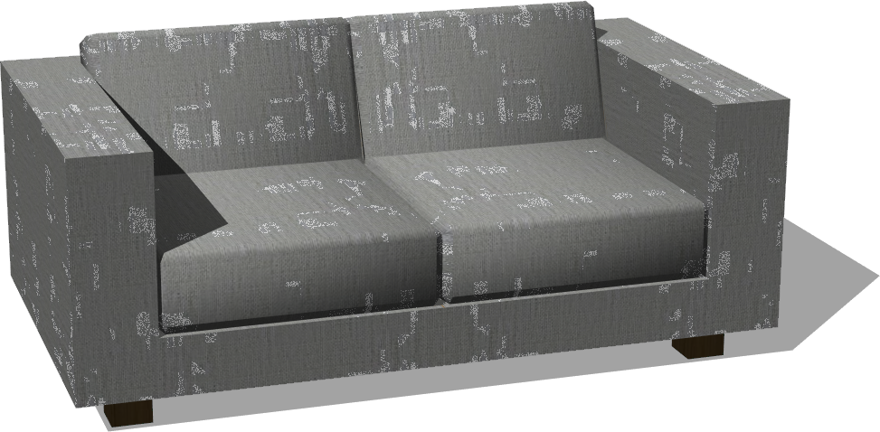

# Living Room Furniture

## Armchair

An armchair (1 x 0.8 x 1.1 m).

Derived from [Solid](../reference/solid.md).

%figure



%end

```
Armchair {
  SFVec3f    translation 0 0 0
  SFRotation rotation    0 1 0 0
  SFString   name        "armchair"
  SFColor    color       1 1 1
  MFString   textureUrl  "textures/sofa.jpg"
  SFNode     physics     NULL
}
```

> **File location**: "WEBOTS\_HOME/projects/objects/living_room_furniture/protos/Armchair.proto"

### Armchair Field Summary

- `color`: Defines the color of the armchair.

- `textureUrl`: Defines the texture used for the armchair.

- `physics`: Is equivalent to the `physics` field of the [Solid](../reference/solid.md) node.

## Carpet

A carpet (2.4 x 0.02 x 1.6 m).

Derived from [Solid](../reference/solid.md).

%figure



%end

```
Carpet {
  SFVec3f    translation 0 0 0
  SFRotation rotation    0 1 0 0
  SFString   name        "carpet"
  SFColor    color       1 1 1
  MFString   textureUrl  "textures/carpet.jpg"
}
```

> **File location**: "WEBOTS\_HOME/projects/objects/living_room_furniture/protos/Carpet.proto"

### Carpet Field Summary

- `color`: Defines the color of the carpet.

- `textureUrl`: Defines the texture used for the armchair.

## Sofa

A sofa for two people (1 x 0.8 x 1.8 m).

Derived from [Solid](../reference/solid.md).

%figure



%end

```
Sofa {
  SFVec3f    translation 0 0 0
  SFRotation rotation    0 1 0 0
  SFString   name        "sofa"
  SFColor    color       1 1 1
  MFString   textureUrl  "textures/sofa.jpg"
  SFNode     physics     NULL
}
```

> **File location**: "WEBOTS\_HOME/projects/objects/living_room_furniture/protos/Sofa.proto"

### Sofa Field Summary

- `color`: Defines the color of the sofa.

- `textureUrl`: Defines the texture used for eh sofa.

- `physics`: Is equivalent to the `physics` field of the [Solid](../reference/solid.md) node.

