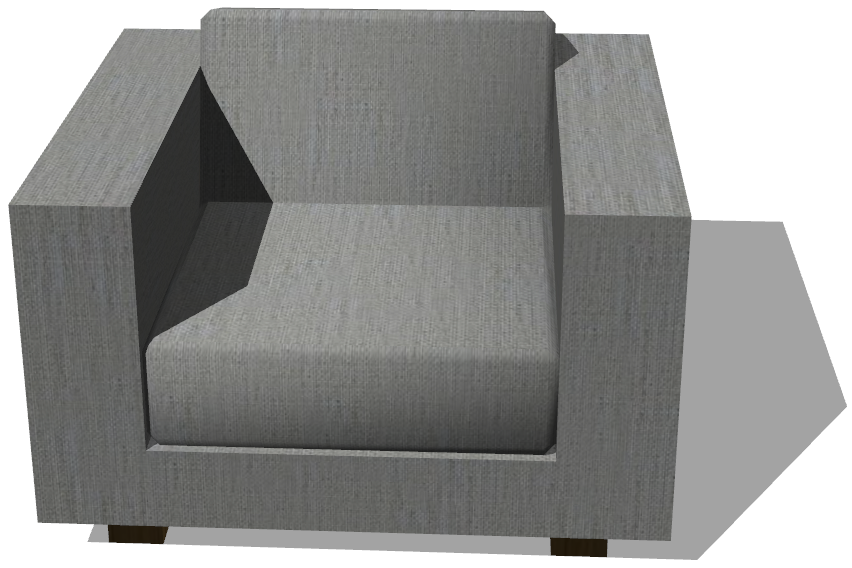
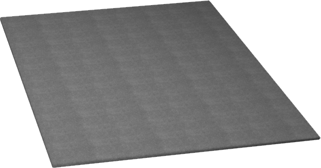
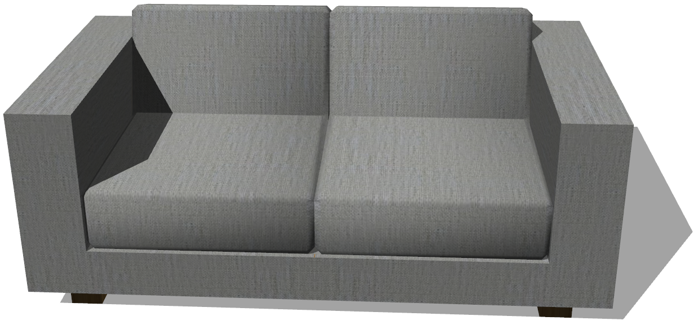

# Living Room Furniture

## Armchair

%figure "Armchair model in Webots."



%end

```
Armchair {
  SFVec3f translation 0 0 0
  SFRotation rotation 0 1 0 0
  SFString name "armchair"
  SFColor color 1 1 1
  MFString textureUrl "textures/sofa.jpg"
  SFNode physics NULL
}
```

> **File location**: "WEBOTS\_HOME/projects/objects/living_room_furniture/protos/Armchair.proto"

### Armchair Description

An armchair (1 x 0.8 x 1.1 m).

## Carpet

%figure "Carpet model in Webots."



%end

```
Carpet {
  SFVec3f translation 0 0 0
  SFRotation rotation 0 1 0 0
  SFString name "carpet"
  SFColor color 1 1 1
  MFString textureUrl "textures/carpet.jpg"
}
```

> **File location**: "WEBOTS\_HOME/projects/objects/living_room_furniture/protos/Carpet.proto"

### Carpet Description

A carpet (2.4 x 0.02 x 1.6 m).

## Sofa

%figure "Sofa model in Webots."



%end

```
Sofa {
  SFVec3f translation 0 0 0
  SFRotation rotation 0 1 0 0
  SFString name "sofa"
  SFColor color 1 1 1
  MFString textureUrl "textures/sofa.jpg"
  SFNode physics NULL
}
```

> **File location**: "WEBOTS\_HOME/projects/objects/living_room_furniture/protos/Sofa.proto"

### Sofa Description

A sofa for two people (1 x 0.8 x 1.8 m).

